# 生成AI進化の系譜 (GraphRAG分析)

> YAGOKORO GraphRAG Engine による自動生成
>
> 総論文数: 241件
> 抽出エンティティ: 244件
> 抽出関係: 229件
> 生成日時: 2025-12-30T01:42:47.890Z

## 📊 GraphRAG分析概要

本分析は、収集した241件の学術論文から、GraphRAGエンジンを使用して
エンティティ（AIモデル、組織、技術、コンセプト）と、それらの間の関係性を
自動抽出し、生成AIの進化の系譜を可視化したものです。

---

## 📈 エンティティ統計

| タイプ | 件数 | 主要なエンティティ |
|--------|------|-------------------|
| AIModel | 109 | Deep reinforcement learning, Transformer, BERT, GPT-3, Denoising Diffusion Probabilistic Models |
| InputType | 1 | human preferences |
| ApplicationArea | 2 | simulated robot locomotion, Atari games |
| Technique | 36 | Auto-CoT, LoRA, cross-attention layers, Rotary Position Embedding (RoPE), ALiBi |
| Concept | 75 | ImageNet, HumanEval, BIG-bench, Emergent Abilities, Constitutional AI |
| AIEntity | 3 | Overfitting, harmless AI assistant, Training Speed |
| AIConcept | 1 | Mixture of Experts (MoE) |
| Organization | 9 | Amazon, Microsoft, Google DeepMind, Meta, OpenAI |
| Component | 1 | Bert retriever |
| Person | 4 | Vaswani et al., human annotators, jquesnelle, yizhongw |
| Approach | 1 | Chain of Thought |
| Dataset | 1 | RefinedWeb Dataset |
| AIModelTechnique | 1 | Instruction Tuning |

---

## 🔗 関係統計

| 関係タイプ | 件数 |
|------------|------|
| USES_TECHNIQUE | 55 |
| EVALUATED_ON | 44 |
| DEVELOPED_BY | 30 |
| RELATED_TO | 31 |
| DERIVED_FROM | 35 |
| EVALuated_on | 7 |
| USED_BY | 1 |
| USE_IN | 1 |
| IMPROVES_PERFORMANCE_OF | 1 |
| POWERED_BY | 1 |
| SOLVES | 3 |
| PART_OF | 8 |
| USE_TECHNIQUE | 8 |
| OUTPERFORMS | 1 |
| USED_TECHNIQUE | 1 |
| COLLECTED_BY | 1 |
| GENERATED_BY | 1 |

---

## 🤖 AIモデル系譜図

以下はGraphRAGで抽出されたAIモデル間の関係を可視化した系譜図です。

---

## ⚙️ 主要技術系譜図

以下はGraphRAGで抽出された技術・コンセプト間の関係を可視化した系譜図です。

```mermaid
flowchart TB
    %% === 主要技術系譜 ===
    
    %% Attention/Transformer系技術
    subgraph Attention["⚡ Attention/Transformer"]
        direction TB
        cross_attention_laye["cross-attention layers"]
        attention_mechanism["attention mechanism"]
    end

    %% 推論・Reasoning技術
    subgraph Reasoning["🧠 推論・Reasoning"]
        direction TB
        chain_of_thought_pro["Chain-of-Thought Prompting"]
    end

    %% 学習・最適化技術
    subgraph Training["📚 学習・最適化"]
        direction TB
        lora["LoRA"]
        rlhf["RLHF"]
        instruction_tuning["instruction tuning"]
        fine_tuning["fine-tuning"]
        supervised_learning["supervised learning"]
        reinforcement_learni["reinforcement learning"]
    end

    %% プロンプト技術
    subgraph Prompting["📝 プロンプティング"]
        direction TB
        chain_of_thought_pro["Chain-of-Thought Prompting"]
    end

    %% その他技術
    subgraph OtherTech["🔧 その他技術"]
        direction TB
        opro["OPRO"]
        alibi["ALiBi"]
        position_interpolati["Position Interpolation"]
        github_copilot["GitHub Copilot"]
        yarn["YaRN"]
        action_plan_generati["action plan generation"]
        pytorch["PyTorch"]
        rotary_position_embe["Rotary Position Embedding (RoPE)"]
        pathways["Pathways"]
        tpu_v4["TPU v4"]
        drawbench["DrawBench"]
        bm25["BM25"]
    end

    %% コンセプト
    subgraph Concepts["💡 コンセプト"]
        direction TB
        large_language_model["Large language models"]
        humaneval["HumanEval"]
        fine_tuning_aligned_["Fine-tuning Aligned Language Models Compromises Safety"]
        few_shot_learning["few-shot learning"]
        llm["LLM"]
        lost_in_the_middle["Lost in the Middle"]
        constitutional_ai["Constitutional AI"]
        mmlu["MMLU"]
        toolbench["ToolBench"]
        pixel_space["pixel space"]
        big_bench["BIG-bench"]
        hotpotqa["HotpotQA"]
    end

    %% 技術間の関係
    transformer -->|uses technique| attention_mechanism
    gpt_3 -->|uses technique| few_shot_learning
    lora -->|uses technique| pytorch
    lora -->|derived from| microsoft
    latent_diffusion_mod -->|uses technique| cross_attention_laye
    latent_diffusion_mod -->|uses technique| pixel_space
    cross_attention_laye -->|improves performance of| latent_diffusion_mod
    codex -->|uses technique| github_copilot
    codex -->|evaluated on| humaneval
    github_copilot -->|powered by| codex
    gpt_j -->|solves| humaneval
    flan -->|uses technique| instruction_tuning
    chain_of_thought_pro -->|related to| large_language_model
    instructgpt -->|uses technique| rlhf
    instructgpt -->|evaluated on| few_shot_learning
    palm -->|uses technique| pathways
    palm -->|uses technique| tpu_v4
    big_bench -->|derived from| few_shot_learning
    palm -->|evaluated on| big_bench
    imagen -->|uses technique| drawbench
    react -->|uses technique| chain_of_thought_pro
    react -->|uses technique| action_plan_generati
    react -->|evaluated on| hotpotqa
    react -->|evaluated on| fever
    react -->|evaluated on| alfworld
    react -->|evaluated on| webshop
    self_instruct -->|uses technique| super_naturalinstruc
    e5 -->|uses technique| bm25
    constitutional_ai -->|developed by| rl_from_ai_feedback_
    constitutional_ai -->|use technique| supervised_learning
    constitutional_ai -->|use technique| reinforcement_learni
    large_language_model -->|uses technique| demonstrations
    large_language_model -->|derived from| gpt_3
    large_language_model -->|uses technique| ground_truth_demonst
    large_language_model -->|uses technique| randomly_replacing_l
    gsm8k -->|derived from| large_language_model
    large_language_model -->|uses technique| chain_of_thought_pro
    large_language_model -->|derived from| rlhf
    large_language_model -->|derived from| lora
    large_language_model -->|related to| openai
    large_language_model -->|related to| meta
    large_language_model -->|related to| amazon
    large_language_model -->|uses technique| automatic_prompt_eng
    automatic_prompt_eng -->|evaluated on| large_language_model
    blip_2 -->|developed by| vqav2
    llava -->|used technique| llm
    llava -->|evaluated on| science_qa
    gpt_4 -->|uses technique| rlhf
    few_shot_learning -->|related to| gpt_4
    voyager -->|uses technique| llm
    phi_1 -->|developed by| position_interpolati
    phi_1 -->|evaluated on| humaneval
    lost_in_the_middle -->|evaluated on| lora
    lost_in_the_middle -->|evaluated on| rlhf
    toolllm -->|derived from| toolbench
    toolbench -->|collected by| rapidapi_hub
    yarn -->|developed by| llama
    opro -->|evaluated on| gsm8k
    opro -->|developed by| google_deepmind
    fine_tuning_aligned_ -->|developed by| meta
    fine_tuning_aligned_ -->|uses technique| openai
    fine_tuning_aligned_ -->|related to| llama
    fine_tuning_aligned_ -->|derived from| lora

    %% スタイリング  
    classDef attention fill:#e91e63,color:white
    classDef reasoning fill:#3f51b5,color:white
    classDef training fill:#009688,color:white
    classDef prompt fill:#ff5722,color:white
    classDef concept fill:#607d8b,color:white
```

---

## 📋 主要AIモデル一覧

- **Deep reinforcement learning** (confidence: 90%)
  - A sophisticated machine learning technique for training agents to make a sequence of decisions in an environment.
- **Transformer** (confidence: 90%)
  - A new simple network architecture based solely on attention mechanisms
- **BERT** (confidence: 90%)
  - A new language representation model designed to pre-train deep bidirectional representations from unlabeled text
- **GPT-3** (confidence: 90%)
  - A large autoregressive language model with 175 billion parameters
- **Denoising Diffusion Probabilistic Models** (confidence: 90%)
  - A class of latent variable models inspired by considerations from nonequilibrium thermodynamics, used for high-quality image synthesis.
- **Vision Transformer** (confidence: 90%)
  - A transformer-based model applied directly to sequences of image patches for image recognition tasks.
- **Switch Transformers** (confidence: 90%)
  - A new model that addresses complexity, communication costs, and training instability in Mixture of Experts (MoE) models.
- **RoBERTa** (confidence: 90%)
  - A pre-trained language model from Facebook AI Research
- **GPT-2** (confidence: 90%)
  - A generative pre-trained transformer model from OpenAI
- **RETRO** (confidence: 90%)
  - Retrieval-Enhanced Transformer
- **Latent Diffusion Models** (confidence: 90%)
  - A type of diffusion model operating in latent space
- **transformer model** (confidence: 90%)
  - A type of AI model introduced by Vaswani et al.
- **Codex** (confidence: 90%)
  - A GPT language model fine-tuned on publicly available code from GitHub
- **FLAN** (confidence: 90%)
  - A finetuned language model described in the paper
- **InstructGPT** (confidence: 90%)
  - A model fine-tuned using human feedback to align with user intent
- **PaLM** (confidence: 90%)
  - A large language model trained by Google
- **Pathways Language Model PaLM** (confidence: 90%)
  - The specific model name
- **Reinforcement Learning from Human Feedback** (confidence: 90%)
  - A method used to finetune language models to act as helpful and harmless assistants
- **Flamingo** (confidence: 90%)
  - A Visual Language Model for Few-Shot Learning
- **Imagen** (confidence: 90%)
  - A text-to-image diffusion model with high photorealism and language understanding

---

## 🔧 主要技術一覧

- **Auto-CoT** (confidence: 95%)
  - An automatic CoT prompting method proposed in the paper
- **LoRA** (confidence: 90%)
  - Low-Rank Adaptation technique for large language models
- **cross-attention layers** (confidence: 90%)
  - A method introduced into the model architecture to enhance its capabilities
- **Rotary Position Embedding (RoPE)** (confidence: 90%)
  - A novel method to effectively leverage positional information in transformer-based language models
- **ALiBi** (confidence: 90%)
  - A position method that biases query-key attention scores with a penalty proportional to their distance
- **Chain-of-Thought Prompting** (confidence: 90%)
  - A method for prompting large language models to generate intermediate reasoning steps.
- **chain of thought (CoT) prompting** (confidence: 90%)
  - A technique for eliciting complex multi-step reasoning through step-by-step answer examples
- **CoT prompting** (confidence: 90%)
  - Chain-of-thought prompting with two major paradigms
- **Position Interpolation** (confidence: 90%)
  - A method for extending the context window size of RoPE-based pretrained LLMs.
- **greedy and gradient-based search techniques** (confidence: 90%)
  - Methods used to automatically generate adversarial suffixes.
- **YaRN** (confidence: 90%)
  - A compute-efficient method to extend the context window of large language models
- **OPRO** (confidence: 90%)
  - Optimization by PROmpting
- **prompt optimization** (confidence: 90%)
  - The process of finding instructions to maximize task accuracy using prompts
- **attention mechanism** (confidence: 80%)
  - A component in the Transformer model that connects the encoder and decoder
- **Adam** (confidence: 80%)
  - An optimization algorithm used in training machine learning models
- **GitHub Copilot** (confidence: 80%)
  - A production version of Codex that powers a feature in GitHub
- **instruction tuning** (confidence: 80%)
  - The method of finetuning language models on tasks described via instructions
- **TPU v4** (confidence: 80%)
  - A type of Tensor Processing Unit used for training the model
- **DrawBench** (confidence: 80%)
  - A benchmark for evaluating text-to-image models
- **action plan generation** (confidence: 80%)
  - A method for generating task-specific actions
- **RL from AI Feedback (RLAIF)** (confidence: 80%)
  - A reinforcement learning technique using AI preferences as the reward signal
- **reinforcement learning** (confidence: 80%)
  - A phase of training where the model learns from a dataset of AI preferences evaluated by another model
- **demonstrations** (confidence: 80%)
  - Input-label pairs used for in-context learning.
- **ground truth demonstrations** (confidence: 80%)
  - Demonstrations that are assumed to be correct or accurate.
- **few-shot learners** (confidence: 80%)
  - A method where the model learns from a few examples

---

## 💡 主要コンセプト

- **ImageNet** (confidence: 90%)
  - A large-scale visual database for use in machine learning research.
- **HumanEval** (confidence: 90%)
  - An evaluation set released to measure functional correctness for synthesizing programs from docstrings
- **BIG-bench** (confidence: 90%)
  - A benchmark suite recently released for evaluating AI models
- **Emergent Abilities** (confidence: 90%)
  - An unpredictable phenomenon where certain abilities appear in larger language models but are absent in smaller ones.
- **Constitutional AI** (confidence: 90%)
  - A method for training a harmless AI assistant through self-improvement and feedback without human labels identifying harmful outputs
- **Large language models** (confidence: 90%)
  - A general term for AI models capable of understanding and generating human-like text.
- **in-context learning** (confidence: 90%)
  - A method where a model learns to perform a new task by conditioning on input-label pairs without explicit training.
- **language modeling** (confidence: 90%)
  - A task in natural language processing where the model predicts the next word in a sequence given the previous words.
- **linear regression** (confidence: 90%)
  - A statistical method used to model the relationship between a dependent variable and one or more independent variables
- **Big-Bench Hard tasks** (confidence: 90%)
  - A set of challenging tasks designed to test the capabilities of AI systems
- **Fine-tuning Aligned Language Models Compromises Safety** (confidence: 90%)
  - A concept discussing the risks associated with fine-tuning language models.
- **CIFAR-100** (confidence: 85%)
  - A dataset of 60,000 32x32 color images belonging to 100 classes, usually used for benchmarking image classification algorithms.
- **Science QA** (confidence: 85%)
  - A dataset for science question answering
- **Rotary Position Embeddings (RoPE)** (confidence: 85%)
  - A technique for encoding positional information in transformer-based language models
- **traveling salesman problems** (confidence: 85%)
  - A classic optimization problem in computer science
- **GLUE** (confidence: 80%)
  - A benchmark for natural language understanding tasks
- **MultiNLI** (confidence: 80%)
  - A natural language inference dataset
- **SQuAD** (confidence: 80%)
  - A reading comprehension dataset
- **Language Models are Few-Shot Learners** (confidence: 80%)
  - The title of the research paper
- **few-shot learning** (confidence: 80%)
  - A method where models learn from a small number of examples or instructions

---

## 🏢 主要組織

- **Amazon** (confidence: 90%)
- **Microsoft** (confidence: 85%)
- **Google DeepMind** (confidence: 85%)
- **Meta** (confidence: 80%)
- **OpenAI** (confidence: 70%)
- **RapidAPI Hub** (confidence: 70%)
- **Google AI Studio** (confidence: 60%)
- **Cloud Vertex AI** (confidence: 60%)
- **Minedojo** (confidence: 60%)

---

## 📚 分析対象論文

本分析は以下の論文データベースに基づいています:

| 年 | 論文数 |
|----|--------|
| 2017 | 2 |
| 2018 | 1 |
| 2020 | 12 |
| 2021 | 14 |
| 2022 | 30 |
| 2023 | 120 |
| 2024 | 62 |

---

*Generated by YAGOKORO GraphRAG Engine*
