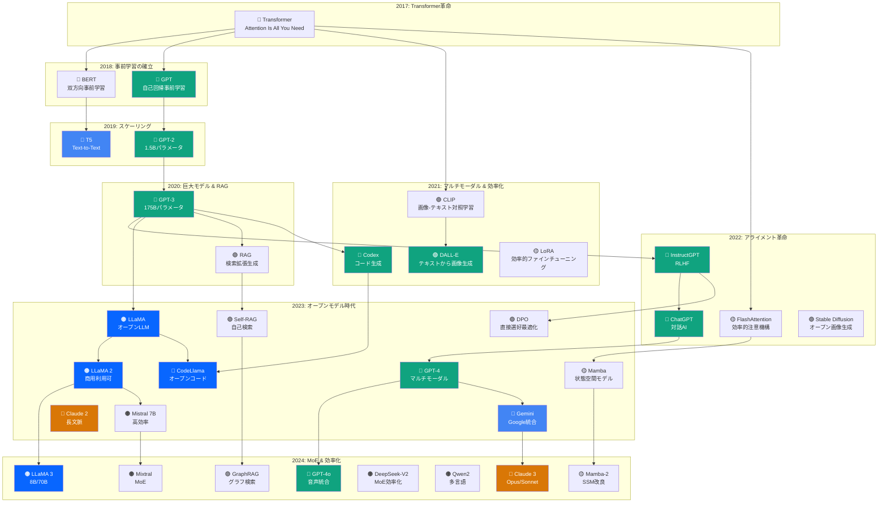

# 生成AI進化の系譜

> YAGOKORO Knowledge Database から自動生成
> 
> 総論文数: 193件
> 生成日時: 2025-12-29T22:58:00.928Z

## 📊 概要

生成AI (Generative AI) は2017年のTransformer発表から急速に進化し、
2024年現在では様々な分野で実用化されています。

本文書は、収集した193件の学術論文を分析し、
生成AIの進化の系譜をまとめたものです。

---

## 🏛️ 主要マイルストーン

| 年 | イベント | 主要論文 |
|----|----------|----------|
| 2017 | **Transformer革命** | Attention Is All You Need |
| 2018 | **事前学習の確立** | BERT, GPT |
| 2019 | **スケーリング開始** | GPT-2, T5 |
| 2020 | **巨大モデル時代** | GPT-3, RAG |
| 2021 | **マルチモーダル** | CLIP, DALL-E, Codex, LoRA |
| 2022 | **アライメント革命** | InstructGPT, ChatGPT, FlashAttention |
| 2023 | **オープンモデル時代** | LLaMA, Mistral, GPT-4, Mamba |
| 2024 | **MoE & 効率化** | Mixtral, LLaMA 3, Claude 3, GPT-4o |

---

## 🌳 系譜図

---

## 📈 技術トレンド

### 1. Foundation Models (基盤モデル)
- **2017**: Transformerアーキテクチャの発明
- **2018-2019**: BERT/GPTによる事前学習パラダイムの確立
- **2020-2022**: GPT-3→InstructGPT→ChatGPTの進化
- **2023-2024**: GPT-4、Claude 3、Geminiのマルチモーダル化

### 2. Open Models (オープンモデル)
- **2023**: LLaMA、Mistral 7Bがオープンソース化
- **2024**: Mixtral (MoE)、LLaMA 3、Qwen2、DeepSeekの台頭

### 3. Efficient AI (効率化)
- **2021**: LoRA (効率的ファインチューニング)
- **2022**: FlashAttention (GPU最適化)
- **2023-2024**: Mamba (状態空間モデル)、量子化技術

### 4. RAG & Retrieval (検索拡張)
- **2020**: RAG (Retrieval-Augmented Generation)
- **2023**: Self-RAG、RAPTOR
- **2024**: GraphRAG、CRAG

### 5. Alignment & Safety (整合性と安全性)
- **2022**: RLHF、InstructGPT
- **2023**: DPO、Constitutional AI
- **2024**: ORPO、Llama Guard

### 6. Multimodal (マルチモーダル)
- **2021**: CLIP、DALL-E
- **2023**: GPT-4V、LLaVA
- **2024**: GPT-4o、Gemini Pro Vision

---

# カテゴリ別統計

| カテゴリ | 論文数 | チャンク数 | 年範囲 |
|----------|--------|------------|--------|
| LLM | 50 | 7,020 | 2020-2024 |
| Multimodal | 23 | 4,395 | 2020-2024 |
| Efficiency | 21 | 2,986 | 2020-2024 |
| Alignment | 19 | 3,074 | 2017-2024 |
| Reasoning | 16 | 2,350 | 2022-2024 |
| RAG | 14 | 1,655 | 2020-2024 |
| Evaluation | 8 | 2,426 | 2020-2024 |
| Code | 8 | 1,986 | 2021-2024 |
| Agent | 8 | 1,197 | 2022-2024 |
| Architecture | 6 | 682 | 2020-2024 |
| Safety | 5 | 825 | 2020-2023 |
| Prompting | 5 | 768 | 2022-2024 |
| Foundation | 3 | 281 | 2017-2020 |
| Embedding | 3 | 276 | 2022-2024 |
| Training | 3 | 852 | 2023-2024 |
| Science | 1 | 89 | 2021-2021 |

---

## 📚 参考文献

本系譜は以下のソースから収集した論文に基づいています:

- **arXiv**: 179件
- **Unpaywall (学術誌)**: 14件

---

*Generated by YAGOKORO MCP Knowledge Base*
