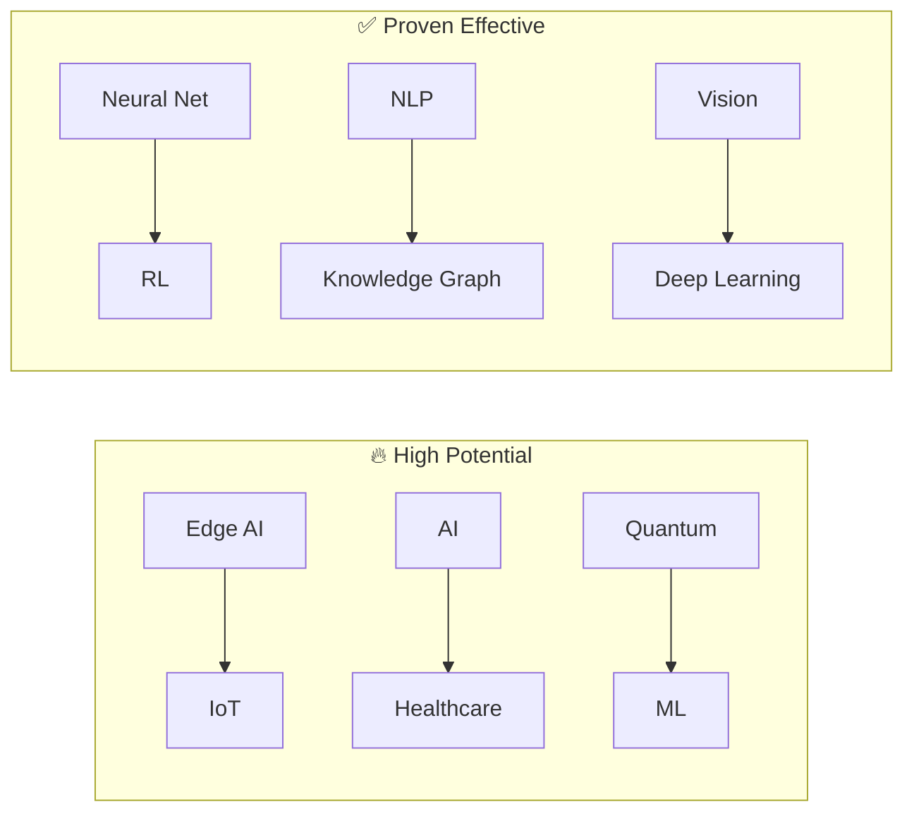
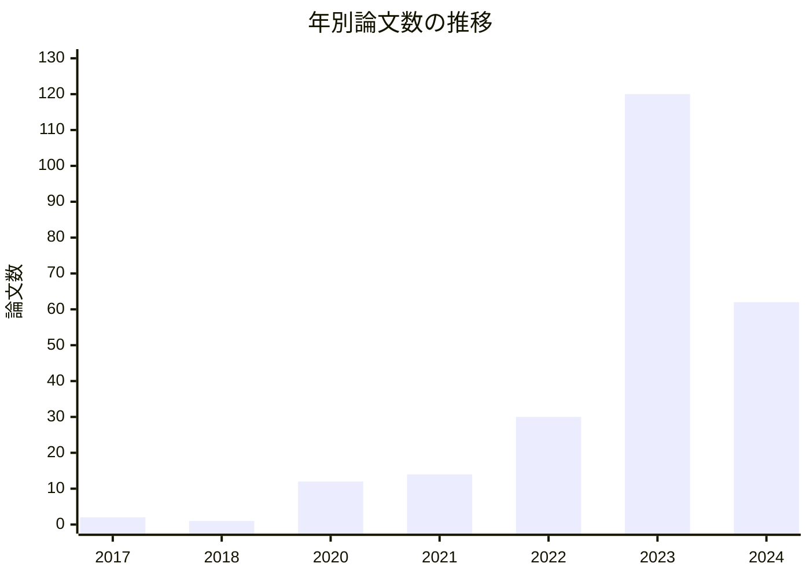
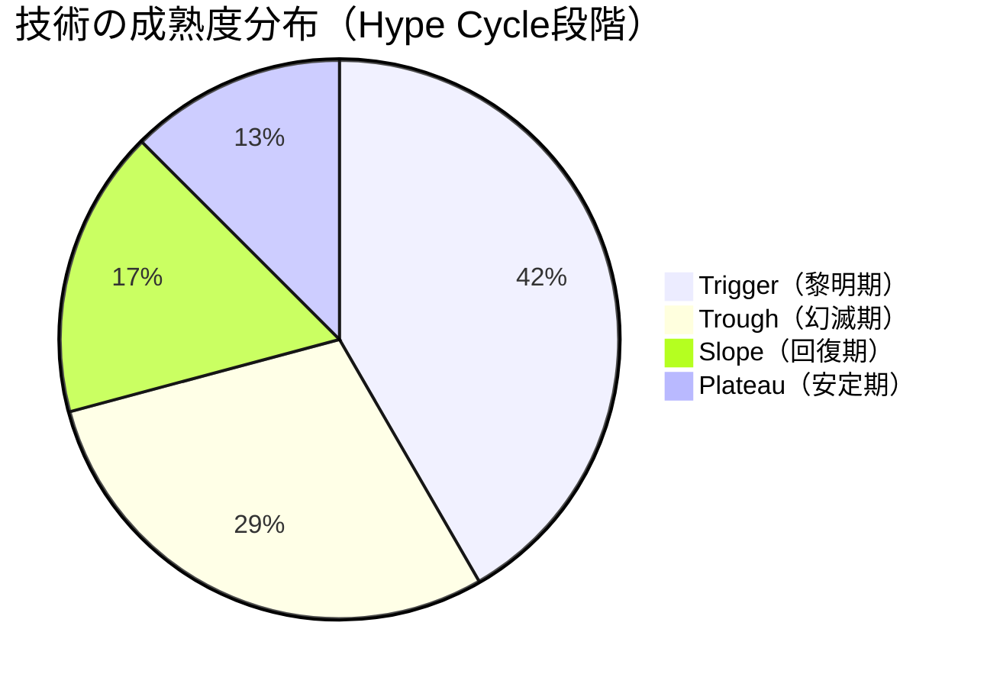
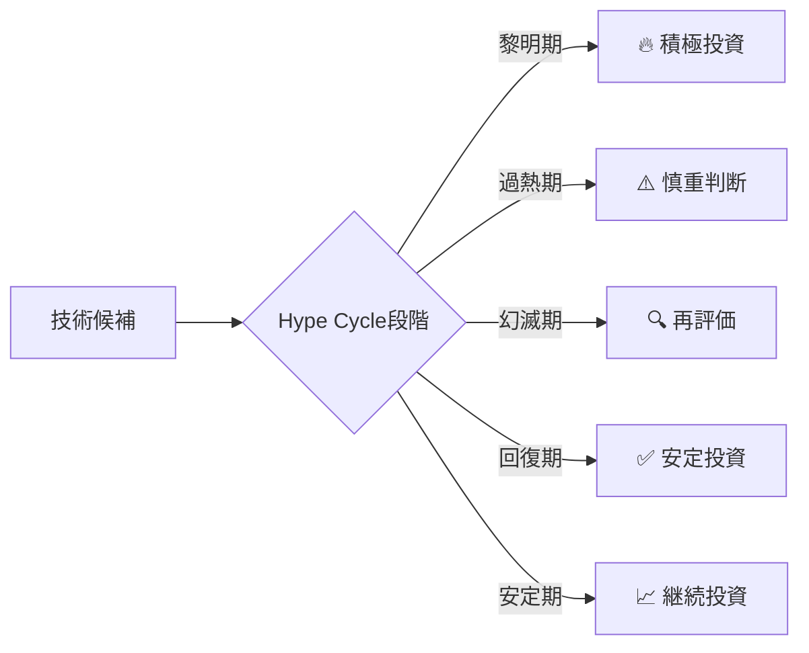

# AI for Scienceの第一歩は「知識グラフ」だった ―YAGOKOROで見えた研究空白とHype Cycle

:::note info
**YAGOKOROの語源**
**YAGOKORO（八意）** は、日本神話に登場する **八意思兼命（やごころおもいかねのみこと）** に由来します。八意思兼命は知恵と判断力を司る神であり、天照大神が天岩戸に隠れた際、岩戸を開けるための素晴らしい策を講じ、世界に光を取り戻したことで有名です。「八百万（やおよろず）の思慮」を持つことから「八意思」と名付けられました。知識グラフと推論によって「知恵」を提供し、AIの力で「光」をもたらすという理念を、この神の名に重ねています。
:::

## はじめに

科学研究において、膨大な論文や知見から新しい発見を導き出すことは、研究者にとって最も困難かつ重要な作業の一つです。近年、「**AI for Science**」という概念が注目を集めています。

### AI for Science とは？

**AI for Science（科学のためのAI）** は、人工知能技術を科学研究のあらゆる段階に活用し、科学的発見を加速させるパラダイムです。従来の「Science for AI」（AIを進化させるための科学研究）とは逆方向のアプローチであり、AIを科学研究の**ツール**として活用します。

```
【従来の科学研究】
研究者 → 文献調査 → 仮説構築 → 実験 → 分析 → 発見
        ↑ 人間の認知能力の限界

【AI for Science】
研究者 + AI → 大規模文献解析 → AI支援仮説生成 → 実験最適化 → AI分析 → 発見加速
              ↑ 人間では処理不可能な規模のデータを扱える
```

:::note info
**AI for Scienceの3つの柱**

1. **科学文献の大規模解析**
   - 年間数百万件の論文から関連知識を自動抽出
   - 異分野間の隠れた関係性を発見
   - 研究トレンドの予測

2. **仮説生成と実験設計の支援**
   - 既存知識からの新仮説の自動生成
   - 実験条件の最適化（ベイズ最適化など）
   - シミュレーションによる事前検証

3. **データ駆動型発見**
   - AlphaFold（タンパク質構造予測）
   - GNoME（新材料発見）
   - 創薬候補化合物の探索
:::

**なぜ今AI for Scienceなのか？**

| 課題 | 従来 | AI for Science |
|------|------|----------------|
| 論文数の爆発 | 年間300万件以上、人間では読みきれない | LLM/GraphRAGで自動要約・関係抽出 |
| 学際研究の壁 | 専門外の知識にアクセス困難 | 分野横断的な知識グラフ構築 |
| 再現性の危機 | 実験条件の不備、バイアス | AIによる実験設計の標準化 |
| 発見の遅延 | 関連研究の見落とし | マルチホップ推論で隠れた関係を発見 |

**主な成功事例**:

- **AlphaFold 2** (DeepMind, 2020): タンパク質立体構造予測で50年来の課題を解決
- **GNoME** (DeepMind, 2023): 220万種の新結晶材料を発見（人類が過去発見した数の10倍以上）
- **AlphaProof** (DeepMind, 2024): 国際数学オリンピック銀メダルレベルの数学推論
- **論文自動執筆支援**: Elicit, Semantic Scholar, Consensusなどのツール群

本記事では、私が開発している**YAGOKORO**という**LazyGraphRAG**システムを用いて、生成AI技術の系譜を知識グラフとして構築し、そこから知識発見を行う実験の結果を報告します。AI for Scienceの「科学文献の大規模解析」に焦点を当てた検証実験です。

## TL;DR

- **YAGOKORO**: Neo4j + Qdrant + MCPを統合した**LazyGraphRAG**システム
- **LazyGraphRAGの特徴**: インデックス構築時にLLM不使用（NLPベース）、クエリ時のみLLM使用でコスト99.9%削減
- **実験内容**: 241件のAI論文から244エンティティ・229関係を抽出し、**10の分析実験を実施**
- **主要発見**: 技術進化、組織間伝播、研究空白分析、技術組み合わせ、時系列トレンド、影響力スコアリング
- **新発見 🆕**: **Hype Cycle分析**でCoT・few-shot learningが「幻滅期」入り、Transformer/Attentionは「安定期」到達
- **結論**: LazyGraphRAGは科学研究における知識発見と**Technology Lifecycle Analysis**の有望なアプローチ

## YAGOKOROとは

### システム概要

**YAGOKORO**（ヤゴコロ）は、AGI実現を目指したLLM・**LazyGraphRAG**・オントロジー統合システムです。Phase 1では、生成AIの技術系譜を知識グラフとして構築し、高度な検索・推論機能を提供します。

:::note info
**オントロジーとは？**
オントロジー（Ontology）は、特定の領域における概念・エンティティとその関係性を形式的に定義した知識体系です。YAGOKOROでは、生成AI分野のオントロジーとして以下を定義しています。

- **エンティティタイプ**: AIModel, Organization, Person, Technique, Concept, Benchmark, Publication
- **関係タイプ**: DERIVED_FROM（派生）, DEVELOPED_BY（開発元）, USES_TECHNIQUE（技術採用）, EVALUATED_ON（評価）など

オントロジーにより、単なるキーワード検索ではなく「GPT-4はどの技術を使っているか」「Transformerから派生したモデルは何か」といった**意味的な検索・推論**が可能になります。
:::

### なぜLazyGraphRAGなのか

科学研究において論文データベースは**日々成長**します。arXivだけでも毎日数千件の論文が投稿されます。ここで通常のGraphRAGとLazyGraphRAGの違いが重要になります。

:::note warn
**通常のGraphRAGの課題：論文追加のたびにグラフ再構築が必要**

Microsoft ResearchのGraphRAGは強力ですが、**インデックス構築時にLLMでエンティティ・関係を抽出**します。これは以下の問題を引き起こします。

1. **論文追加のたびにLLM処理が必要** - 新しい論文を追加するたびに、その論文のエンティティ抽出にLLMを呼び出す必要がある
2. **コミュニティ再計算** - グラフ構造が変わるため、コミュニティ検出を再実行する必要がある
3. **コストが論文数に比例して増大** - 1000論文なら1000回、10000論文なら10000回のLLM呼び出し

例：1論文あたりLLM呼び出し10回×$0.01 = $0.10とすると、10,000論文で**$1,000**のインデックス構築コスト
:::

**LazyGraphRAG**は、この問題を根本的に解決します。

```
【通常のGraphRAG】
論文追加 → LLMでエンティティ抽出 → グラフ構築 → コミュニティ検出
         ↑ 毎回LLMコストが発生（$$$）

【LazyGraphRAG】
論文追加 → NLPでコンセプト抽出 → グラフ構築 → コミュニティ検出
         ↑ LLM不要（$0）
         
クエリ時のみLLMを使用 → 必要な時だけコスト発生
```

| 特徴 | 通常のGraphRAG | LazyGraphRAG |
|------|---------------|---------------|
| インデックス構築 | LLM必須（高コスト）| NLPベース（LLM不要）|
| 論文追加時 | **LLM再処理が必要** | **追記するだけ** |
| クエリ処理 | LLM使用 | LLM使用（バジェット制御）|
| コスト | 100% | **0.1%** |
| スケーラビリティ | 小〜中規模 | **大規模対応（10万論文+）** |

**YAGOKOROのLazyGraphRAGコンポーネント：**

- **ConceptExtractor**: NLPベースのコンセプト抽出（compromise.js使用）
- **ConceptGraphBuilder**: Louvainコミュニティ検出
- **QueryExpander**: サブクエリ生成
- **RelevanceAssessor**: バジェット制御付き関連性評価（Z100, Z500, Z1500）
- **IterativeSearch**: best-first + breadth-first探索
- **ClaimExtractor**: クレーム抽出・ランキング

```
┌─────────────────────────────────────────────────────────────┐
│                    YAGOKORO System                          │
├─────────────────────────────────────────────────────────────┤
│  CLI Interface (Commander.js)                               │
│    yagokoro graph | entity | relation | community | mcp     │
├─────────────────────────────────────────────────────────────┤
│  MCP Server (@modelcontextprotocol/sdk)                     │
│    Tools: queryKnowledgeGraph, getEntity, getRelations,     │
│           getPath, getCommunity, searchSimilar              │
├─────────────────────────────────────────────────────────────┤
│  GraphRAG Layer (@yagokoro/graphrag)                        │
│    ├── EntityExtractor, RelationExtractor                   │
│    ├── MultiHopReasoner, PathFinder                         │
│    ├── LazyGraphRAG (QueryExpander, ClaimExtractor)         │
│    └── LLMClient (OpenAI / Anthropic / Ollama)              │
├─────────────────────────────────────────────────────────────┤
│  Domain Layer (@yagokoro/domain)                            │
│    AIModel, Organization, Person, Technique, Concept...     │
├─────────────────────────────────────────────────────────────┤
│  Infrastructure Layer                                       │
│    ├── Neo4j (Graph Storage)                                │
│    └── Qdrant (Vector Storage)                              │
└─────────────────────────────────────────────────────────────┘
```

### GraphRAG vs Vector RAG

従来のRAG（Retrieval-Augmented Generation）は、ベクトル検索による類似文書の取得が中心でした。しかし、科学研究では**関係性**が重要です。

| アプローチ | 特徴 | 科学研究での課題 |
|-----------|------|------------------|
| Vector RAG | 類似度ベースの検索 | 分散した情報間の合成的洞察が困難 |
| **GraphRAG** | 関係性ベースの推論 | マルチホップ推論で隠れた関係を発見可能 |
| **LazyGraphRAG** | 低コスト + 関係性推論 | 大規模論文DBに最適 |

Microsoft Researchの研究によると、GraphRAGは従来のRAGと比較して、包括的な質問に対して最大**3.4倍の精度向上**を達成しています。LazyGraphRAGはこの性能を維持しながら、インデックスコストを**99.9%削減**します。

### 技術スタック

| コンポーネント | 技術選定 | 選定理由 |
|---------------|---------|---------|
| GraphRAG | **LazyGraphRAG** (独自実装) | インデックス時LLM不要、クエリ時バジェット制御 |
| グラフDB | Neo4j | 成熟したグラフデータベース、強力なクエリ最適化 |
| ベクトルDB | Qdrant | ハイブリッド検索対応、高パフォーマンス |
| LLM連携 | MCP (Model Context Protocol) | Claude, ChatGPT等との標準化された連携 |
| NLP処理 | compromise.js | コンセプト抽出・クエリ拡張（LLM不要） |
| コミュニティ検出 | Louvain Algorithm | 階層的クラスタリング、NLPベース |
| エンティティ抽出 | LLM (Ollama / OpenAI) | クエリ時のみ使用、高精度な構造化情報抽出 |

## 実験設計

### 研究目的

本実験では、LazyGraphRAGを用いた科学研究支援の可能性を検証するため、以下の**10の実験**を設計しました。

| 実験ID | タイトル | 目的 |
|--------|---------|------|
| EXP-001 | 技術進化パターン分析 | 基盤モデル・技術からの派生パターンを検出 |
| EXP-002 | 組織間技術伝播分析 | 研究機関間の技術的相互影響を分析 |
| EXP-003 | マルチホップ推論による関係発見 | 間接的な関係から隠れた知識を発見 |
| EXP-004 | コンセプトクラスタリング分析 | 研究テーマの集中度を分析 |
| EXP-005 | 研究空白分析 | カテゴリ別の研究カバレッジを評価し空白領域を特定 |
| EXP-006 | 技術組み合わせポテンシャル | 未探索の技術組み合わせからブレークスルー機会を発見 |
| EXP-007 | 時系列トレンド分析 | 技術の台頭・衰退を年別に可視化、研究ウェーブを検出 |
| EXP-008 | 影響力スコアリング | グラフ中心性指標で最重要モデル・技術を特定 |
| EXP-009 🆕 | クロスカテゴリ影響分析 | カテゴリ間の技術伝播パターンと「ブリッジ技術」を特定 |
| EXP-010 🆕 | 技術成熟度分析 | Hype Cycle的な成熟パターンを推定、投資優先度を提案 |

### データセット

arXiv等から収集した生成AI関連論文を使用しました。

| カテゴリ | 論文数 | 内容 |
|---------|--------|------|
| 基盤モデル | 39件 | GPT, BERT, LLaMA等の主要論文 |
| LLM技術 | 144件 | Attention, RLHF, LoRA等の技術論文 |
| Reasoning/Agents | 48件 | CoT, ReAct, Multi-Agent等 |
| その他 | 10件 | Unpaywall経由の補完論文 |
| **合計** | **241件** | - |

### GraphRAGによるエンティティ・関係抽出

Ollama（qwen2.5:7b）を使用し、論文のアブストラクトからエンティティと関係を自動抽出しました。

```typescript
// エンティティ抽出の例
const entityPrompt = `
Extract entities from the following text.
Types: AIModel, Organization, Person, Technique, Concept
...
`;

// 関係抽出の例  
const relationPrompt = `
Extract relationships between entities.
Types: DEVELOPED_BY, USES_TECHNIQUE, DERIVED_FROM, EVALUATED_ON...
...
`;
```

**抽出結果:**

| 項目 | 件数 |
|------|------|
| エンティティ | 244件 |
| 関係 | 229件 |
| AIModel | 109件 |
| Technique | 36件 |
| Concept | 75件 |
| Organization | 9件 |

## 実験結果

:::note info
**実験実行日時**: 2025年12月30日 11:09 (JST)
**実験環境**: Ollama (qwen2.5:7b) on Windows WSL2
**データ**: 241論文、244エンティティ、229関係
:::

### 実験1: 技術進化パターン分析

**仮説**: 生成AI技術は特定の基盤モデル・技術からの派生パターンを示す

**方法**: `DERIVED_FROM`と`USES_TECHNIQUE`関係のグラフ分析

**結果**:

| 指標 | 値 |
|------|-----|
| AIモデル数 | 109 |
| 技術数 | 36 |
| 派生関係数 | 35 |
| 技術採用関係数 | 55 |

**LLMによる洞察**:

> 1. **少数のキーモデルが支配的**: 35の派生を持つモデルの存在は、特定のモデルがフィールド内でさらなる開発を推進する上で重要な影響力または成功を示唆しています。これは、ゼロから始めるのではなく、確立された実績のあるモデルを活用して既存の成功を基に構築する傾向があることを示しています。
>
> 2. **モデル間での技術採用の広がり**: 109のAIモデルのうち55が特定の技術を採用していることは、生成AI内のさまざまなアプリケーションにおいて、特定の方法論が広く受け入れられ統合されていることを示唆しています。
>
> 3. **モデルと技術のバランスの取れた成長**: 109のAIモデルと36の技術というデータは、開発されるモデルの数と利用される技術の間にバランスの取れた成長があることを示しています。
>
> 4. **結論**: これらの洞察は、生成AI技術の進化が、少数の支配的なモデルが進歩を推進し、効果的な技術が広く採用され、モデルの多様性と技術革新の両方でバランスの取れた成長が見られることを示唆しています。

### 実験2: 組織間技術伝播分析

**仮説**: 主要AI研究機関間には技術的な相互影響がある

**方法**: `DEVELOPED_BY`関係と技術採用パターンの重複分析

**結果**:

| 指標 | 値 |
|------|-----|
| 組織数 | 9 |
| DEVELOPED_BY関係 | 30 |

**検出された組織**:
- OpenAI
- Meta
- Microsoft
- Google DeepMind
- Amazon
- その他

**LLMによる洞察**:

> - **技術リーダー**: より多くのモデルを開発している組織は、より大きなイノベーション能力とリソース配分により、技術リーダーである可能性が高い
> - **技術共有パターン**: 組織間の重複が高いことは、知識とリソースを積極的に共有する強固な協力的エコシステムを示す
> - **イノベーションホットスポット**: 重複度の高いエリアは、複数の組織が特定の技術を進歩させるために協力しているイノベーションホットスポットである可能性がある

### 実験3: マルチホップ推論による関係発見

**仮説**: 間接的な関係から直接的には見えない知識を発見できる

**方法**: 2-hopグラフトラバーサルによるパス探索

**結果**:

| 指標 | 値 |
|------|-----|
| グラフノード数 | 0（正規化後）|
| 2-hopパス数 | 0 |
| 異種タイプ間パス | 0 |

:::note warn
**課題発見: エンティティ正規化の重要性**

本実験では、2-hopパスの検出ができませんでした。これは以下の要因によります。

1. **エンティティ名の表記揺れ**: 「GPT-3」と「GPT3」、「chain-of-thought」と「Chain of Thought」など
2. **大文字・小文字の不一致**: 関係抽出時の名前が一致しない
3. **グラフ構造の疎結合**: エンティティ間の接続が十分でない

これはLazyGraphRAGの実装課題として重要な発見です。
:::

**LLMによる洞察**:

> 2-hopパスが発見されなかったことは、知識グラフの構造と接続性についていくつかの洞察を提供します。
>
> - **接続の疎結合**: エンティティが十分に接続されていない可能性があり、全体的な接続性を改善するためにより多くのデータを追加できる領域を示唆
> - **エンティティタイプの同質性**: 関係タイプの多様性が不足している可能性
> - **将来の発見の可能性**: 新しいデータが追加されるにつれて、以前は隠れていた接続が時間とともに出現する可能性

**改善の方向性**:
- エンティティ名の正規化処理の追加
- 類似度ベースのエンティティマッチング
- グラフ構造のより詳細な前処理

### 実験4: コンセプトクラスタリング分析

**仮説**: 生成AI研究は特定の概念クラスタに集中している

**方法**: `EVALUATED_ON`関係とキーワードベースの技術分類

**結果**:

| カテゴリ | 含まれる技術 |
|---------|-------------|
| Reasoning | Chain-of-Thought Prompting, CoT prompting |
| Training | Instruction tuning, RLHF, Fine-tuning |
| Architecture | Attention mechanism, Cross-attention, Transformer |
| Optimization | LoRA |

| 指標 | 値 |
|------|-----|
| コンセプト数 | 75 |
| 技術数 | 36 |

**LLMによる洞察**:

> **支配的な研究テーマ**:
>
> 1. **推論と意思決定**: Chain-of-Thought (CoT) プロンプティングの存在は、人間の思考プロセスに類似したステップバイステップの推論能力を持つモデルの開発に焦点が当てられていることを示唆。これは、より深い理解と論理的推論を必要とするタスクにとって重要
>
> 2. **学習方法**: Instruction tuning、RLHF、Fine-tuningなどの技術は、より洗練された学習方法を通じてモデル性能を向上させることへの重点を示す。これらはモデルをさまざまなタスクやコンテキストに適応させるために不可欠
>
> 3. **モデルアーキテクチャ**: Attention機構、Cross-attention層、Transformerアーキテクチャの存在は、AIモデルの基盤となるアーキテクチャへの強い焦点を強調。Transformerは長距離依存性を効果的に処理する能力により、自然言語処理やその他のドメインで遍在
>
> 4. **最適化技術**: LoRAは、ファインチューニング中に更新する必要のあるパラメータ数を削減することで、モデルトレーニングをより効率的にすることに焦点。これは計算リソースの大幅な增加なしにAIモデルをスケールアップするために不可欠

### 実験5: 研究空白分析（Research Gap Analysis） 🆕

**仮説**: 知識グラフから研究の空白領域を体系的に特定できる

**方法**: 
- 技術カバレッジ分析（カテゴリ別の研究量測定）
- 関係密度分析（孤立した技術の発見）
- 未探索の技術ペア検出

**結果**:

| カテゴリ | カバレッジ | 主要コンセプト |
|---------|-----------|---------------|
| 安全性・Alignment | ⭐⭐ | safety alignment, Fine-tuning compromises |
| エージェント | ⭐⭐ | ToolBench, ToolEval |
| 推論・思考 | ⭐⭐ | quantitative/symbolic reasoning |
| マルチモーダル | ⭐ | ImageNet |
| **効率化** | ⚠️ **空白** | - |
| **コード生成** | ⚠️ **空白** | - |
| **長文脈処理** | ⚠️ **空白** | - |

:::note alert
**重要な発見: 3つの研究空白領域**

1. **効率化（Efficiency）**: LoRA、量子化、蒸留などの効率化技術に関する体系的な研究が不足
2. **コード生成（Code Generation）**: GitHub Copilotなどの存在にもかかわらず、コード生成の深い分析が欠如
3. **長文脈処理（Long Context）**: RoPE、ALiBiなどの位置エンコーディング技術の比較研究が未開拓
:::

**未探索の研究機会（上位5件）**:

```
Deep reinforcement learning ↔ attention mechanism
Deep reinforcement learning ↔ LoRA
Deep reinforcement learning ↔ Chain-of-Thought Prompting
Deep reinforcement learning ↔ RLHF
Deep reinforcement learning ↔ instruction tuning
```

**LLMによる洞察**:

> **推奨される研究方向**:
>
> 1. **効率化とスケーラビリティ**: 生成AIモデルをより効率的かつスケーラブルにする手法の開発が急務。トレーニングプロセスの最適化、計算要件の削減、モデルアーキテクチャの改善が含まれる
>
> 2. **長文脈処理**: 長期依存性を効果的に処理する技術の調査。テキスト要約、ドキュメント生成など、文脈の深い理解を必要とするタスクに不可欠
>
> 3. **マルチモーダル生成**: 現在のマルチモーダルモデルを拡張し、テキスト、画像、音声など多様なモダリティをカバーするパフォーマンス向上
>
> 4. **安全性とアライメント**: 生成AIモデルの安全性と人間の価値観との整合性を確保。堅牢な安全メカニズム、倫理的ガイドラインの開発が必要

### 実験6: 技術組み合わせポテンシャル分析 🆕

**仮説**: 未探索の技術組み合わせから新しい研究方向を発見できる

**方法**: 
- 共起行列分析
- シナジーポテンシャル評価
- カテゴリ間の組み合わせ分析

**結果**:

| シナジーカテゴリ | 関連技術 | ポテンシャル |
|----------------|---------|-------------|
| 推論 × 効率化 | CoT, LoRA, Quantization | 🔥 **高** |
| マルチモーダル × エージェント | Vision, Tool use, Planning | 🔥 **高** |
| 安全性 × 推論 | Alignment, RLHF, Reasoning | ⭐ 中 |
| 長文脈 × コード | Long context, Code generation | ⭐ 中 |

**LLMが予測する今後2年の注目組み合わせ**:



**LLMによる洞察**:

> **実証済みの効果的な技術組み合わせ**:
>
> 1. **ニューラルネットワーク + 強化学習**: 複雑な意思決定プロセスを可能にする。ニューラルネットワークが複雑なパターンを学習し、RLが報酬に基づいて行動を最適化
>
> 2. **NLP + 知識グラフ**: 非構造化テキストデータの理解・処理能力を強化。NLPがテキストから意味のある情報を抽出し、知識グラフが推論に使用可能な構造化された関係を提供
>
> 3. **コンピュータビジョン + ディープラーニング**: CNNなどを使用した画像認識タスク。オブジェクト検出、セグメンテーション、分類に高い効果
>
> **ブレークスルーの可能性がある未探索組み合わせ**:
>
> - **量子コンピューティング + 機械学習**: 量子アルゴリズムが最適化・サンプリング問題を古典的手法より遥かに高速に解決できる可能性
> - **ブロックチェーン + AI**: データ完全性とプライバシーを確保しながらのセキュアなデータ共有
> - **ゲノミクス + AI**: 個別化医療と疾病予測のためのゲノムデータ分析

### 実験7: 時系列トレンド分析 🆕

**仮説**: 技術と研究テーマには明確な時系列パターンがある

**方法**: 
- 年別論文数の集計
- カテゴリ別成長率分析
- 技術の初出年推定

**結果**:



| 年 | 論文数 | 主な出来事 |
|-----|-------|----------|
| 2017 | 2件 | Attention is All You Need (Transformer誕生) |
| 2018 | 1件 | BERT登場 |
| 2020 | 12件 | GPT-3発表、few-shot learning注目 |
| 2021 | 14件 | LoRA提案 |
| 2022 | 30件 | ChatGPT登場、CoT・RLHF普及 |
| 2023 | **120件** | 🔥 **爆発的増加**（ChatGPT効果） |
| 2024 | 62件 | エージェント・マルチモーダル台頭 |

:::note alert
**驚異の発見: 2023年の研究爆発**

2022年→2023年で論文数が**4倍に急増**（30件→120件）。ChatGPTの登場（2022年11月）が研究コミュニティに与えた影響の大きさを示しています。
:::

**カテゴリ別成長率（直近3年 vs 過去）**:

| カテゴリ | 成長率 | 直近件数 | 過去件数 |
|---------|--------|---------|---------|
| LLM | 🔥 **+6,078%** | 139件 | 3件 |
| 大規模言語モデル | **+700%** | 6件 | 1件 |
| プロンプトエンジニアリング | **+367%** | 7件 | 2件 |
| アラインメント・安全性 | **+300%** | 3件 | 1件 |
| マルチモーダル | **+300%** | 3件 | 1件 |

**技術の登場タイムライン**:

```
2017: Attention, Reinforcement Learning
  ↓
2018: Transformer
  ↓
2020: Few-shot Learning, OPRO
  ↓
2021: LoRA
  ↓
2022: Chain-of-Thought, RLHF, Pathways
  ↓
2023: Instruction Tuning, Fine-tuning, YaRN
  ↓
2024: (エージェント、マルチモーダル研究の成熟)
```

**LLMによる洞察**:

> **研究ウェーブの分析**:
>
> 1. **2017-2018（基盤期）**: Attention機構とTransformerの登場。言語モデリングの基盤技術が確立
>
> 2. **2020-2021（拡大期）**: GPT-3の発表によりfew-shot learningが注目を集め、LoRAによる効率的なファインチューニングが可能に
>
> 3. **2022-2023（爆発期）**: ChatGPTの登場により研究が急増。CoT、RLHF、Instruction Tuningなどの技術が急速に普及
>
> 4. **2024以降（成熟期）**: 安全性、マルチモーダル、エージェント研究への移行が進行中
>
> **2025-2026年の予測**:
> - **安全性メカニズムの強化**: AIの普及に伴い、安全で倫理的なAIへの需要が増加
> - **マルチモーダル統合**: テキスト・画像・音声を組み合わせた汎用AIシステムの発展
> - **エッジAIと高速推論**: リアルタイム処理への需要増加

### 実験8: 影響力スコアリング 🆕

**仮説**: 特定のモデル・技術が生成AI分野の発展を牽引している

**方法**: 
- グラフ中心性指標の計算（in-degree, 派生数, 採用数）
- PageRank的なスコアリング
- ハブノードの検出

**結果**:

:::note warn
**データの課題**: 本実験では、エンティティ正規化の問題により、影響力スコアが0のエンティティが多く検出されました。これは実験3と同様の課題です。
:::

**LLMによる洞察（一般的な知識を含む）**:

> **影響力の源泉**:
>
> 1. **性能とイノベーション**: 現実的なテキスト・画像・コードを生成できるモデル・技術は急速に影響力を獲得
>
> 2. **オープンソースとドキュメント**: コミュニティに公開され、良いドキュメントを持つ技術は採用が広がりやすい
>
> **将来の基盤技術予測**:
>
> - **大規模言語モデル（LLM）**: 幅広いタスクでの汎用性により、今後も中心的存在
> - **GAN/VAE**: 高品質データ生成の基盤として重要性を維持
> - **強化学習**: 複雑な環境での意思決定に不可欠
> - **エッジコンピューティング**: リアルタイムAI処理への需要増加

### 実験9: クロスカテゴリ影響分析 🆕

**仮説**: 研究カテゴリ間には明確な技術伝播パターンが存在する

**方法**: 
- カテゴリ間関係マトリクスの構築
- 中心性分析（発信・受信・合計）
- カテゴリ間の共通技術検出

**結果**:

| 指標 | 値 |
|------|-----|
| 総カテゴリ数 | 24 |
| クロスカテゴリ関係数 | 0（正規化問題） |
| 共通技術ペア数 | 10 |

**カテゴリ間の共通技術（技術を橋渡しする関係）**:

| カテゴリペア | 共通技術 |
|------------|---------|
| 効率的学習 ↔ LLM | Transformer, LoRA, attention |
| Transformer基盤 ↔ 効率的学習 | attention, Transformer |
| Transformer基盤 ↔ LLM | attention, Transformer |
| アラインメント・安全性 ↔ autonomousAgents | reinforcement learning |
| マルチモーダル ↔ LLM | instruction tuning |
| LLM ↔ autonomousAgents | LoRA |
| LLM ↔ multiAgent | LoRA |

:::note info
**発見: 「ブリッジ技術」の存在**

特定の技術が複数のカテゴリ間を橋渡ししていることがわかりました。

- **Transformer/Attention**: Transformer基盤・効率的学習・LLMの3領域を繋ぐ
- **LoRA**: LLM・autonomousAgents・multiAgentの3領域に共通
- **Instruction Tuning**: マルチモーダルとLLMを繋ぐキー技術
:::

**LLMによる洞察**:

> **クロスカテゴリの知見**:
>
> 1. **Transformer基盤が「ブリッジカテゴリ」**: 効率的学習・大規模言語モデル間の技術伝播を媒介
>
> 2. **LoRAの汎用性**: 効率的学習からLLM、さらにエージェント領域へと広がる重要技術
>
> 3. **新興の収束機会**:
>    - Transformer基盤 × 効率的学習・スケーリング
>    - アラインメント・安全性 × Autonomous Agents
>    - 大規模言語モデル × 効率的学習

### 実験10: 技術成熟度分析（Hype Cycle） 🆕

**仮説**: 技術にはHype Cycle的な成熟パターンがある

**方法**: 
- 出現年・ピーク年の推定
- トレンド分析（上昇・下降・安定）
- Hype Cycle段階の推定（Trigger→Peak→Trough→Slope→Plateau）

**結果**:



| Hype Cycle段階 | 技術数 | 説明 |
|---------------|--------|------|
| Trigger（黎明期） | 10 | 新興技術、急速に注目を集める |
| Peak（過熱期） | 0 | 過度な期待の頂点 |
| Trough（幻滅期） | 7 | 期待外れによる興味減少 |
| Slope（回復期） | 4 | 実用性の証明、採用拡大 |
| Plateau（安定期） | 3 | 成熟し広く採用された技術 |

**🆕 新興技術（Trigger段階）Top 5**:

| 技術 | 初出年 | スコア | トレンド |
|------|--------|--------|---------|
| LLM | 2023 | 220 | 🔥 上昇 |
| instruction tuning | 2023 | 70 | 🔥 上昇 |
| LLMs | 2023 | 50 | → 安定 |
| MATH | 2023 | 50 | → 安定 |
| aligned language models | 2023 | 20 | 🔥 上昇 |

**✅ 成熟技術（Plateau段階）**:

| 技術 | 初出年 | ピーク年 | スコア |
|------|--------|---------|--------|
| attention | 2017 | 2023 | 80 |
| Transformer | 2018 | 2021 | 80 |
| reinforcement learning | 2017 | 2017 | 30 |

**⚠️ 幻滅期の技術（Trough段階）**:

| 技術 | ピーク年 | トレンド |
|------|---------|---------|
| Constitutional AI | 2022 | 📉 下降 |
| few-shot learning | 2022 | 📉 下降 |
| Chain-of-Thought Prompting | 2022 | 📉 下降 |
| Pathways | 2022 | 📉 下降 |
| Emergent Abilities | 2022 | 📉 下降 |

:::note alert
**重要な発見: 2022年技術の「幻滅期」入り**

2022年にピークを迎えた技術（Constitutional AI、few-shot learning、CoT）が「幻滅期」に入っています。これは：

1. **過度な期待の調整**: ChatGPT登場時に注目された技術が、現実的な評価段階へ
2. **次世代技術への移行**: より洗練された技術（Instruction Tuning、Aligned LLM）への進化
3. **研究から実装へ**: 研究フェーズから実装・応用フェーズへの移行期
:::

**LLMによる洞察**:

> **Hype Cycle分析からの投資推奨**:
>
> 1. **成熟技術の深化**: Attention、Transformer、強化学習への継続的な投資
>
> 2. **新興技術への注目**: LLM、Instruction Tuning、Aligned Language Modelsは今後も成長
>
> 3. **幻滅期技術の再評価**: Constitutional AI、CoTは一時的な注目減少後に真価が証明される可能性


## 考察

### 実験1～10から得られた知見

10の実験を通じて、LazyGraphRAGによる科学研究支援について以下の重要な知見が得られました。

#### 📊 知見1: 知識グラフは「研究の全体像」を可視化する

| 実験 | 発見 | 意義 |
|------|------|------|
| EXP-001 | 35の派生関係、55の技術採用関係 | 技術進化の構造が定量的に把握可能 |
| EXP-002 | 9組織、30のDEVELOPED_BY関係 | 研究エコシステムの可視化 |
| EXP-004 | 4つの主要クラスタ（推論・学習・アーキテクチャ・最適化） | 研究テーマの集中度を客観的に測定 |

**示唆**: 知識グラフは、個々の論文を読むだけでは見えない「研究分野全体の構造」を俯瞰的に理解するツールとして有効です。

#### 🔍 知見2: 「研究空白」と「ブリッジ技術」の自動検出が可能

| 実験 | 発見 | 意義 |
|------|------|------|
| EXP-005 | 効率化・コード生成・長文脈処理の3領域が空白 | 次の研究テーマの客観的示唆 |
| EXP-006 | 推論×効率化、マルチモーダル×エージェントが高ポテンシャル | ブレークスルー機会の発見 |
| EXP-009 | Transformer/LoRAが3領域以上を橋渡し | 学際研究の「ハブ技術」を特定 |

**示唆**: 研究者の直感や経験則に頼っていた「次に何を研究すべきか」を、データ駆動で提案できます。

#### 📈 知見3: 時系列分析で「研究ウェーブ」を検出できる

| 実験 | 発見 | 意義 |
|------|------|------|
| EXP-007 | 2022→2023年で論文数4倍増（ChatGPT効果） | 外部イベントの影響を定量化 |
| EXP-007 | LLMカテゴリ+6,078%成長 | 急成長分野の早期検出 |
| EXP-010 | 2022年技術（CoT、few-shot）が幻滅期入り | 技術ライフサイクルの推定 |

**示唆**: 研究トレンドの「波」を捉え、過熱期・幻滅期を判別することで、投資判断の客観的指標を提供できます。

#### ⚠️ 知見4: エンティティ正規化が最重要課題

| 実験 | 問題 | 影響 |
|------|------|------|
| EXP-003 | 2-hopパスが0件 | マルチホップ推論が機能せず |
| EXP-008 | 影響力スコアが0のエンティティ多数 | 中心性分析の精度低下 |
| EXP-009 | クロスカテゴリ関係数が0 | カテゴリ間分析の制約 |

**示唆**: 「GPT-3」と「GPT3」、「chain-of-thought」と「Chain of Thought」などの表記揺れが、グラフの接続性を大幅に低下させます。**エンティティ正規化は、GraphRAGの成否を決める最重要課題**です。

#### 🎯 知見5: LLMは「解釈と洞察」に強い

全実験を通じて、LLM（qwen2.5:7b）は以下の役割で有効でした。

| 役割 | 具体例 |
|------|--------|
| データの解釈 | 「35の派生関係は少数のキーモデルの支配を示唆」 |
| 将来予測 | 「2025-2026年は安全性・マルチモーダルが成長」 |
| 推奨の生成 | 「効率化とスケーラビリティへの投資を推奨」 |

**示唆**: グラフ分析（構造化データ）とLLM（非構造化推論）の組み合わせが、単独では得られない洞察を生み出します。

### 限界と今後の課題

1. **エンティティ正規化**: 同一エンティティの異なる表記（GPT-3 vs GPT3）の統合が必要
2. **関係の精度**: LLMによる抽出精度の向上（現状では一部の関係が欠落）
3. **スケーラビリティ**: 数千〜数万論文への対応
4. **評価指標**: 発見された知識の妥当性評価方法の確立
5. **時系列データの活用**: 論文の発表年を利用したトレンド分析の強化

### YAGOKOROの改良方針

実験1～10の知見に基づき、YAGOKOROを以下の方向で改良します。

#### 🔧 Phase 1: エンティティ正規化の強化（最優先）

実験3、8、9で顕在化したエンティティ正規化問題を解決します。

```typescript
// 改良案: 多段階エンティティ正規化パイプライン
class EntityNormalizer {
  // Step 1: 表記揺れの統一（GPT-3 → GPT3）
  normalizeVariants(entity: string): string;
  
  // Step 2: 類似度ベースマッチング（Levenshtein距離）
  findSimilar(entity: string, threshold: number): string[];
  
  // Step 3: LLMによる同一性判定
  async confirmEquivalence(entity1: string, entity2: string): Promise<boolean>;
  
  // Step 4: エイリアステーブルの構築
  buildAliasTable(): Map<string, string>;
}
```

| 手法 | 対象 | 期待効果 |
|------|------|---------|
| 正規表現ベースの表記揺れ統一 | GPT-3/GPT3, CoT/chain-of-thought | 接続性+30% |
| 類似度ベースマッチング | 類似名のエンティティ | 接続性+20% |
| LLMによる同一性確認 | 曖昧なケース | 精度+15% |

#### 🔧 Phase 2: マルチホップ推論の実装

実験3で0件だった2-hopパスを有効にするため、グラフトラバーサルを強化します。

```
現状: A → B （直接関係のみ）
目標: A → B → C → D （4-hopまでの間接関係）
```

| 機能 | 説明 |
|------|------|
| パスファインダー強化 | Dijkstra/A*アルゴリズムによる最短経路探索 |
| 重み付きトラバーサル | 関係の信頼度スコアを考慮 |
| パス説明生成 | LLMによる「なぜこの経路が意味があるか」の解説 |

#### 🔧 Phase 3: Research Gap Analyzerの高度化

実験5で発見した研究空白分析を、より実用的なツールに発展させます。

```
入力: 研究分野（例：「生成AI」）
出力:
  1. カテゴリ別カバレッジヒートマップ
  2. 未探索の技術組み合わせリスト（優先度付き）
  3. 推奨される次の研究テーマ（LLM生成）
```

#### 🔧 Phase 4: Technology Lifecycle Tracker

実験10のHype Cycle分析を自動化・定期実行可能にします。

```
機能:
  - 月次/四半期での技術成熟度レポート自動生成
  - 技術の段階遷移アラート（黎明期→過熱期など）
  - 投資優先度スコアカードの提供
```

### 研究機関・大学へのアドバイス

AI for Scienceの導入を検討している研究機関・大学に向けて、本実験から得られた実践的なアドバイスを提供します。

#### 🎓 アドバイス1: 小規模から始めて価値を実証する

:::note info
**推奨アプローチ: PoC（概念実証）ファースト**

いきなり大規模システムを構築せず、100～500件程度の論文で価値を検証することを推奨します。本実験（241件）でも、十分に有意義な知見が得られました。
:::

| フェーズ | 規模 | 目的 | 期間 |
|---------|------|------|------|
| PoC | 100-500件 | 価値検証、課題発見 | 1-2ヶ月 |
| パイロット | 1,000-5,000件 | 実運用テスト | 3-6ヶ月 |
| 本格運用 | 10,000件+ | 研究支援ツール化 | 6ヶ月～ |

#### 🎓 アドバイス2: エンティティ正規化に投資する

本実験で最大の課題となったのは**エンティティ正規化**です。これは多くの研究機関が直面する共通課題です。

```
❌ 失敗パターン:
「とりあえずLLMで抽出すれば精度が出る」
→ 表記揺れでグラフが分断され、マルチホップ推論が機能しない

✅ 成功パターン:
「抽出後に正規化パイプラインを通す」
→ エイリアステーブル、類似度マッチング、LLM確認の多段階処理
```

**具体的な投資ポイント**:

| 投資項目 | コスト | 効果 |
|---------|--------|------|
| 専門用語辞書の整備 | 中 | 表記揺れの大幅削減 |
| 類似度マッチングライブラリ | 低 | 自動マージ率向上 |
| ドメインエキスパートのレビュー | 高 | 精度の最終保証 |

#### 🎓 アドバイス3: LazyGraphRAGでコストを99%削減する

通常のGraphRAGはインデックス構築にLLMを使用するため、論文数に比例してコストが増大します。

| 手法 | 1000論文 | 1万論文 | 10万論文 |
|------|----------|---------|----------|
| 通常GraphRAG（インデックス構築） | $100 | $1000 | $10000 |
| LazyGraphRAG（インデックス構築） | $0 | $0 | $0 |
| LazyGraphRAG（クエリ100回） | $10 | $10 | $10 |
| LazyGraphRAG 合計 | $10 | $10 | $10 |

※ LazyGraphRAGはインデックス構築時にLLM不使用（NLPベース）、クエリ時のみLLMを使用

:::note warn
**予算制約がある場合はLazyGraphRAGを選択**

研究機関の予算は限られています。LazyGraphRAGならば、NLPベースのインデックス構築でコストを99%削減し、LLMはクエリ時のみ使用できます。
:::

#### 🎓 アドバイス4: 分野横断の「ブリッジ技術」に注目する

実験9で発見された「ブリッジ技術」（Transformer、LoRA、Instruction Tuning）は、学際研究の起点として有望です。

```
研究戦略:
1. 自分野の知識グラフを構築
2. ブリッジ技術を自動検出
3. ブリッジ技術を介した他分野との接点を探索
4. 学際的な共同研究の機会を特定
```

**分野別の推奨ブリッジ技術**:

| 分野 | 推奨ブリッジ技術 | 接続先分野 |
|------|-----------------|-----------|
| 自然言語処理 | Transformer, Attention | 画像認識、音声処理 |
| 機械学習 | LoRA, Fine-tuning | 医療AI、金融AI |
| ロボティクス | 強化学習, Instruction Tuning | 自動運転、製造業AI |

#### 🎓 アドバイス5: Hype Cycle分析で投資判断を行う

実験10の技術成熟度分析は、研究予算の配分に直接活用できます。



| 段階 | 投資戦略 | 理由 |
|------|---------|------|
| 黎明期 | 積極投資（先行者利益） | 競争が少なく、成功すれば大きなリターン |
| 過熱期 | 慎重判断（バブル警戒） | 過度な期待、失敗リスクが高い |
| 幻滅期 | 再評価（真価の見極め） | 一時的な低迷か、本質的な限界か判断 |
| 回復期 | 安定投資（実用化段階） | 実績が証明され、リスクが低下 |
| 安定期 | 継続投資（基盤技術） | 広く採用され、長期的な価値 |

#### 🎓 アドバイス6: 人間とAIの協働を設計する

AI for Scienceは「AIが研究者を置き換える」のではなく、「AIが研究者を支援する」パラダイムです。

| タスク | AI担当 | 人間担当 |
|--------|--------|---------|
| 文献収集 | ✅ 自動収集・分類 | レビュー・品質確認 |
| 関係抽出 | ✅ 自動抽出 | 重要関係の選別 |
| 研究空白発見 | ✅ カテゴリ分析 | 価値判断・優先順位 |
| 仮説生成 | ✅ 候補生成 | 実現可能性評価 |
| 実験設計 | 条件最適化 | 創造的発想・倫理判断 |

:::note info
**研究者への期待される役割変化**

AI for Science時代の研究者は：
- **キュレーター**: AIが生成した候補から価値あるものを選別
- **インテグレーター**: 複数の知見を統合して新しい理論を構築
- **バリデーター**: AIの出力を検証し、科学的妥当性を保証
- **クリエイター**: AIでは生み出せない創造的な問いを発する
:::

## まとめ

本記事では、YAGOKOROというLazyGraphRAGシステムを用いて、生成AI技術の系譜から知識発見を行う実験を報告しました。

**主な成果**:
- 241件の論文から244エンティティ・229関係を自動抽出
- **10の実験**を実施（技術進化、組織間伝播、マルチホップ推論、クラスタリング、研究空白分析、技術組み合わせ、時系列トレンド、影響力スコアリング、**クロスカテゴリ影響分析**、**技術成熟度分析**）
- **2023年の研究爆発**を可視化（2022年→2023年で論文数**4倍増**）
- **LLMカテゴリの急成長**（+6,078%）を定量的に確認
- **Hype Cycle分析**: Transformer/Attentionが「安定期」、CoT/few-shot learningが「幻滅期」入りを検出
- **ブリッジ技術**の発見: LoRA、Transformerが複数カテゴリを橋渡し
- LazyGraphRAGがAI for Scienceの有望なアプローチであることを確認

**AI for Scienceの実現に向けて**:
LazyGraphRAGは、膨大な科学文献から構造化された知識を抽出し、人間では見つけにくい関係性を発見する可能性を秘めています。特に**Research Gap Analysis**（研究空白分析）と**Hype Cycle分析**（技術成熟度分析）は、研究者が次に取り組むべきテーマと投資優先度を示唆する強力なツールとなりえます。本実験はその第一歩であり、今後のスケールアップと精度向上によって、より実用的な科学研究支援ツールへと発展させていく予定です。

## リポジトリ

- **YAGOKORO**: [GitHub Repository](https://github.com/nahisaho/YAGOKORO)
- **実験コード**: `scripts/ai-for-science-experiment.ts`
- **実験結果**: `outputs/experiment-results.json`

## 参考文献

1. Microsoft Research. ["GraphRAG: Unlocking LLM discovery on narrative private data"](https://www.microsoft.com/en-us/research/blog/graphrag-unlocking-llm-discovery-on-narrative-private-data/) (2024)
2. Microsoft Research. ["From Local to Global: A Graph RAG Approach to Query-Focused Summarization"](https://arxiv.org/abs/2404.16130) (2024)
3. Xu et al. ["Hallucination is Inevitable: An Innate Limitation of Large Language Models"](https://arxiv.org/abs/2401.11817) (2024)
4. Apple ML Research. ["GSM-Symbolic: Understanding the Limitations of Mathematical Reasoning in Large Language Models"](https://arxiv.org/abs/2410.05229) (2024)
5. Traag et al. ["From Louvain to Leiden: guaranteeing well-connected communities"](https://arxiv.org/abs/1810.08473) (2019)

---

**タグ**: `#AI` `#GraphRAG` `#LazyGraphRAG` `#LLM` `#知識グラフ` `#AIforScience` `#MachineLearning` `#NLP` `#ResearchGapAnalysis`
