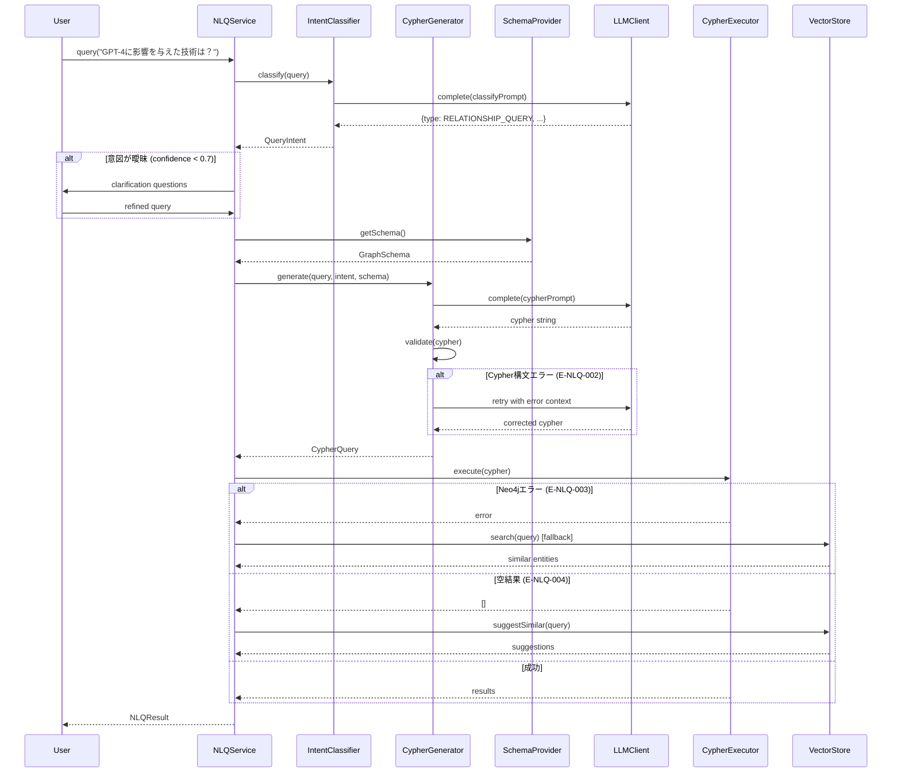
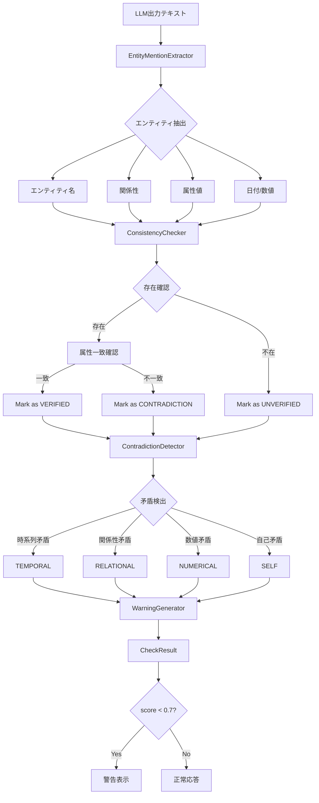
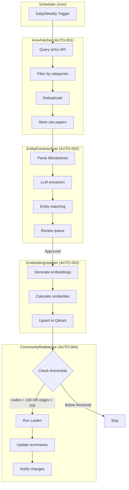
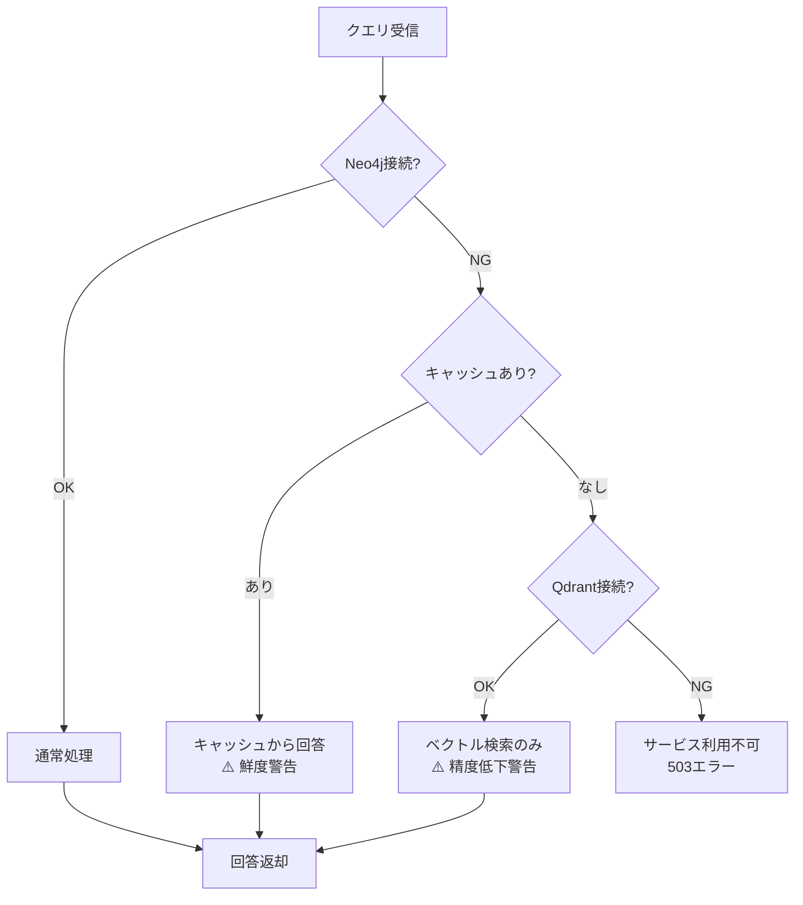

# 設計書: Phase 2 - GraphRAG強化・MCP統合・可視化

**Document ID**: DES-002
**Version**: 1.0
**Created**: 2025-12-29
**Status**: Draft
**Related Requirements**: REQ-002

---

## 1. C4 アーキテクチャ設計

### 1.1 C4 Level 1: System Context Diagram（Phase 2拡張）

```
┌─────────────────────────────────────────────────────────────────────────────┐
│                         System Context (Phase 2)                             │
└─────────────────────────────────────────────────────────────────────────────┘

    ┌──────────────┐    ┌──────────────┐    ┌──────────────┐    ┌──────────────┐
    │   AI Agent   │    │  Developer   │    │  Researcher  │    │   Browser    │
    │  (Claude,    │    │  (CLI User)  │    │  (API User)  │    │    User      │
    │   GPT)       │    │              │    │              │    │  (VIS)       │
    └──────┬───────┘    └──────┬───────┘    └──────┬───────┘    └──────┬───────┘
           │ MCP                │ CLI               │ REST API          │ HTTP
           │ + NLQ              │                   │                   │
           ▼                    ▼                   ▼                   ▼
    ┌─────────────────────────────────────────────────────────────────────────┐
    │                                                                         │
    │                        YAGOKORO System (Phase 2)                        │
    │                                                                         │
    │   Phase 1: 知識グラフ構築・検索・マルチホップ推論・MCP                    │
    │   Phase 2: 自然言語クエリ・CoT推論・ハルシネーション検出・可視化           │
    │                                                                         │
    └──────────────────────────────┬──────────────────────────────────────────┘
                                   │
           ┌───────────────────────┼───────────────────────┐
           │                       │                       │
           ▼                       ▼                       ▼
    ┌──────────────┐        ┌──────────────┐        ┌──────────────┐
    │   Ollama     │        │   Neo4j      │        │   Qdrant     │
    │   (Local)    │        │   Database   │        │   Vector     │
    │              │        │              │        │   Store      │
    │  qwen2.5:7b  │        │  Graph +     │        │              │
    │  bge-m3      │        │  Community   │        │  Semantic    │
    └──────────────┘        └──────────────┘        └──────────────┘
           │
           ▼ (Optional)
    ┌──────────────┐        ┌──────────────┐
    │   OpenAI     │        │   arXiv      │
    │   API        │        │   API        │
    │  gpt-4o      │        │  (AUTO)      │
    └──────────────┘        └──────────────┘
```

### 1.2 C4 Level 2: Container Diagram（Phase 2拡張）

```
┌─────────────────────────────────────────────────────────────────────────────┐
│                        YAGOKORO System (Phase 2)                             │
└─────────────────────────────────────────────────────────────────────────────┘

┌─────────────────────────────────────────────────────────────────────────────┐
│  Presentation Layer (Phase 2 NEW)                                            │
│  ┌─────────────────────────────────────────────────────────────────┐        │
│  │                    yagokoro-visualization                        │        │
│  │                      [React + D3.js]                             │        │
│  │                                                                  │        │
│  │  - Interactive Graph View (VIS-001)                             │        │
│  │  - Timeline View (VIS-002)                                      │        │
│  │  - Filter Panel (VIS-003)                                       │        │
│  │  - Detail Panel (VIS-004)                                       │        │
│  └──────────────────────────┬───────────────────────────────────────┘        │
│                             │ HTTP/REST                                      │
└─────────────────────────────┼────────────────────────────────────────────────┘
                              │
┌─────────────────────────────┼────────────────────────────────────────────────┐
│  Interface Layer                                                             │
│  ┌─────────────────────────┐    ┌─────────────────────────┐                 │
│  │      libs/cli           │    │      libs/mcp           │                 │
│  │    [TypeScript]         │    │    [TypeScript]         │                 │
│  │                         │    │                         │                 │
│  │  CLI Commands           │    │  MCP Server             │                 │
│  │  + ask (NLQ) NEW        │    │  + askNaturalLanguage   │                 │
│  │                         │    │  + explainReasoning     │                 │
│  │                         │    │  + checkHallucination   │                 │
│  │                         │    │  + getTimeline          │                 │
│  │                         │    │  + compareEntities      │                 │
│  └──────────────┬──────────┘    └──────────────┬──────────┘                 │
│                 │                              │                             │
│  ┌──────────────┴──────────────────────────────┴──────────────┐             │
│  │                     libs/api (NEW)                          │             │
│  │                    [Hono + Zod]                             │             │
│  │                                                             │             │
│  │  REST API Endpoints (API-001):                              │             │
│  │  - GET  /api/v1/entities, /entities/{id}                   │             │
│  │  - GET  /api/v1/query (NLQ)                                │             │
│  │  - GET  /api/v1/path                                       │             │
│  │  - GET  /api/v1/communities                                │             │
│  │  - POST /api/v1/entities                                   │             │
│  └─────────────────────────────────────────────────────────────┘             │
│                             │                                                │
└─────────────────────────────┼────────────────────────────────────────────────┘
                              │
┌─────────────────────────────┼────────────────────────────────────────────────┐
│  Application Layer (Phase 2 Extensions)                                      │
│                             │                                                │
│  ┌──────────────────────────┴───────────────────────────────────┐           │
│  │                      libs/graphrag                            │           │
│  │                      [TypeScript]                             │           │
│  │                                                               │           │
│  │  Phase 1 (既存):                                              │           │
│  │  - EntityExtractor, RelationExtractor                        │           │
│  │  - MultiHopReasoner, HybridSearchEngine                      │           │
│  │  - CommunityDetector, LocalQueryEngine, GlobalQueryEngine    │           │
│  │                                                               │           │
│  │  Phase 2 (追加):                                              │           │
│  │  - reasoning/CoTGenerator      (GGR-001)                     │           │
│  │  - reasoning/EvidenceTracker   (GGR-002, GGR-003)           │           │
│  └──────────────────────────────────────────────────────────────┘           │
│                                                                              │
│  ┌─────────────────────────────┐    ┌─────────────────────────────┐         │
│  │      libs/nlq (NEW)         │    │   libs/hallucination (NEW)  │         │
│  │      [TypeScript]           │    │      [TypeScript]           │         │
│  │                             │    │                             │         │
│  │  - CypherGenerator          │    │  - ConsistencyChecker       │         │
│  │    (NLQ-001)                │    │    (HAL-001)                │         │
│  │  - IntentClassifier         │    │  - ContradictionDetector    │         │
│  │    (NLQ-002)                │    │    (HAL-002)                │         │
│  │  - QueryRefiner             │    │  - RealtimeWarner           │         │
│  │    (NLQ-003)                │    │    (HAL-003)                │         │
│  └─────────────────────────────┘    └─────────────────────────────┘         │
│                                                                              │
│  ┌─────────────────────────────┐                                            │
│  │      libs/automation (NEW)  │                                            │
│  │      [TypeScript]           │                                            │
│  │                             │                                            │
│  │  - ArxivFetcher (AUTO-001)  │                                            │
│  │  - EntityExtractorAuto      │                                            │
│  │    (AUTO-002)               │                                            │
│  │  - EmbeddingUpdater         │                                            │
│  │    (AUTO-003)               │                                            │
│  │  - CommunityRedetector      │                                            │
│  │    (AUTO-004)               │                                            │
│  └─────────────────────────────┘                                            │
│                                                                              │
└──────────────────────────────────────────────────────────────────────────────┘
                              │
┌─────────────────────────────┼────────────────────────────────────────────────┐
│  Domain Layer                                                                │
│  ┌──────────────────────────┴───────────────────────────────────┐           │
│  │                      libs/domain                              │           │
│  │                      [TypeScript]                             │           │
│  │                                                               │           │
│  │  Entities: AIModel, Organization, Technique, Publication,    │           │
│  │            Person, Concept, Benchmark, Community             │           │
│  │                                                               │           │
│  │  Value Objects: Embedding, Confidence, QueryIntent (NEW)     │           │
│  │                                                               │           │
│  │  Ports: EntityRepository, VectorStore, LLMClient,           │           │
│  │         CypherExecutor (NEW)                                 │           │
│  └──────────────────────────────────────────────────────────────┘           │
│                                                                              │
└──────────────────────────────────────────────────────────────────────────────┘
                              │
┌─────────────────────────────┼────────────────────────────────────────────────┐
│  Infrastructure Layer                                                        │
│  ┌────────────────────┐  ┌────────────────────┐  ┌────────────────────┐     │
│  │    libs/neo4j      │  │   libs/vector      │  │   libs/llm (NEW)   │     │
│  │   [TypeScript]     │  │   [TypeScript]     │  │   [TypeScript]     │     │
│  │                    │  │                    │  │                    │     │
│  │  Neo4j Repos       │  │  Qdrant Adapter    │  │  - OllamaClient    │     │
│  │  + CypherExecutor  │  │                    │  │  - OpenAIClient    │     │
│  │    (NEW)           │  │                    │  │  - LLMRouter       │     │
│  └─────────┬──────────┘  └─────────┬──────────┘  └─────────┬──────────┘     │
│            │                       │                       │                 │
└────────────┼───────────────────────┼───────────────────────┼─────────────────┘
             │                       │                       │
             ▼                       ▼                       ▼
      ┌──────────────┐        ┌──────────────┐        ┌──────────────┐
      │   Neo4j      │        │   Qdrant     │        │   Ollama /   │
      │   5.26.0     │        │   v1.13.2    │        │   OpenAI     │
      └──────────────┘        └──────────────┘        └──────────────┘
```

### 1.3 C4 Level 3: Component Diagram - libs/nlq

```
┌─────────────────────────────────────────────────────────────────────────────┐
│                              libs/nlq                                        │
│                    Natural Language Query Library                            │
└─────────────────────────────────────────────────────────────────────────────┘

┌─────────────────────────────────────────────────────────────────────────────┐
│  Public API (index.ts)                                                       │
│  ┌─────────────────────────────────────────────────────────────────┐        │
│  │  export { NLQService, CypherGenerator, IntentClassifier }       │        │
│  │  export type { NLQResult, QueryIntent, CypherQuery }            │        │
│  └─────────────────────────────────────────────────────────────────┘        │
└─────────────────────────────────────────────────────────────────────────────┘
                              │
                              ▼
┌─────────────────────────────────────────────────────────────────────────────┐
│  Core Components                                                             │
│                                                                              │
│  ┌─────────────────────────────┐    ┌─────────────────────────────┐         │
│  │      NLQService             │    │     IntentClassifier        │         │
│  │                             │    │                             │         │
│  │  + query(nl: string):       │    │  + classify(query: string): │         │
│  │      Promise<NLQResult>     │    │      Promise<QueryIntent>   │         │
│  │  + setLanguage(lang)        │    │  + getConfidence(): number  │         │
│  │  + enableFallback(bool)     │◄───│  + isAmbiguous(): boolean   │         │
│  │                             │    │                             │         │
│  │  Dependencies:              │    │  Intents:                   │         │
│  │  - IntentClassifier         │    │  - ENTITY_LOOKUP            │         │
│  │  - CypherGenerator          │    │  - RELATIONSHIP_QUERY       │         │
│  │  - QueryRefiner             │    │  - PATH_FINDING             │         │
│  │  - CypherExecutor (port)    │    │  - AGGREGATION              │         │
│  │  - VectorStore (port)       │    │  - GLOBAL_SUMMARY           │         │
│  └──────────────┬──────────────┘    │  - COMPARISON               │         │
│                 │                    └─────────────────────────────┘         │
│                 │                                                            │
│                 ▼                                                            │
│  ┌─────────────────────────────┐    ┌─────────────────────────────┐         │
│  │     CypherGenerator         │    │      QueryRefiner           │         │
│  │                             │    │                             │         │
│  │  + generate(query, intent,  │    │  + refine(query, context):  │         │
│  │      schema): CypherQuery   │    │      Promise<RefinedQuery>  │         │
│  │  + validate(cypher): bool   │    │  + suggestClarifications(): │         │
│  │  + retry(error): CypherQuery│    │      string[]               │         │
│  │                             │    │  + isComplete(): boolean    │         │
│  │  Uses:                      │    │                             │         │
│  │  - SchemaProvider           │    │  Max Turns: 3               │         │
│  │  - LLMClient (port)         │    │                             │         │
│  │  - PromptTemplates          │    │                             │         │
│  └─────────────────────────────┘    └─────────────────────────────┘         │
│                                                                              │
└─────────────────────────────────────────────────────────────────────────────┘
                              │
                              ▼
┌─────────────────────────────────────────────────────────────────────────────┐
│  Support Components                                                          │
│                                                                              │
│  ┌─────────────────────────────┐    ┌─────────────────────────────┐         │
│  │     SchemaProvider          │    │     PromptTemplates         │         │
│  │                             │    │                             │         │
│  │  + getSchema(): GraphSchema │    │  + getCypherPrompt(intent)  │         │
│  │  + getNodeLabels(): string[]│    │  + getClassifyPrompt()      │         │
│  │  + getRelTypes(): string[]  │    │  + getRefinePrompt()        │         │
│  │  + refreshCache(): void     │    │                             │         │
│  │                             │    │  Templates:                 │         │
│  │  Cache TTL: 1 hour          │    │  - prompts/cypher-gen.md    │         │
│  │                             │    │  - prompts/intent-class.md  │         │
│  └─────────────────────────────┘    └─────────────────────────────┘         │
│                                                                              │
│  ┌─────────────────────────────┐                                            │
│  │     ErrorHandler            │                                            │
│  │                             │                                            │
│  │  Error Codes:               │                                            │
│  │  - E-NLQ-001: LLM Timeout   │                                            │
│  │  - E-NLQ-002: Syntax Error  │                                            │
│  │  - E-NLQ-003: Neo4j Error   │                                            │
│  │  - E-NLQ-004: Empty Result  │                                            │
│  │  - E-NLQ-005: Schema Fail   │                                            │
│  │                             │                                            │
│  │  + handle(error): Fallback  │                                            │
│  │  + suggestAlternatives()    │                                            │
│  └─────────────────────────────┘                                            │
│                                                                              │
└─────────────────────────────────────────────────────────────────────────────┘
                              │
                              ▼
┌─────────────────────────────────────────────────────────────────────────────┐
│  Ports (Interfaces) - Dependency Injection                                   │
│                                                                              │
│  ┌─────────────────────┐  ┌─────────────────────┐  ┌─────────────────────┐  │
│  │  LLMClient          │  │  CypherExecutor     │  │  VectorStore        │  │
│  │  (from libs/domain) │  │  (from libs/domain) │  │  (from libs/domain) │  │
│  │                     │  │                     │  │                     │  │
│  │  + complete()       │  │  + execute(cypher)  │  │  + search(query)    │  │
│  │  + embed()          │  │  + validate()       │  │  + getSimilar()     │  │
│  └─────────────────────┘  └─────────────────────┘  └─────────────────────┘  │
│                                                                              │
└─────────────────────────────────────────────────────────────────────────────┘
```

### 1.4 C4 Level 3: Component Diagram - libs/hallucination

```
┌─────────────────────────────────────────────────────────────────────────────┐
│                          libs/hallucination                                  │
│                   Hallucination Detection Library                            │
└─────────────────────────────────────────────────────────────────────────────┘

┌─────────────────────────────────────────────────────────────────────────────┐
│  Public API (index.ts)                                                       │
│  ┌─────────────────────────────────────────────────────────────────┐        │
│  │  export { HallucinationService, ConsistencyChecker }            │        │
│  │  export type { CheckResult, Contradiction, Warning }            │        │
│  └─────────────────────────────────────────────────────────────────┘        │
└─────────────────────────────────────────────────────────────────────────────┘
                              │
                              ▼
┌─────────────────────────────────────────────────────────────────────────────┐
│  Core Components                                                             │
│                                                                              │
│  ┌─────────────────────────────────────────────────────────────────┐        │
│  │                    HallucinationService                          │        │
│  │                                                                  │        │
│  │  + check(text: string, context: GraphContext):                  │        │
│  │      Promise<CheckResult>                                        │        │
│  │  + getWarnings(): Warning[]                                     │        │
│  │  + setThreshold(score: number): void                            │        │
│  │                                                                  │        │
│  │  Orchestrates:                                                   │        │
│  │  1. EntityMentionExtractor                                       │        │
│  │  2. ConsistencyChecker                                           │        │
│  │  3. ContradictionDetector                                        │        │
│  │  4. WarningGenerator                                             │        │
│  └──────────────────────────────────────────────────────────────────┘        │
│                              │                                               │
│         ┌────────────────────┼────────────────────┐                         │
│         ▼                    ▼                    ▼                         │
│  ┌─────────────────┐  ┌─────────────────┐  ┌─────────────────┐              │
│  │ EntityMention   │  │ Consistency     │  │ Contradiction   │              │
│  │ Extractor       │  │ Checker         │  │ Detector        │              │
│  │                 │  │                 │  │                 │              │
│  │ + extract(text) │  │ + check(        │  │ + detect(text): │              │
│  │   : Mention[]   │  │     mentions,   │  │   Contradiction │              │
│  │                 │  │     graph):     │  │     []          │              │
│  │ Extracts:       │  │   Consistency   │  │                 │              │
│  │ - Entity names  │  │     Result      │  │ Types:          │              │
│  │ - Relations     │  │                 │  │ - TEMPORAL      │              │
│  │ - Attributes    │  │ Checks:         │  │ - RELATIONAL    │              │
│  │ - Dates/Numbers │  │ - Existence     │  │ - NUMERICAL     │              │
│  │                 │  │ - Attributes    │  │ - SELF          │              │
│  │                 │  │ - Relations     │  │                 │              │
│  │                 │  │ - Temporal      │  │ Severity:       │              │
│  └─────────────────┘  └─────────────────┘  │ - LOW/MED/HIGH  │              │
│                                             └─────────────────┘              │
│                                                                              │
│  ┌─────────────────────────────────────────────────────────────────┐        │
│  │                    WarningGenerator                              │        │
│  │                                                                  │        │
│  │  + generate(checkResult): Warning[]                             │        │
│  │  + formatForUI(): UIWarning[]                                   │        │
│  │  + formatForAPI(): APIWarning[]                                 │        │
│  │                                                                  │        │
│  │  Warning Levels:                                                 │        │
│  │  - INFO:    score >= 0.7                                        │        │
│  │  - WARNING: score >= 0.5 && score < 0.7                         │        │
│  │  - ERROR:   score < 0.5                                         │        │
│  │                                                                  │        │
│  │  Includes: "グラフで確認" link generation                        │        │
│  └─────────────────────────────────────────────────────────────────┘        │
│                                                                              │
└─────────────────────────────────────────────────────────────────────────────┘
                              │
                              ▼
┌─────────────────────────────────────────────────────────────────────────────┐
│  Ports (Interfaces)                                                          │
│                                                                              │
│  ┌─────────────────────┐  ┌─────────────────────┐                           │
│  │  GraphQueryPort     │  │  LLMClient          │                           │
│  │                     │  │                     │                           │
│  │  + findEntity()     │  │  + extractMentions()│                           │
│  │  + findRelation()   │  │                     │                           │
│  │  + getAttribute()   │  │                     │                           │
│  └─────────────────────┘  └─────────────────────┘                           │
│                                                                              │
└─────────────────────────────────────────────────────────────────────────────┘
```

### 1.5 C4 Level 3: Component Diagram - libs/graphrag/reasoning

```
┌─────────────────────────────────────────────────────────────────────────────┐
│                     libs/graphrag/reasoning (Phase 2 追加)                   │
│                       Graph-Guided Reasoning Module                          │
└─────────────────────────────────────────────────────────────────────────────┘

┌─────────────────────────────────────────────────────────────────────────────┐
│  Public API                                                                  │
│  ┌─────────────────────────────────────────────────────────────────┐        │
│  │  export { CoTGenerator, EvidenceTracker, ConfidenceScorer }     │        │
│  │  export type { CoTExplanation, Evidence, ConfidenceScore }      │        │
│  └─────────────────────────────────────────────────────────────────┘        │
└─────────────────────────────────────────────────────────────────────────────┘
                              │
                              ▼
┌─────────────────────────────────────────────────────────────────────────────┐
│  Core Components                                                             │
│                                                                              │
│  ┌─────────────────────────────────────────────────────────────────┐        │
│  │                      CoTGenerator                                │        │
│  │                                                                  │        │
│  │  + generate(path: GraphPath): Promise<CoTExplanation>           │        │
│  │  + setLanguage(lang: 'ja' | 'en'): void                         │        │
│  │  + formatAsMarkdown(): string                                   │        │
│  │  + formatAsJSON(): object                                       │        │
│  │                                                                  │        │
│  │  Input:                                                          │        │
│  │  ┌──────────────────────────────────────────────────────────┐   │        │
│  │  │ GraphPath:                                                │   │        │
│  │  │   GPT-4 ─[USES]─> Transformer ─[INTRODUCED_BY]─>         │   │        │
│  │  │   "Attention Is All You Need" ─[INFLUENCED]─> BERT       │   │        │
│  │  └──────────────────────────────────────────────────────────┘   │        │
│  │                                                                  │        │
│  │  Output:                                                         │        │
│  │  ┌──────────────────────────────────────────────────────────┐   │        │
│  │  │ CoTExplanation:                                           │   │        │
│  │  │   steps: [                                                │   │        │
│  │  │     { text: "GPT-4はTransformerを使用", evidence: ... }, │   │        │
│  │  │     { text: "Transformerは2017年に導入", evidence: ... },│   │        │
│  │  │     { text: "BERTに影響を与えた", evidence: ... }        │   │        │
│  │  │   ]                                                       │   │        │
│  │  │   conclusion: "GPT-4とBERTは同じ技術的祖先を持つ"         │   │        │
│  │  └──────────────────────────────────────────────────────────┘   │        │
│  └─────────────────────────────────────────────────────────────────┘        │
│                                                                              │
│  ┌─────────────────────────────┐    ┌─────────────────────────────┐         │
│  │     EvidenceTracker         │    │    ConfidenceScorer         │         │
│  │                             │    │                             │         │
│  │  + track(step): Evidence    │    │  + score(path, evidence):   │         │
│  │  + getSourceDoc(): Doc      │    │      ConfidenceScore        │         │
│  │  + markInferred(): void     │    │                             │         │
│  │                             │    │  Dimensions:                │         │
│  │  Evidence Types:            │    │  - graphCoverage: 0-1       │         │
│  │  - GRAPH_EDGE (verified)    │    │  - pathConfidence: 0-1      │         │
│  │  - GRAPH_ATTR (verified)    │    │  - recency: 0-1             │         │
│  │  - INFERRED (推測)          │    │  - sourceQuality: 0-1       │         │
│  │  - EXTERNAL (外部参照)      │    │  - consensus: 0-1           │         │
│  │                             │    │                             │         │
│  └─────────────────────────────┘    │  overall = weighted_avg()   │         │
│                                      └─────────────────────────────┘         │
│                                                                              │
└─────────────────────────────────────────────────────────────────────────────┘
```

### 1.6 C4 Level 3: Component Diagram - libs/visualization

```
┌─────────────────────────────────────────────────────────────────────────────┐
│                         libs/visualization                                   │
│                    Interactive Graph Visualization                           │
└─────────────────────────────────────────────────────────────────────────────┘

┌─────────────────────────────────────────────────────────────────────────────┐
│  React Components                                                            │
│                                                                              │
│  ┌────────────────────────────────────────────────────────────────┐         │
│  │                      <GraphExplorer />                          │         │
│  │                       (Main Container)                          │         │
│  │  ┌────────────────────────────────────────────────────────┐    │         │
│  │  │  State: nodes, edges, selectedNode, filters, viewMode  │    │         │
│  │  └────────────────────────────────────────────────────────┘    │         │
│  └────────────────────────────────────────────────────────────────┘         │
│                              │                                               │
│         ┌────────────────────┼────────────────────┐                         │
│         ▼                    ▼                    ▼                         │
│  ┌─────────────────┐  ┌─────────────────┐  ┌─────────────────┐              │
│  │ <GraphCanvas /> │  │ <FilterPanel /> │  │ <DetailPanel /> │              │
│  │   (VIS-001)     │  │   (VIS-003)     │  │   (VIS-004)     │              │
│  │                 │  │                 │  │                 │              │
│  │ Props:          │  │ Props:          │  │ Props:          │              │
│  │ - nodes         │  │ - nodeTypes     │  │ - selectedNode  │              │
│  │ - edges         │  │ - relTypes      │  │ - onNavigate    │              │
│  │ - onNodeClick   │  │ - timeRange     │  │                 │              │
│  │ - onZoom        │  │ - onFilter      │  │ Sections:       │              │
│  │                 │  │                 │  │ - Properties    │              │
│  │ Uses: D3.js     │  │ Filters:        │  │ - Relations     │              │
│  │ or Cytoscape.js │  │ - AND/OR        │  │ - Sources       │              │
│  │                 │  │ - Save/Load     │  │ - Community     │              │
│  └─────────────────┘  └─────────────────┘  └─────────────────┘              │
│                                                                              │
│  ┌─────────────────────────────────────────────────────────────────┐        │
│  │                    <TimelineView /> (VIS-002)                    │        │
│  │                                                                  │        │
│  │  Props: entities, timeRange, categories, onSelect               │        │
│  │                                                                  │        │
│  │  ┌──────────────────────────────────────────────────────────┐   │        │
│  │  │  2017 ──●── Transformer                                   │   │        │
│  │  │         │                                                 │   │        │
│  │  │  2018 ──●── BERT ──●── GPT-1                              │   │        │
│  │  │         │          │                                      │   │        │
│  │  │  2019 ──●── GPT-2 ─┴── T5                                 │   │        │
│  │  │         │                                                 │   │        │
│  │  │  2020 ──●── GPT-3                                         │   │        │
│  │  │         │                                                 │   │        │
│  │  │  2022 ──●── ChatGPT                                       │   │        │
│  │  │         │                                                 │   │        │
│  │  │  2023 ──●── GPT-4                                         │   │        │
│  │  └──────────────────────────────────────────────────────────┘   │        │
│  │                                                                  │        │
│  │  Features:                                                       │        │
│  │  - Category Lanes (AIModel, Technique, Publication)             │        │
│  │  - Relation Lines between entities                              │        │
│  │  - Animation playback                                           │        │
│  └─────────────────────────────────────────────────────────────────┘        │
│                                                                              │
└─────────────────────────────────────────────────────────────────────────────┘
                              │
                              ▼
┌─────────────────────────────────────────────────────────────────────────────┐
│  Data Layer                                                                  │
│                                                                              │
│  ┌─────────────────────────────────────────────────────────────────┐        │
│  │                      GraphDataService                            │        │
│  │                                                                  │        │
│  │  + fetchNodes(filter): Promise<Node[]>                          │        │
│  │  + fetchEdges(nodeIds): Promise<Edge[]>                         │        │
│  │  + fetchTimeline(range): Promise<TimelineData>                  │        │
│  │  + fetchEntityDetail(id): Promise<EntityDetail>                 │        │
│  │                                                                  │        │
│  │  Uses: REST API (libs/api)                                      │        │
│  └─────────────────────────────────────────────────────────────────┘        │
│                                                                              │
└─────────────────────────────────────────────────────────────────────────────┘
```

---

## 2. 詳細設計

### 2.1 NLQ機能 詳細設計 (DES-002-NLQ)

#### 2.1.1 クラス図

```typescript
// libs/nlq/src/types.ts

/** クエリ意図の種類 */
export type QueryIntentType =
  | 'ENTITY_LOOKUP'      // 特定エンティティ検索
  | 'RELATIONSHIP_QUERY' // 関係性探索
  | 'PATH_FINDING'       // パス検索
  | 'AGGREGATION'        // 集計クエリ
  | 'GLOBAL_SUMMARY'     // 全体要約
  | 'COMPARISON';        // 比較クエリ

/** 意図分類結果 */
export interface QueryIntent {
  type: QueryIntentType;
  confidence: number;      // 0.0 - 1.0
  entities: string[];      // 検出されたエンティティ名
  relations?: string[];    // 検出された関係タイプ
  isAmbiguous: boolean;
}

/** Cypherクエリ結果 */
export interface CypherQuery {
  cypher: string;
  parameters: Record<string, unknown>;
  intent: QueryIntentType;
  generatedAt: Date;
}

/** NLQサービス結果 */
export interface NLQResult {
  success: boolean;
  data?: unknown[];
  cypher?: CypherQuery;
  error?: NLQError;
  fallbackUsed: boolean;
  executionTimeMs: number;
}

/** エラー定義 */
export type NLQErrorCode =
  | 'E-NLQ-001'  // LLMタイムアウト
  | 'E-NLQ-002'  // Cypher構文エラー
  | 'E-NLQ-003'  // Neo4j実行エラー
  | 'E-NLQ-004'  // 空結果
  | 'E-NLQ-005'; // スキーマ取得失敗

export interface NLQError {
  code: NLQErrorCode;
  message: string;
  details?: unknown;
  suggestions?: string[];
}
```

#### 2.1.2 シーケンス図 - 自然言語クエリ処理



#### 2.1.3 プロンプトテンプレート設計

```markdown
# prompts/cypher-generation.md

## System Prompt

あなたはNeo4jグラフデータベースの専門家です。
ユーザーの自然言語クエリをCypherクエリに変換してください。

## Schema Context

以下のノードラベルとリレーションタイプが存在します：

### ノードラベル
{{nodeLabels}}

### リレーションタイプ
{{relationTypes}}

### プロパティ例
{{sampleProperties}}

## Rules

1. 存在するラベルとリレーションタイプのみを使用すること
2. パラメータ化されたクエリを生成すること（$paramName形式）
3. LIMIT句を必ず含めること（デフォルト: 100）
4. 日本語のエンティティ名は英語に変換して検索すること
5. 大文字小文字を区別しない検索にはtoLower()を使用

## Output Format

```json
{
  "cypher": "MATCH (n:Label)-[r:REL]->(m) WHERE ... RETURN ...",
  "parameters": { "param1": "value1" },
  "explanation": "このクエリは..."
}
```

## User Query

{{userQuery}}

## Query Intent

{{queryIntent}}
```

### 2.2 GGR機能 詳細設計 (DES-002-GGR)

#### 2.2.1 CoT生成アルゴリズム

```typescript
// libs/graphrag/src/reasoning/cot-generator.ts

export interface CoTStep {
  stepNumber: number;
  text: string;
  evidence: Evidence;
  edgeInfo: {
    source: string;
    relation: string;
    target: string;
  };
}

export interface CoTExplanation {
  steps: CoTStep[];
  conclusion: string;
  language: 'ja' | 'en';
  confidence: ConfidenceScore;
  generatedAt: Date;
}

export class CoTGenerator {
  constructor(
    private llmClient: LLMClient,
    private evidenceTracker: EvidenceTracker
  ) {}

  async generate(path: GraphPath): Promise<CoTExplanation> {
    const language = this.detectLanguage(path.query);
    const steps: CoTStep[] = [];
    
    // 1. パスの各エッジを説明文に変換
    for (let i = 0; i < path.edges.length; i++) {
      const edge = path.edges[i];
      const evidence = this.evidenceTracker.track(edge);
      
      const stepText = await this.generateStepText(
        edge, 
        language,
        i + 1,
        path.edges.length
      );
      
      steps.push({
        stepNumber: i + 1,
        text: stepText,
        evidence,
        edgeInfo: {
          source: edge.source.name,
          relation: edge.type,
          target: edge.target.name
        }
      });
    }
    
    // 2. 結論を生成
    const conclusion = await this.generateConclusion(
      path.query,
      steps,
      language
    );
    
    // 3. 信頼度スコアを計算
    const confidence = this.calculateConfidence(steps);
    
    return {
      steps,
      conclusion,
      language,
      confidence,
      generatedAt: new Date()
    };
  }
  
  private async generateStepText(
    edge: GraphEdge,
    language: 'ja' | 'en',
    stepNum: number,
    totalSteps: number
  ): Promise<string> {
    const prompt = this.buildStepPrompt(edge, language, stepNum, totalSteps);
    return this.llmClient.complete(prompt, { temperature: 0.3 });
  }
}
```

#### 2.2.2 信頼度スコアリング

```typescript
// libs/graphrag/src/reasoning/confidence-scorer.ts

export interface ConfidenceScore {
  graphCoverage: number;   // グラフデータによるカバー率
  pathConfidence: number;  // パス全体の確からしさ
  recency: number;         // 情報の新しさ
  sourceQuality: number;   // ソース文書の信頼性
  consensus: number;       // 複数パスによる裏付け
  overall: number;         // 総合スコア
}

export class ConfidenceScorer {
  private weights = {
    graphCoverage: 0.25,
    pathConfidence: 0.25,
    recency: 0.15,
    sourceQuality: 0.20,
    consensus: 0.15
  };
  
  score(path: GraphPath, evidences: Evidence[]): ConfidenceScore {
    const graphCoverage = this.calculateGraphCoverage(path, evidences);
    const pathConfidence = this.calculatePathConfidence(path);
    const recency = this.calculateRecency(path);
    const sourceQuality = this.calculateSourceQuality(evidences);
    const consensus = this.calculateConsensus(path);
    
    const overall = 
      this.weights.graphCoverage * graphCoverage +
      this.weights.pathConfidence * pathConfidence +
      this.weights.recency * recency +
      this.weights.sourceQuality * sourceQuality +
      this.weights.consensus * consensus;
    
    return {
      graphCoverage,
      pathConfidence,
      recency,
      sourceQuality,
      consensus,
      overall: Math.round(overall * 100) / 100
    };
  }
  
  private calculateGraphCoverage(path: GraphPath, evidences: Evidence[]): number {
    const verifiedCount = evidences.filter(
      e => e.type === 'GRAPH_EDGE' || e.type === 'GRAPH_ATTR'
    ).length;
    return verifiedCount / evidences.length;
  }
  
  private calculateRecency(path: GraphPath): number {
    const currentYear = new Date().getFullYear();
    const avgYear = path.nodes.reduce((sum, node) => {
      const year = node.properties.year || currentYear - 5;
      return sum + year;
    }, 0) / path.nodes.length;
    
    // 5年以内なら1.0、10年以上前なら0.5
    const yearsOld = currentYear - avgYear;
    return Math.max(0.5, 1 - (yearsOld / 10));
  }
}
```

### 2.3 HAL機能 詳細設計 (DES-002-HAL)

#### 2.3.1 整合性チェックフロー



#### 2.3.2 矛盾検出ルール

```typescript
// libs/hallucination/src/contradiction-detector.ts

export type ContradictionType = 
  | 'TEMPORAL'    // 時系列矛盾
  | 'RELATIONAL'  // 関係性矛盾
  | 'NUMERICAL'   // 数値矛盾
  | 'SELF';       // 自己矛盾

export type Severity = 'LOW' | 'MEDIUM' | 'HIGH';

export interface Contradiction {
  type: ContradictionType;
  severity: Severity;
  claimed: string;       // LLMが主張した内容
  actual: string;        // グラフ上の実際の値
  location: {            // テキスト内の位置
    start: number;
    end: number;
  };
  suggestion: string;    // 修正提案
}

export class ContradictionDetector {
  private rules: ContradictionRule[] = [
    // 時系列ルール
    {
      type: 'TEMPORAL',
      detect: (mention, graph) => {
        if (mention.year && graph.year) {
          if (Math.abs(mention.year - graph.year) > 1) {
            return {
              severity: this.getTemporalSeverity(mention.year, graph.year),
              claimed: `${mention.year}年`,
              actual: `${graph.year}年`
            };
          }
        }
        return null;
      }
    },
    
    // 関係性ルール
    {
      type: 'RELATIONAL',
      detect: (mention, graph) => {
        if (mention.organization && graph.organization) {
          if (mention.organization !== graph.organization) {
            return {
              severity: 'HIGH',
              claimed: mention.organization,
              actual: graph.organization
            };
          }
        }
        return null;
      }
    },
    
    // 数値ルール
    {
      type: 'NUMERICAL',
      detect: (mention, graph) => {
        if (mention.parameterCount && graph.parameterCount) {
          const ratio = mention.parameterCount / graph.parameterCount;
          if (ratio < 0.5 || ratio > 2.0) {
            return {
              severity: 'MEDIUM',
              claimed: this.formatNumber(mention.parameterCount),
              actual: this.formatNumber(graph.parameterCount)
            };
          }
        }
        return null;
      }
    }
  ];
  
  detect(text: string, mentions: Mention[], graphData: GraphData): Contradiction[] {
    const contradictions: Contradiction[] = [];
    
    for (const mention of mentions) {
      const graphEntity = graphData.findEntity(mention.name);
      if (!graphEntity) continue;
      
      for (const rule of this.rules) {
        const result = rule.detect(mention, graphEntity);
        if (result) {
          contradictions.push({
            type: rule.type,
            ...result,
            location: mention.location,
            suggestion: this.generateSuggestion(rule.type, result)
          });
        }
      }
    }
    
    // 自己矛盾チェック
    contradictions.push(...this.detectSelfContradictions(text, mentions));
    
    return contradictions;
  }
}
```

### 2.4 VIS機能 詳細設計 (DES-002-VIS)

#### 2.4.1 Reactコンポーネント階層

```
<App>
└── <GraphExplorer>
    ├── <Toolbar>
    │   ├── <ViewToggle />       (Graph/Timeline切替)
    │   ├── <SearchBar />        (キーワード検索)
    │   └── <ExportButton />     (PNG/SVG/JSON出力)
    │
    ├── <MainView>
    │   ├── <GraphCanvas />      (VIS-001: D3.js/Cytoscape)
    │   │   ├── <NodeRenderer />
    │   │   ├── <EdgeRenderer />
    │   │   └── <LabelRenderer />
    │   │
    │   └── <TimelineView />     (VIS-002)
    │       ├── <TimeAxis />
    │       ├── <CategoryLane />
    │       └── <EntityMarker />
    │
    ├── <Sidebar>
    │   ├── <FilterPanel />      (VIS-003)
    │   │   ├── <NodeTypeFilter />
    │   │   ├── <RelationTypeFilter />
    │   │   ├── <TimeRangeSlider />
    │   │   └── <SavedFilters />
    │   │
    │   └── <DetailPanel />      (VIS-004)
    │       ├── <EntityHeader />
    │       ├── <PropertyList />
    │       ├── <RelationList />
    │       └── <SourceList />
    │
    └── <StatusBar>
        ├── <NodeCount />
        ├── <EdgeCount />
        └── <LoadingIndicator />
```

#### 2.4.2 状態管理設計（Zustand）

```typescript
// libs/visualization/src/store/graph-store.ts

import { create } from 'zustand';

interface GraphNode {
  id: string;
  label: string;
  type: string;
  properties: Record<string, unknown>;
  x?: number;
  y?: number;
}

interface GraphEdge {
  id: string;
  source: string;
  target: string;
  type: string;
  properties: Record<string, unknown>;
}

interface FilterState {
  nodeTypes: string[];
  relationTypes: string[];
  timeRange: [number, number];
  searchQuery: string;
  organizations: string[];
}

interface GraphState {
  // データ
  nodes: GraphNode[];
  edges: GraphEdge[];
  selectedNodeId: string | null;
  hoveredNodeId: string | null;
  
  // フィルタ
  filters: FilterState;
  
  // ビュー
  viewMode: 'graph' | 'timeline';
  zoom: number;
  pan: { x: number; y: number };
  
  // ローディング
  isLoading: boolean;
  error: string | null;
  
  // アクション
  setNodes: (nodes: GraphNode[]) => void;
  setEdges: (edges: GraphEdge[]) => void;
  selectNode: (id: string | null) => void;
  hoverNode: (id: string | null) => void;
  setFilter: (filter: Partial<FilterState>) => void;
  resetFilters: () => void;
  setViewMode: (mode: 'graph' | 'timeline') => void;
  setZoom: (zoom: number) => void;
  setPan: (pan: { x: number; y: number }) => void;
  fetchData: (filter: FilterState) => Promise<void>;
}

export const useGraphStore = create<GraphState>((set, get) => ({
  nodes: [],
  edges: [],
  selectedNodeId: null,
  hoveredNodeId: null,
  filters: {
    nodeTypes: [],
    relationTypes: [],
    timeRange: [2015, 2025],
    searchQuery: '',
    organizations: []
  },
  viewMode: 'graph',
  zoom: 1,
  pan: { x: 0, y: 0 },
  isLoading: false,
  error: null,
  
  setNodes: (nodes) => set({ nodes }),
  setEdges: (edges) => set({ edges }),
  selectNode: (id) => set({ selectedNodeId: id }),
  hoverNode: (id) => set({ hoveredNodeId: id }),
  setFilter: (filter) => set((state) => ({
    filters: { ...state.filters, ...filter }
  })),
  resetFilters: () => set({
    filters: {
      nodeTypes: [],
      relationTypes: [],
      timeRange: [2015, 2025],
      searchQuery: '',
      organizations: []
    }
  }),
  setViewMode: (mode) => set({ viewMode: mode }),
  setZoom: (zoom) => set({ zoom }),
  setPan: (pan) => set({ pan }),
  
  fetchData: async (filter) => {
    set({ isLoading: true, error: null });
    try {
      const response = await fetch('/api/v1/graph', {
        method: 'POST',
        body: JSON.stringify(filter)
      });
      const data = await response.json();
      set({ nodes: data.nodes, edges: data.edges, isLoading: false });
    } catch (error) {
      set({ error: (error as Error).message, isLoading: false });
    }
  }
}));
```

#### 2.4.3 パフォーマンス最適化

```typescript
// libs/visualization/src/components/GraphCanvas.tsx

import { useCallback, useMemo, useRef, useEffect } from 'react';
import * as d3 from 'd3';
import { useGraphStore } from '../store/graph-store';

// 1000ノード以上の場合のWebGL描画
const WEBGL_THRESHOLD = 1000;

export function GraphCanvas() {
  const canvasRef = useRef<HTMLCanvasElement>(null);
  const { nodes, edges, zoom, pan } = useGraphStore();
  
  // ノード位置のメモ化
  const nodePositions = useMemo(() => {
    const simulation = d3.forceSimulation(nodes)
      .force('link', d3.forceLink(edges).id((d: any) => d.id))
      .force('charge', d3.forceManyBody().strength(-100))
      .force('center', d3.forceCenter(400, 300));
    
    // 100回シミュレーションを実行
    for (let i = 0; i < 100; i++) simulation.tick();
    
    return new Map(nodes.map(n => [n.id, { x: n.x!, y: n.y! }]));
  }, [nodes, edges]);
  
  // 可視ノードのフィルタリング（ビューポート内のみ）
  const visibleNodes = useMemo(() => {
    const viewportBounds = {
      minX: -pan.x / zoom,
      maxX: (-pan.x + window.innerWidth) / zoom,
      minY: -pan.y / zoom,
      maxY: (-pan.y + window.innerHeight) / zoom
    };
    
    return nodes.filter(node => {
      const pos = nodePositions.get(node.id);
      if (!pos) return false;
      return (
        pos.x >= viewportBounds.minX - 50 &&
        pos.x <= viewportBounds.maxX + 50 &&
        pos.y >= viewportBounds.minY - 50 &&
        pos.y <= viewportBounds.maxY + 50
      );
    });
  }, [nodes, nodePositions, zoom, pan]);
  
  // WebGL/Canvas描画の切り替え
  const renderMethod = nodes.length > WEBGL_THRESHOLD ? 'webgl' : 'canvas';
  
  useEffect(() => {
    if (renderMethod === 'webgl') {
      // WebGL描画（Pixi.jsなど）
      renderWithWebGL(canvasRef.current!, visibleNodes, edges, zoom, pan);
    } else {
      // Canvas 2D描画
      renderWithCanvas(canvasRef.current!, visibleNodes, edges, zoom, pan);
    }
  }, [visibleNodes, edges, zoom, pan, renderMethod]);
  
  return (
    <canvas 
      ref={canvasRef} 
      width={window.innerWidth} 
      height={window.innerHeight}
      style={{ cursor: 'grab' }}
    />
  );
}
```

### 2.5 AUTO機能 詳細設計 (DES-002-AUTO)

#### 2.5.1 自動更新パイプライン



#### 2.5.2 arXiv API クライアント

```typescript
// libs/automation/src/arxiv-fetcher.ts

export interface ArxivPaper {
  id: string;
  title: string;
  abstract: string;
  authors: string[];
  categories: string[];
  published: Date;
  updated: Date;
  pdfUrl: string;
}

export interface FetchOptions {
  categories: string[];      // cs.AI, cs.CL, cs.LG
  maxResults: number;        // default: 100
  sortBy: 'relevance' | 'lastUpdatedDate' | 'submittedDate';
  sortOrder: 'ascending' | 'descending';
  startDate?: Date;
  endDate?: Date;
}

export class ArxivFetcher {
  private baseUrl = 'http://export.arxiv.org/api/query';
  private rateLimitMs = 3000; // 3秒間隔
  
  async fetch(options: FetchOptions): Promise<ArxivPaper[]> {
    const query = this.buildQuery(options);
    const papers: ArxivPaper[] = [];
    let start = 0;
    
    while (start < options.maxResults) {
      const url = `${this.baseUrl}?${query}&start=${start}&max_results=100`;
      
      const response = await fetch(url);
      const xml = await response.text();
      const batch = this.parseResponse(xml);
      
      if (batch.length === 0) break;
      papers.push(...batch);
      start += 100;
      
      // レート制限
      await this.sleep(this.rateLimitMs);
    }
    
    return this.deduplicate(papers);
  }
  
  private buildQuery(options: FetchOptions): string {
    const categoryQuery = options.categories
      .map(cat => `cat:${cat}`)
      .join('+OR+');
    
    const params = new URLSearchParams({
      search_query: categoryQuery,
      sortBy: options.sortBy,
      sortOrder: options.sortOrder
    });
    
    return params.toString();
  }
  
  private deduplicate(papers: ArxivPaper[]): ArxivPaper[] {
    const seen = new Set<string>();
    return papers.filter(paper => {
      if (seen.has(paper.id)) return false;
      seen.add(paper.id);
      return true;
    });
  }
}
```

### 2.6 API設計 (DES-002-API)

#### 2.6.1 REST API エンドポイント

```typescript
// libs/api/src/routes.ts

import { Hono } from 'hono';
import { z } from 'zod';
import { zValidator } from '@hono/zod-validator';

const app = new Hono();

// === Entities ===

// GET /api/v1/entities
const listEntitiesSchema = z.object({
  type: z.string().optional(),
  limit: z.coerce.number().default(100),
  offset: z.coerce.number().default(0),
  search: z.string().optional()
});

app.get('/api/v1/entities', 
  zValidator('query', listEntitiesSchema),
  async (c) => {
    const { type, limit, offset, search } = c.req.valid('query');
    // Implementation
  }
);

// GET /api/v1/entities/:id
app.get('/api/v1/entities/:id', async (c) => {
  const id = c.req.param('id');
  // Implementation
});

// === Natural Language Query ===

// GET /api/v1/query
const querySchema = z.object({
  q: z.string().min(1),
  lang: z.enum(['ja', 'en']).default('ja'),
  fallback: z.coerce.boolean().default(true)
});

app.get('/api/v1/query',
  zValidator('query', querySchema),
  async (c) => {
    const { q, lang, fallback } = c.req.valid('query');
    // NLQService.query(q, { lang, fallback })
  }
);

// === Path Finding ===

// GET /api/v1/path
const pathSchema = z.object({
  from: z.string(),
  to: z.string(),
  maxHops: z.coerce.number().default(4)
});

app.get('/api/v1/path',
  zValidator('query', pathSchema),
  async (c) => {
    const { from, to, maxHops } = c.req.valid('query');
    // MultiHopReasoner.findPath(from, to, maxHops)
  }
);

// === Communities ===

// GET /api/v1/communities
app.get('/api/v1/communities', async (c) => {
  // CommunityRepository.findAll()
});

// GET /api/v1/communities/:id
app.get('/api/v1/communities/:id', async (c) => {
  const id = c.req.param('id');
  // CommunityRepository.findById(id)
});

// === Graph Data (for Visualization) ===

// POST /api/v1/graph
const graphSchema = z.object({
  nodeTypes: z.array(z.string()).optional(),
  relationTypes: z.array(z.string()).optional(),
  timeRange: z.tuple([z.number(), z.number()]).optional(),
  limit: z.number().default(500)
});

app.post('/api/v1/graph',
  zValidator('json', graphSchema),
  async (c) => {
    const filter = c.req.valid('json');
    // GraphQueryService.getSubgraph(filter)
  }
);

// === Hallucination Check ===

// POST /api/v1/check-hallucination
const checkSchema = z.object({
  text: z.string(),
  entityIds: z.array(z.string()).optional()
});

app.post('/api/v1/check-hallucination',
  zValidator('json', checkSchema),
  async (c) => {
    const { text, entityIds } = c.req.valid('json');
    // HallucinationService.check(text, entityIds)
  }
);

export default app;
```

#### 2.6.2 OpenAPI 仕様（抜粋）

```yaml
# openapi.yaml
openapi: 3.0.3
info:
  title: YAGOKORO API
  version: 2.0.0
  description: GraphRAG Knowledge Graph API

servers:
  - url: http://localhost:3000
    description: Development

paths:
  /api/v1/query:
    get:
      summary: Natural Language Query
      operationId: queryNaturalLanguage
      tags: [Query]
      parameters:
        - name: q
          in: query
          required: true
          schema:
            type: string
          description: Natural language query
        - name: lang
          in: query
          schema:
            type: string
            enum: [ja, en]
            default: ja
        - name: fallback
          in: query
          schema:
            type: boolean
            default: true
      responses:
        '200':
          description: Query result
          content:
            application/json:
              schema:
                $ref: '#/components/schemas/NLQResult'
        '400':
          $ref: '#/components/responses/BadRequest'
        '500':
          $ref: '#/components/responses/InternalError'

components:
  schemas:
    NLQResult:
      type: object
      properties:
        success:
          type: boolean
        data:
          type: array
          items:
            type: object
        cypher:
          type: string
        fallbackUsed:
          type: boolean
        executionTimeMs:
          type: number
        error:
          $ref: '#/components/schemas/NLQError'
    
    NLQError:
      type: object
      properties:
        code:
          type: string
          enum: [E-NLQ-001, E-NLQ-002, E-NLQ-003, E-NLQ-004, E-NLQ-005]
        message:
          type: string
        suggestions:
          type: array
          items:
            type: string

  responses:
    BadRequest:
      description: Bad Request
      content:
        application/json:
          schema:
            type: object
            properties:
              error:
                type: string
              details:
                type: array
                items:
                  type: object
    
    InternalError:
      description: Internal Server Error
      content:
        application/json:
          schema:
            type: object
            properties:
              error:
                type: string

  securitySchemes:
    ApiKeyAuth:
      type: apiKey
      in: header
      name: X-API-Key

security:
  - ApiKeyAuth: []
```

### 2.7 MCP Server拡張設計 (DES-002-MCP)

#### 2.7.1 新規ツール定義

```typescript
// libs/mcp/src/tools/query-tool.ts

import { z } from 'zod';
import { Tool } from '@modelcontextprotocol/sdk/types.js';
import { NLQService } from '@yagokoro/nlq';

export const queryToolSchema = z.object({
  query: z.string().describe('自然言語の質問文'),
  lang: z.enum(['ja', 'en']).default('ja').describe('クエリ言語'),
  includeEvidence: z.boolean().default(true).describe('根拠情報を含めるか')
});

export type QueryToolInput = z.infer<typeof queryToolSchema>;

export const queryTool: Tool = {
  name: 'query',
  description: '自然言語でGraphRAGナレッジグラフに問い合わせます。AIモデル、論文、人物、組織などの情報を検索できます。',
  inputSchema: {
    type: 'object',
    properties: {
      query: {
        type: 'string',
        description: '自然言語の質問文（例: "Transformerを開発した研究者は誰？"）'
      },
      lang: {
        type: 'string',
        enum: ['ja', 'en'],
        default: 'ja',
        description: 'クエリ言語'
      },
      includeEvidence: {
        type: 'boolean',
        default: true,
        description: '根拠情報（引用元、信頼度スコア）を含めるか'
      }
    },
    required: ['query']
  }
};

export async function handleQueryTool(
  input: QueryToolInput,
  nlqService: NLQService
): Promise<string> {
  const result = await nlqService.query(input.query, {
    lang: input.lang,
    fallback: true
  });
  
  if (!result.success) {
    return JSON.stringify({
      error: result.error?.code,
      message: result.error?.message,
      suggestions: result.error?.suggestions
    }, null, 2);
  }
  
  const response = {
    answer: result.data,
    ...(input.includeEvidence && {
      evidence: {
        cypher: result.cypher,
        fallbackUsed: result.fallbackUsed,
        executionTimeMs: result.executionTimeMs
      }
    })
  };
  
  return JSON.stringify(response, null, 2);
}
```

#### 2.7.2 ハルシネーションチェックツール

```typescript
// libs/mcp/src/tools/check-hallucination-tool.ts

import { z } from 'zod';
import { Tool } from '@modelcontextprotocol/sdk/types.js';
import { HallucinationService } from '@yagokoro/hallucination';

export const checkHallucinationSchema = z.object({
  text: z.string().describe('検証するテキスト'),
  entityHints: z.array(z.string()).optional().describe('検証対象のエンティティ名ヒント')
});

export type CheckHallucinationInput = z.infer<typeof checkHallucinationSchema>;

export const checkHallucinationTool: Tool = {
  name: 'check_hallucination',
  description: 'テキスト内のAI関連の主張をナレッジグラフと照合し、ハルシネーション（事実誤認）を検出します。',
  inputSchema: {
    type: 'object',
    properties: {
      text: {
        type: 'string',
        description: '検証するテキスト（例: "GPT-4はGoogleが2023年に発表した"）'
      },
      entityHints: {
        type: 'array',
        items: { type: 'string' },
        description: '検証対象のエンティティ名ヒント（任意）'
      }
    },
    required: ['text']
  }
};

export async function handleCheckHallucinationTool(
  input: CheckHallucinationInput,
  hallucinationService: HallucinationService
): Promise<string> {
  const result = await hallucinationService.check(
    input.text,
    input.entityHints
  );
  
  return JSON.stringify({
    isReliable: result.warnings.length === 0,
    warnings: result.warnings.map(w => ({
      type: w.type,
      message: w.message,
      severity: w.severity,
      suggestion: w.suggestion
    })),
    verifiedFacts: result.verifiedFacts,
    unverifiedClaims: result.unverifiedClaims
  }, null, 2);
}
```

#### 2.7.3 MCP Server統合

```typescript
// libs/mcp/src/server/server.ts への追加

import { queryTool, handleQueryTool } from '../tools/query-tool.js';
import { checkHallucinationTool, handleCheckHallucinationTool } from '../tools/check-hallucination-tool.js';

// ツール登録
server.setRequestHandler(ListToolsRequestSchema, async () => {
  return {
    tools: [
      // 既存ツール...
      queryTool,
      checkHallucinationTool
    ]
  };
});

// ツールハンドラー
server.setRequestHandler(CallToolRequestSchema, async (request) => {
  switch (request.params.name) {
    case 'query':
      return {
        content: [{
          type: 'text',
          text: await handleQueryTool(
            request.params.arguments as QueryToolInput,
            nlqService
          )
        }]
      };
    
    case 'check_hallucination':
      return {
        content: [{
          type: 'text',
          text: await handleCheckHallucinationTool(
            request.params.arguments as CheckHallucinationInput,
            hallucinationService
          )
        }]
      };
    
    // 既存ケース...
  }
});
```

---

### 2.8 エラーリカバリー戦略 (DES-002-ERR)

#### 2.8.1 障害パターンとリカバリー

| コンポーネント | 障害タイプ | 検出方法 | リカバリー戦略 | フォールバック |
|---------------|-----------|----------|---------------|---------------|
| **NLQService** | LLMタイムアウト | 30秒超過 | 3回リトライ（指数バックオフ） | キャッシュ結果 or ベクトル検索 |
| **NLQService** | Cypher構文エラー | Neo4j例外 | プロンプト修正して再生成 | エラーメッセージ + サジェスト |
| **Neo4j** | 接続断 | ConnectionError | 3回リトライ + Circuit Breaker | 読み取り専用モード（キャッシュ） |
| **Qdrant** | 接続断 | ConnectionError | 3回リトライ | グラフのみで回答（精度低下警告） |
| **Ollama** | モデル未起動 | 503エラー | 自動起動試行 | OpenAI切替（設定時） |
| **ArxivFetcher** | Rate Limit | 429エラー | 指数バックオフ（最大5分） | スキップしてログ記録 |
| **ArxivFetcher** | ネットワーク障害 | タイムアウト | 3回リトライ | 次回スケジュールで再試行 |

#### 2.8.2 Circuit Breaker実装

```typescript
// libs/graphrag/src/resilience/circuit-breaker.ts

export interface CircuitBreakerConfig {
  failureThreshold: number;     // 障害閾値（デフォルト: 5）
  recoveryTimeout: number;      // 回復待機時間ms（デフォルト: 30000）
  monitoringWindow: number;     // 監視窓ms（デフォルト: 60000）
}

export type CircuitState = 'CLOSED' | 'OPEN' | 'HALF_OPEN';

export class CircuitBreaker {
  private state: CircuitState = 'CLOSED';
  private failureCount = 0;
  private lastFailureTime = 0;
  private successCount = 0;
  
  constructor(
    private readonly name: string,
    private readonly config: CircuitBreakerConfig = {
      failureThreshold: 5,
      recoveryTimeout: 30000,
      monitoringWindow: 60000
    }
  ) {}
  
  async execute<T>(operation: () => Promise<T>): Promise<T> {
    if (this.state === 'OPEN') {
      if (Date.now() - this.lastFailureTime > this.config.recoveryTimeout) {
        this.state = 'HALF_OPEN';
        this.successCount = 0;
      } else {
        throw new CircuitOpenError(this.name);
      }
    }
    
    try {
      const result = await operation();
      this.onSuccess();
      return result;
    } catch (error) {
      this.onFailure();
      throw error;
    }
  }
  
  private onSuccess(): void {
    if (this.state === 'HALF_OPEN') {
      this.successCount++;
      if (this.successCount >= 3) {
        this.state = 'CLOSED';
        this.failureCount = 0;
      }
    } else {
      this.failureCount = 0;
    }
  }
  
  private onFailure(): void {
    this.failureCount++;
    this.lastFailureTime = Date.now();
    
    if (this.failureCount >= this.config.failureThreshold) {
      this.state = 'OPEN';
    }
  }
  
  getState(): CircuitState {
    return this.state;
  }
}

export class CircuitOpenError extends Error {
  constructor(circuitName: string) {
    super(`Circuit breaker '${circuitName}' is OPEN`);
    this.name = 'CircuitOpenError';
  }
}
```

#### 2.8.3 リトライ戦略

```typescript
// libs/graphrag/src/resilience/retry.ts

export interface RetryConfig {
  maxRetries: number;           // 最大リトライ回数
  baseDelay: number;            // 基本待機時間ms
  maxDelay: number;             // 最大待機時間ms
  backoffMultiplier: number;    // バックオフ乗数
}

export const DEFAULT_RETRY_CONFIG: RetryConfig = {
  maxRetries: 3,
  baseDelay: 1000,
  maxDelay: 30000,
  backoffMultiplier: 2
};

export async function withRetry<T>(
  operation: () => Promise<T>,
  config: RetryConfig = DEFAULT_RETRY_CONFIG,
  shouldRetry: (error: unknown) => boolean = () => true
): Promise<T> {
  let lastError: unknown;
  
  for (let attempt = 0; attempt <= config.maxRetries; attempt++) {
    try {
      return await operation();
    } catch (error) {
      lastError = error;
      
      if (attempt === config.maxRetries || !shouldRetry(error)) {
        throw error;
      }
      
      const delay = Math.min(
        config.baseDelay * Math.pow(config.backoffMultiplier, attempt),
        config.maxDelay
      );
      
      await sleep(delay);
    }
  }
  
  throw lastError;
}

function sleep(ms: number): Promise<void> {
  return new Promise(resolve => setTimeout(resolve, ms));
}
```

#### 2.8.4 グレースフルデグラデーション



---

## 3. Architecture Decision Records (ADR)

### ADR-005: NLQ用LLMプロバイダー選定

**Status**: Accepted
**Date**: 2025-12-29
**Related**: REQ-002-NLQ-001

#### Context
自然言語クエリからCypherへの変換に使用するLLMを選定する必要がある。

#### Decision
**デフォルト: Ollama (qwen2.5:7b)**、**オプション: OpenAI (gpt-4o)** のデュアル構成を採用。

#### Rationale
| 候補 | 長所 | 短所 | 採用 |
|------|------|------|------|
| Ollama qwen2.5:7b | ローカル実行、無料、プライバシー保護 | 精度がやや劣る | ✅ デフォルト |
| OpenAI gpt-4o | 高精度、最新 | コスト、API依存 | ✅ オプション |
| Claude 3.5 | 高精度、長文対応 | コスト | × |
| Llama 3.1 70B | 高精度、OSS | リソース要求大 | × |

#### Consequences
- 環境変数 `YAGOKORO_LLM_PROVIDER` でプロバイダー切替
- OpenAI使用時は `OPENAI_API_KEY` が必要
- 精度重視の場合のみOpenAI推奨

---

### ADR-006: 可視化ライブラリ選定

**Status**: Accepted
**Date**: 2025-12-29
**Related**: REQ-002-VIS-001

#### Context
インタラクティブなグラフ可視化のためのライブラリを選定する必要がある。

#### Decision
**D3.js** を主軸とし、大規模グラフには **Cytoscape.js** のWebGL拡張を併用。

#### Rationale
| 候補 | 長所 | 短所 | 採用 |
|------|------|------|------|
| D3.js | 柔軟性、豊富なドキュメント | 学習コスト | ✅ 主軸 |
| Cytoscape.js | グラフ特化、WebGL対応 | カスタマイズ制限 | ✅ 大規模用 |
| Vis.js | シンプル | 開発停滞 | × |
| G6 (AntV) | 高機能 | 中国語ドキュメント | × |
| React Flow | React統合 | グラフ特化でない | × |

#### Consequences
- 1000ノード未満: D3.js (SVG)
- 1000ノード以上: Cytoscape.js (WebGL)
- タイムラインビューは D3.js で独自実装

---

### ADR-007: REST APIフレームワーク選定

**Status**: Accepted
**Date**: 2025-12-29
**Related**: REQ-002-API-001

#### Context
REST API提供のためのWebフレームワークを選定する必要がある。

#### Decision
**Hono** を採用する。

#### Rationale
| 候補 | 長所 | 短所 | 採用 |
|------|------|------|------|
| Hono | 超軽量、高速、TypeScript | 新しい | ✅ |
| Express | 成熟、エコシステム | 古い設計、遅い | × |
| Fastify | 高速、プラグイン豊富 | 複雑 | × |
| Koa | シンプル | ミドルウェア手動 | × |

#### Consequences
- Zodとの統合が容易 (`@hono/zod-validator`)
- Edge Runtime対応で将来的にCloudflare Workers移行可能
- 学習コストは低い

---

### ADR-008: 状態管理ライブラリ選定

**Status**: Accepted
**Date**: 2025-12-29
**Related**: REQ-002-VIS

#### Context
可視化コンポーネントの状態管理ライブラリを選定する必要がある。

#### Decision
**Zustand** を採用する。

#### Rationale
| 候補 | 長所 | 短所 | 採用 |
|------|------|------|------|
| Zustand | シンプル、軽量、TypeScript | 大規模向きでない | ✅ |
| Redux Toolkit | 成熟、DevTools | ボイラープレート | × |
| Jotai | 原子的、React向け | 学習コスト | × |
| Recoil | Facebook製 | 開発停滞 | × |

#### Consequences
- シンプルなAPI、学習コスト低
- Immerとの統合でイミュータブル更新が容易
- 必要に応じてRedux Toolkit移行可能

---

## 4. データモデル拡張

### 4.1 新規Value Objects

```typescript
// libs/domain/src/value-objects/query-intent.ts

import { z } from 'zod';

export const QueryIntentSchema = z.object({
  type: z.enum([
    'ENTITY_LOOKUP',
    'RELATIONSHIP_QUERY',
    'PATH_FINDING',
    'AGGREGATION',
    'GLOBAL_SUMMARY',
    'COMPARISON'
  ]),
  confidence: z.number().min(0).max(1),
  entities: z.array(z.string()),
  relations: z.array(z.string()).optional(),
  isAmbiguous: z.boolean()
});

export type QueryIntent = z.infer<typeof QueryIntentSchema>;

// libs/domain/src/value-objects/confidence-score.ts

export const ConfidenceScoreSchema = z.object({
  graphCoverage: z.number().min(0).max(1),
  pathConfidence: z.number().min(0).max(1),
  recency: z.number().min(0).max(1),
  sourceQuality: z.number().min(0).max(1),
  consensus: z.number().min(0).max(1),
  overall: z.number().min(0).max(1)
});

export type ConfidenceScore = z.infer<typeof ConfidenceScoreSchema>;

// libs/domain/src/value-objects/evidence.ts

export const EvidenceSchema = z.object({
  type: z.enum(['GRAPH_EDGE', 'GRAPH_ATTR', 'INFERRED', 'EXTERNAL']),
  source: z.string(),
  confidence: z.number().min(0).max(1),
  details: z.record(z.unknown()).optional()
});

export type Evidence = z.infer<typeof EvidenceSchema>;
```

### 4.2 新規Ports（インターフェース）

```typescript
// libs/domain/src/ports/cypher-executor.ts

export interface CypherExecutor {
  execute<T>(cypher: string, parameters?: Record<string, unknown>): Promise<T[]>;
  validate(cypher: string): Promise<boolean>;
  getSchema(): Promise<GraphSchema>;
}

export interface GraphSchema {
  nodeLabels: string[];
  relationTypes: string[];
  propertyKeys: Record<string, string[]>;
}

// libs/domain/src/ports/llm-client.ts

export interface LLMClient {
  complete(prompt: string, options?: CompletionOptions): Promise<string>;
  embed(text: string): Promise<number[]>;
  embedBatch(texts: string[]): Promise<number[][]>;
}

export interface CompletionOptions {
  temperature?: number;
  maxTokens?: number;
  stopSequences?: string[];
}
```

---

## 5. ディレクトリ構造（Phase 2追加）

```
libs/
├── nlq/                          # NEW: 自然言語クエリ
│   ├── src/
│   │   ├── index.ts              # Public exports
│   │   ├── nlq-service.ts        # Main orchestrator
│   │   ├── cypher-generator.ts   # NLQ→Cypher変換
│   │   ├── intent-classifier.ts  # 意図分類
│   │   ├── query-refiner.ts      # 対話的精緻化
│   │   ├── schema-provider.ts    # スキーマキャッシュ
│   │   ├── error-handler.ts      # エラー処理
│   │   └── types.ts              # 型定義
│   ├── test/
│   │   ├── nlq-service.test.ts
│   │   ├── cypher-generator.test.ts
│   │   └── intent-classifier.test.ts
│   ├── package.json
│   └── tsconfig.json
│
├── hallucination/                # NEW: ハルシネーション検出
│   ├── src/
│   │   ├── index.ts
│   │   ├── hallucination-service.ts
│   │   ├── entity-mention-extractor.ts
│   │   ├── consistency-checker.ts
│   │   ├── contradiction-detector.ts
│   │   ├── warning-generator.ts
│   │   └── types.ts
│   ├── test/
│   ├── package.json
│   └── tsconfig.json
│
├── visualization/                # NEW: 可視化UI
│   ├── src/
│   │   ├── index.ts
│   │   ├── components/
│   │   │   ├── GraphExplorer.tsx
│   │   │   ├── GraphCanvas.tsx
│   │   │   ├── TimelineView.tsx
│   │   │   ├── FilterPanel.tsx
│   │   │   └── DetailPanel.tsx
│   │   ├── store/
│   │   │   └── graph-store.ts
│   │   ├── hooks/
│   │   │   ├── useGraphData.ts
│   │   │   └── useFilters.ts
│   │   └── utils/
│   │       ├── layout.ts
│   │       └── colors.ts
│   ├── test/
│   ├── package.json
│   └── tsconfig.json
│
├── automation/                   # NEW: 自動更新
│   ├── src/
│   │   ├── index.ts
│   │   ├── arxiv-fetcher.ts
│   │   ├── entity-extractor-auto.ts
│   │   ├── embedding-updater.ts
│   │   ├── community-redetector.ts
│   │   └── scheduler.ts
│   ├── test/
│   ├── package.json
│   └── tsconfig.json
│
├── api/                          # NEW: REST API
│   ├── src/
│   │   ├── index.ts
│   │   ├── routes.ts
│   │   ├── middleware/
│   │   │   ├── auth.ts
│   │   │   ├── rate-limit.ts
│   │   │   └── error-handler.ts
│   │   └── openapi.yaml
│   ├── test/
│   ├── package.json
│   └── tsconfig.json
│
├── graphrag/                     # EXTENDED
│   ├── src/
│   │   ├── reasoning/
│   │   │   ├── cot-generator.ts      # NEW
│   │   │   ├── evidence-tracker.ts   # NEW
│   │   │   └── confidence-scorer.ts  # NEW
│   │   └── ...
│
└── domain/                       # EXTENDED
    ├── src/
    │   ├── value-objects/
    │   │   ├── query-intent.ts       # NEW
    │   │   ├── confidence-score.ts   # NEW
    │   │   └── evidence.ts           # NEW
    │   ├── ports/
    │   │   ├── cypher-executor.ts    # NEW
    │   │   └── ...
    │   └── ...

prompts/                          # NEW: プロンプトテンプレート
├── cypher-generation.md
├── intent-classification.md
├── cot-generation.md
└── entity-extraction.md

data/
├── eval/                         # NEW: 評価データ
│   ├── nlq-test-queries.json
│   └── intent-classification.json
└── perf/                         # NEW: パフォーマンステスト
    └── load-test-data.json
```

---

## 6. 要件トレーサビリティ

| 要件ID | 設計セクション | 主要コンポーネント |
|--------|---------------|-------------------|
| REQ-002-NLQ-001 | 2.1, 1.3 | NLQService, CypherGenerator |
| REQ-002-NLQ-002 | 2.1 | IntentClassifier |
| REQ-002-NLQ-003 | 2.1 | QueryRefiner |
| REQ-002-GGR-001 | 2.2, 1.5 | CoTGenerator |
| REQ-002-GGR-002 | 2.2 | EvidenceTracker |
| REQ-002-GGR-003 | 2.2 | ConfidenceScorer |
| REQ-002-HAL-001 | 2.3, 1.4 | ConsistencyChecker |
| REQ-002-HAL-002 | 2.3 | ContradictionDetector |
| REQ-002-HAL-003 | 2.3 | WarningGenerator |
| REQ-002-VIS-001 | 2.4, 1.6 | GraphCanvas |
| REQ-002-VIS-002 | 2.4 | TimelineView |
| REQ-002-VIS-003 | 2.4 | FilterPanel |
| REQ-002-VIS-004 | 2.4 | DetailPanel |
| REQ-002-AUTO-001 | 2.5 | ArxivFetcher |
| REQ-002-AUTO-002 | 2.5 | EntityExtractorAuto |
| REQ-002-AUTO-003 | 2.5 | EmbeddingUpdater |
| REQ-002-AUTO-004 | 2.5 | CommunityRedetector |
| REQ-002-API-001 | 2.6 | REST API (Hono) |
| REQ-002-API-002 | 2.7 | MCP Tools (query, check_hallucination) |

---

## 7. 改訂履歴

| バージョン | 日付 | 変更内容 | 著者 |
|-----------|------|----------|------|
| 1.0 | 2025-12-29 | 初版作成 | YAGOKORO Team |
| 1.1 | 2025-12-29 | M-1修正: MCP Server拡張設計追加（セクション2.7）、M-2修正: エラーリカバリー戦略追加（セクション2.8） | YAGOKORO Team |

---

## 8. 参照文書

- [REQ-002-phase2-enhancements.md](REQ-002-phase2-enhancements.md) - Phase 2要件定義
- [DES-001-genai-graphrag-system.md](DES-001-genai-graphrag-system.md) - Phase 1設計書
- [constitution.md](../steering/rules/constitution.md) - 憲法（Article I準拠）
```

