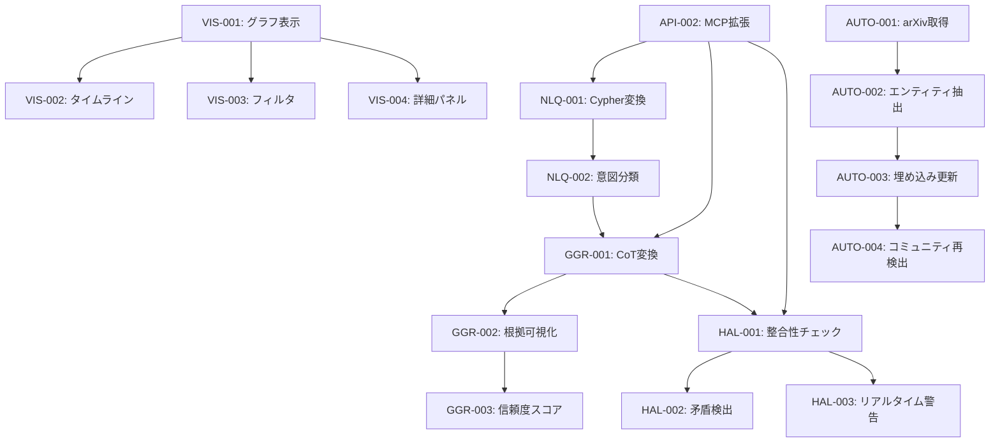

# 要件定義書: Phase 2 - GraphRAG強化・MCP統合・可視化

**Document ID**: REQ-002
**Version**: 1.1
**Created**: 2025-12-29
**Updated**: 2025-12-29
**Status**: Draft → Under Review
**Author**: YAGOKORO Development Team
**Derived From**: YAGOKORO GraphRAG研究分析結果 (2025-12-29)

---

## 1. 概要

### 1.1 目的

本要件定義書は、YAGOKORO GraphRAGシステムのPhase 2開発における要件を定義する。
GraphRAG研究分析により特定された開発機会に基づき、以下の強化領域を対象とする：

1. **MCP統合強化** - 自然言語クエリとAPIの実用化
2. **Graph-Guided Reasoning** - LLMとの深い統合
3. **可視化ダッシュボード** - インタラクティブな探索UI
4. **自動更新パイプライン** - 継続的なデータ更新

### 1.2 背景

Phase 1の実績（2025-12-29時点）：
- **3,580+ ノード**（Person: 1,985, Publication: 1,000, AIModel: 37, etc.）
- **6,839+ 関係性**（AUTHORED: 2,995, BELONGS_TO: 2,476, etc.）
- **11 コミュニティ**（Leidenアルゴリズムによる検出済み）
- **3,446+ ベクトル埋め込み**（bge-m3モデル使用）

研究分析により以下の開発機会を特定：
- MCPツール経由の実用的クエリ機能が未完成
- LLMとの深い統合（Chain-of-Thought、ハルシネーション検出）が未実装
- インタラクティブな可視化が不在
- 手動更新に依存、自動化なし

### 1.3 スコープ

**Phase 2A（本要件・高優先）**:
- MCP統合強化
- Graph-Guided Reasoning

**Phase 2B（本要件・中優先）**:
- 可視化ダッシュボード
- 自動更新パイプライン

**Phase 3以降（将来）**:
- Multimodal Safety & Alignment
- Agent + Federated Learning
- World Models + Embodied AI

### 1.4 ライブラリ構成（Article I準拠）

Phase 2で追加するライブラリ:

```
libs/
├── nlq/                    # 自然言語クエリ処理
│   ├── src/
│   │   ├── index.ts
│   │   ├── cypher-generator.ts      # Cypher変換
│   │   ├── intent-classifier.ts     # 意図分類
│   │   └── query-refiner.ts         # クエリ精緻化
│   ├── test/
│   └── package.json
├── hallucination/          # ハルシネーション検出
│   ├── src/
│   │   ├── index.ts
│   │   ├── consistency-checker.ts   # 整合性チェック
│   │   └── contradiction-detector.ts # 矛盾検出
│   ├── test/
│   └── package.json
└── visualization/          # 可視化コンポーネント
    ├── src/
    │   ├── index.ts
    │   ├── graph-renderer.ts        # グラフ描画
    │   ├── timeline-view.ts         # タイムライン
    │   └── filter-panel.ts          # フィルタUI
    ├── test/
    └── package.json

# 既存ライブラリの拡張
libs/graphrag/src/
├── reasoning/
│   ├── cot-generator.ts            # CoT変換（追加）
│   └── evidence-tracker.ts         # 根拠追跡（追加）
```

**依存関係**:
```
libs/nlq           ← libs/graphrag, libs/neo4j
libs/hallucination ← libs/graphrag, libs/neo4j, libs/domain
libs/visualization ← libs/graphrag (データ取得のみ)
```

### 1.5 要件ID命名規則

```
REQ-002-{カテゴリ}-{連番}

カテゴリ:
  NLQ  = Natural Language Query（自然言語クエリ）
  GGR  = Graph-Guided Reasoning（グラフ誘導推論）
  HAL  = Hallucination Detection（ハルシネーション検出）
  VIS  = Visualization（可視化）
  AUTO = Automation（自動化）
  API  = External API
  NFR  = Non-Functional Requirements（非機能要件）
```

### 1.6 優先度定義

| 優先度 | 定義 |
|--------|------|
| **Must** | Phase 2Aで必須。MVP機能 |
| **Should** | Phase 2Bで強く推奨 |
| **Could** | 望ましいが延期可能 |

### 1.7 要件間の依存関係



**実装順序**:
1. NLQ-001 → NLQ-002（自然言語基盤）
2. GGR-001 → GGR-002 → GGR-003（推論強化）
3. HAL-001 → HAL-002/HAL-003（ハルシネーション検出）
4. API-002（MCP統合）
5. VIS-001 → VIS-002/VIS-003/VIS-004（可視化）
6. AUTO-001 → AUTO-002 → AUTO-003 → AUTO-004（自動化）

---

## 2. ビジネス目標

### 2.1 Phase 2 目標

1. **実用性向上**: AI研究者が自然言語でAI系譜を探索可能にする
2. **信頼性向上**: 推論精度50%向上、ハルシネーション70%削減
3. **可視性向上**: インタラクティブなグラフ探索ツール提供
4. **持続性確保**: 最新AI研究の自動追跡と更新

### 2.2 成功指標

| 指標 | 現状 | Phase 2目標 |
|------|------|-------------|
| 自然言語クエリ成功率 | 0% | 80%+ |
| 推論パスの根拠付与率 | 0% | 90%+ |
| ハルシネーション検出率 | 0% | 70%+ |
| 平均クエリ応答時間 | N/A | < 3秒 |
| データ更新頻度 | 手動 | 週次自動 |

---

## 3. EARS形式要件定義

### 3.1 自然言語クエリ機能 (NLQ)

#### REQ-002-NLQ-001 自然言語からCypher変換（Event-driven）
**優先度**: Must

**要件**: WHEN ユーザーが自然言語でクエリを入力した時、システムはLLMを使用してCypherクエリに変換しNeo4jで実行SHALL。

**例**:
- Input: 「GPT-4に影響を与えた技術は何ですか？」
- Generated Cypher: `MATCH (m:AIModel {name: 'GPT-4'})-[:USES_TECHNIQUE]->(t:Technique) RETURN t`

**受入条件**:
- [ ] 自然言語入力からCypherクエリへの変換成功率 > 80%
- [ ] スキーマ情報をLLMコンテキストに含める
- [ ] 変換失敗時のフォールバック（ベクトル検索）を提供
- [ ] 変換されたCypherクエリをログ出力
- [ ] 変換時間 < 2秒（p95）

**エラーケース**:
| エラーコード | 状況 | 対応 |
|-------------|------|------|
| E-NLQ-001 | LLM応答タイムアウト（>5秒） | ベクトル検索にフォールバック |
| E-NLQ-002 | 生成Cypherの構文エラー | 再生成を最大2回試行、失敗時はベクトル検索 |
| E-NLQ-003 | Neo4j実行エラー | エラーメッセージをユーザーに返却 |
| E-NLQ-004 | 空結果 | 「該当データなし」+ 類似クエリ3件を提案 |
| E-NLQ-005 | スキーマ取得失敗 | キャッシュされたスキーマを使用 |

**評価データセット**:
- テストクエリ数: 200件以上
- カテゴリ分布: Entity(40%), Relationship(25%), Path(15%), Aggregation(10%), Global(10%)
- 日本語/英語: 50%/50%
- 格納場所: `data/eval/nlq-test-queries.json`

**LLMモデル設定**:
- デフォルト: Ollama qwen2.5:7b（ローカル）
- 高精度モード: OpenAI gpt-4o（オプション、API Key必要）
- モデル切替: 環境変数 `YAGOKORO_LLM_PROVIDER`

**トレーサビリティ**:
- テスト: TEST-002-NLQ-001-*
- 設計: DES-002-NLQ-001

---

#### REQ-002-NLQ-002 クエリ意図分類（Ubiquitous）
**優先度**: Must

**要件**: システムは、ユーザークエリを以下の意図カテゴリに分類SHALL：
- **Entity Lookup**: 特定エンティティの情報取得
- **Relationship Query**: 関係性の探索
- **Path Finding**: エンティティ間のパス検索
- **Aggregation**: 統計・集計クエリ
- **Global Summary**: データセット全体の要約
- **Comparison**: エンティティ間の比較

**受入条件**:
- [ ] 意図分類精度 > 85%
- [ ] 複合意図（複数カテゴリ該当）のサポート
- [ ] 分類結果に信頼度スコアを付与
- [ ] 未知意図の検出と適切なエラーメッセージ

**評価データセット**:
- ラベル付きクエリ: 300件以上
- 複合意図サンプル: 50件以上
- 格納場所: `data/eval/intent-classification.json`

**トレーサビリティ**:
- テスト: TEST-002-NLQ-002-*
- 設計: DES-002-NLQ-002

---

#### REQ-002-NLQ-003 対話的クエリ精緻化（Event-driven）
**優先度**: Should

**要件**: WHEN クエリが曖昧または不完全な時、システムは明確化のための質問を生成SHALL。

**例**:
- User: 「Transformerについて教えて」
- System: 「Transformerの何についてお知りになりたいですか？
  1. 技術的な仕組み
  2. 使用しているAIモデル
  3. 関連論文
  4. 発展の歴史」

**受入条件**:
- [ ] 曖昧クエリの検出率 > 70%
- [ ] 最大3回までの対話的精緻化
- [ ] ユーザーがスキップ可能（デフォルト回答を提供）
- [ ] 精緻化履歴の保持

**トレーサビリティ**:
- テスト: TEST-002-NLQ-003-*
- 設計: DES-002-NLQ-003

---

### 3.2 Graph-Guided Reasoning機能 (GGR)

#### REQ-002-GGR-001 グラフパスからChain-of-Thought変換（Event-driven）
**優先度**: Must

**要件**: WHEN マルチホップ推論を実行した時、システムはグラフパスをChain-of-Thought形式の説明に変換SHALL。

**例**:
```
Query: 「GPT-4とBERTの関係は？」

Graph Path:
GPT-4 -[USES_TECHNIQUE]-> Transformer -[INTRODUCED_BY]-> 
"Attention Is All You Need" -[INFLUENCED]-> BERT

Generated CoT:
1. GPT-4はTransformerアーキテクチャを使用しています。
2. Transformerは2017年の論文"Attention Is All You Need"で導入されました。
3. この論文のSelf-Attentionメカニズムは、BERTの開発に大きな影響を与えました。
4. 結論：GPT-4とBERTは共にTransformerアーキテクチャを基盤としており、
   同じ技術的祖先を持つ兄弟モデルと言えます。
```

**受入条件**:
- [ ] パスの各ステップに対応する説明文を生成
- [ ] 説明文にグラフエッジの根拠を埋め込み
- [ ] 日本語・英語両対応（言語自動検出）
- [ ] CoT生成時間 < 3秒（p95）

**多言語対応**:
- Phase 2対象: 日本語、英語
- Phase 3検討: 中国語、韓国語
- 言語検出: クエリ言語に応じて出力言語を自動選択

**LLMモデル設定**:
- CoT生成: qwen2.5:7b（デフォルト）または gpt-4o
- プロンプトテンプレート: `prompts/cot-generation.md`
- 温度パラメータ: 0.3（一貫性重視）

**トレーサビリティ**:
- テスト: TEST-002-GGR-001-*
- 設計: DES-002-GGR-001

---

#### REQ-002-GGR-002 推論根拠の可視化（Ubiquitous）
**優先度**: Must

**要件**: システムは、推論結果に対してグラフベースの根拠情報を付与SHALL。

**受入条件**:
- [ ] 使用したエンティティのリストと信頼度
- [ ] 使用した関係性のリストとソース文書
- [ ] 推論パスの図式表現（JSON/Mermaid）
- [ ] 各ステップの寄与度スコア
- [ ] 根拠の欠如部分の明示（「推測」マーク）

**トレーサビリティ**:
- テスト: TEST-002-GGR-002-*
- 設計: DES-002-GGR-002

---

#### REQ-002-GGR-003 信頼度スコアリング強化（Ubiquitous）
**優先度**: Must

**要件**: システムは、推論結果に多次元の信頼度スコアを付与SHALL。

**スコア次元**:
- **Graph Coverage**: グラフデータによるカバー率
- **Path Confidence**: パス全体の確からしさ
- **Recency**: 情報の新しさ
- **Source Quality**: ソース文書の信頼性
- **Consensus**: 複数パスによる裏付け

**受入条件**:
- [ ] 5次元の信頼度スコアを0.0-1.0で算出
- [ ] 総合信頼度の計算（加重平均）
- [ ] 信頼度閾値による警告表示
- [ ] 低信頼度部分のハイライト

**トレーサビリティ**:
- テスト: TEST-002-GGR-003-*
- 設計: DES-002-GGR-003

---

### 3.3 ハルシネーション検出機能 (HAL)

#### REQ-002-HAL-001 グラフ整合性チェック（Event-driven）
**優先度**: Must

**要件**: WHEN LLMが回答を生成した時、システムはグラフデータとの整合性をチェックSHALL。

**チェック項目**:
- エンティティの存在確認
- 関係性の存在確認
- 属性値の正確性確認
- 時系列の整合性確認

**受入条件**:
- [ ] 生成テキストからエンティティ・関係の抽出
- [ ] グラフとの照合（存在/不存在/矛盾）
- [ ] 整合性スコアの算出（0.0-1.0）
- [ ] 不整合箇所の具体的指摘
- [ ] チェック時間 < 1秒（p95）

**トレーサビリティ**:
- テスト: TEST-002-HAL-001-*
- 設計: DES-002-HAL-001

---

#### REQ-002-HAL-002 矛盾検出（Ubiquitous）
**優先度**: Should

**要件**: システムは、LLM出力内の論理的矛盾を検出SHALL。

**矛盾タイプ**:
- 時系列矛盾（例: 「GPT-3は2024年にリリース」）
- 関係性矛盾（例: 「BERTはOpenAIが開発」）
- 数値矛盾（例: 「GPT-4は10Bパラメータ」）
- 自己矛盾（同一回答内での矛盾）

**受入条件**:
- [ ] 矛盾検出率 > 60%
- [ ] 矛盾タイプの分類
- [ ] 正しい情報の提示（グラフから取得）
- [ ] 矛盾の深刻度評価（low/medium/high）

**トレーサビリティ**:
- テスト: TEST-002-HAL-002-*
- 設計: DES-002-HAL-002

---

#### REQ-002-HAL-003 リアルタイム警告（Event-driven）
**優先度**: Should

**要件**: WHEN ハルシネーションの可能性が検出された時、システムはユーザーにリアルタイムで警告SHALL。

**受入条件**:
- [ ] 整合性スコア < 0.7 で警告表示
- [ ] 警告レベル（info/warning/error）の区別
- [ ] 具体的な不整合箇所の表示
- [ ] 「グラフで確認」へのリンク提供
- [ ] 警告の抑制オプション

**トレーサビリティ**:
- テスト: TEST-002-HAL-003-*
- 設計: DES-002-HAL-003

---

### 3.4 可視化機能 (VIS)

#### REQ-002-VIS-001 インタラクティブグラフ表示（Ubiquitous）
**優先度**: Should

**要件**: システムは、知識グラフのインタラクティブな可視化を提供SHALL。

**受入条件**:
- [ ] D3.js または Cytoscape.js によるグラフレンダリング
- [ ] ノードのドラッグ＆ドロップ
- [ ] ズーム・パン操作
- [ ] ノードタイプ別の色分け
- [ ] エッジタイプ別のスタイル
- [ ] 1,000ノードまでのスムーズ描画（60fps）

**トレーサビリティ**:
- テスト: TEST-002-VIS-001-*
- 設計: DES-002-VIS-001

---

#### REQ-002-VIS-002 タイムライン表示（Event-driven）
**優先度**: Should

**要件**: WHEN ユーザーがタイムラインビューを選択した時、システムは時系列順のエンティティ表示を提供SHALL。

**受入条件**:
- [ ] 年代別のエンティティ配置
- [ ] カテゴリ別のレーン表示
- [ ] 時間範囲のフィルタリング
- [ ] エンティティ間の関係線表示
- [ ] アニメーション再生（時系列進行）

**トレーサビリティ**:
- テスト: TEST-002-VIS-002-*
- 設計: DES-002-VIS-002

---

#### REQ-002-VIS-003 フィルタリング・検索（Event-driven）
**優先度**: Should

**要件**: WHEN ユーザーがフィルタ条件を指定した時、システムは条件に合致するサブグラフを表示SHALL。

**フィルタ条件**:
- エンティティタイプ
- 関係タイプ
- 時間範囲
- 組織
- キーワード検索

**受入条件**:
- [ ] 複数条件のAND/OR結合
- [ ] フィルタ適用のリアルタイムプレビュー
- [ ] フィルタ条件の保存・読み込み
- [ ] フィルタ結果の統計表示

**トレーサビリティ**:
- テスト: TEST-002-VIS-003-*
- 設計: DES-002-VIS-003

---

#### REQ-002-VIS-004 詳細パネル（Event-driven）
**優先度**: Should

**要件**: WHEN ユーザーがノードをクリックした時、システムは詳細情報パネルを表示SHALL。

**表示内容**:
- エンティティ名・タイプ
- 全属性の表示
- 関連エンティティ一覧
- 関連論文・ソース
- コミュニティ所属情報

**受入条件**:
- [ ] クリックから表示まで < 200ms
- [ ] 関連エンティティへのナビゲーション
- [ ] 外部リンク（論文URL等）の提供
- [ ] 編集モードの提供（管理者向け）

**トレーサビリティ**:
- テスト: TEST-002-VIS-004-*
- 設計: DES-002-VIS-004

---

### 3.5 自動更新機能 (AUTO)

#### REQ-002-AUTO-001 arXiv新着論文取得（State-driven）
**優先度**: Could

**要件**: WHILE 自動更新が有効な間、システムは定期的にarXivから新着論文を取得SHALL。

**受入条件**:
- [ ] 日次または週次のスケジュール実行
- [ ] カテゴリフィルタ（cs.AI, cs.CL, cs.LG等）
- [ ] 重複検出と除外
- [ ] 取得結果のログ記録
- [ ] エラー時のリトライ（最大3回）

**トレーサビリティ**:
- テスト: TEST-002-AUTO-001-*
- 設計: DES-002-AUTO-001

---

#### REQ-002-AUTO-002 自動エンティティ抽出（Event-driven）
**優先度**: Could

**要件**: WHEN 新規論文が取得された時、システムはLLMを使用してエンティティと関係を抽出SHALL。

**受入条件**:
- [ ] タイトル・アブストラクトからの抽出
- [ ] 既存エンティティとのマッチング
- [ ] 新規エンティティの自動作成
- [ ] 抽出結果のレビューキュー
- [ ] 手動承認オプション

**トレーサビリティ**:
- テスト: TEST-002-AUTO-002-*
- 設計: DES-002-AUTO-002

---

#### REQ-002-AUTO-003 ベクトル埋め込み更新（Event-driven）
**優先度**: Could

**要件**: WHEN 新規エンティティが追加された時、システムは自動的にベクトル埋め込みを生成SHALL。

**受入条件**:
- [ ] 新規エンティティの埋め込み生成
- [ ] 既存エンティティとの類似度計算
- [ ] Qdrantへの自動追加
- [ ] 埋め込み品質のモニタリング

**トレーサビリティ**:
- テスト: TEST-002-AUTO-003-*
- 設計: DES-002-AUTO-003

---

#### REQ-002-AUTO-004 コミュニティ再検出（State-driven）
**優先度**: Could

**要件**: WHILE グラフが一定以上更新された時、システムはコミュニティ検出を再実行SHALL。

**トリガー条件**:
- 新規ノード追加数 > 100
- 新規エッジ追加数 > 200
- 週次スケジュール

**受入条件**:
- [ ] Leidenアルゴリズムの再実行
- [ ] 差分コミュニティの検出
- [ ] コミュニティサマリの再生成
- [ ] 変更通知の発行

**トレーサビリティ**:
- テスト: TEST-002-AUTO-004-*
- 設計: DES-002-AUTO-004

---

### 3.6 外部API機能 (API)

#### REQ-002-API-001 REST API提供（Ubiquitous）
**優先度**: Should

**要件**: システムは、外部システム連携のためのREST APIを提供SHALL。

**エンドポイント**:
- `GET /api/v1/entities` - エンティティ一覧
- `GET /api/v1/entities/{id}` - エンティティ詳細
- `GET /api/v1/query` - 自然言語クエリ
- `GET /api/v1/path` - パス検索
- `GET /api/v1/communities` - コミュニティ一覧
- `POST /api/v1/entities` - エンティティ追加

**受入条件**:
- [ ] OpenAPI 3.0仕様書の提供
- [ ] 認証（APIキー方式）
- [ ] レート制限（100req/min）
- [ ] レスポンスのページネーション
- [ ] エラーレスポンスの標準化

**トレーサビリティ**:
- テスト: TEST-002-API-001-*
- 設計: DES-002-API-001

---

#### REQ-002-API-002 MCP Tool拡張（Ubiquitous）
**優先度**: Must

**要件**: システムは、以下の追加MCPツールを提供SHALL：

**新規ツール**:
- `askNaturalLanguage` - 自然言語でのクエリ
- `explainReasoning` - 推論パスの説明取得
- `checkHallucination` - ハルシネーションチェック
- `getTimeline` - タイムライン形式での取得
- `compareEntities` - エンティティ比較

**受入条件**:
- [ ] 既存MCPサーバーへの統合
- [ ] ツール説明の多言語化（日英）
- [ ] 入力スキーマのZodバリデーション
- [ ] エラーハンドリングの統一

**トレーサビリティ**:
- テスト: TEST-002-API-002-*
- 設計: DES-002-API-002

---

## 4. 非機能要件

### 4.1 パフォーマンス

#### REQ-002-NFR-001 自然言語クエリ応答時間
**目標値**: < 3秒 (p95)
**測定方法**: k6負荷テストで100並列クエリ実行
**受入条件**: p50 < 1.5秒, p95 < 3秒, p99 < 5秒

#### REQ-002-NFR-002 ハルシネーションチェック時間
**目標値**: < 1秒 (p95)
**測定方法**: 1000件のテストケースで計測
**受入条件**: p50 < 500ms, p95 < 1秒

#### REQ-002-NFR-003 グラフ描画時間
**目標値**: < 2秒（1000ノード）
**測定方法**: Chrome DevToolsでFCP計測
**受入条件**: 初回描画 < 2秒, インタラクション < 100ms

#### REQ-002-NFR-004 同時接続数
**目標値**: 100以上
**測定方法**: k6で同時接続テスト
**受入条件**: エラー率 < 1%

### 4.2 可用性

#### REQ-002-NFR-005 システム稼働率
**目標値**: 99%以上（月間）
**測定方法**: Uptime監視
**受入条件**: 月間ダウンタイム < 7.2時間

#### REQ-002-NFR-006 計画メンテナンス時間
**目標値**: 月4時間以内
**受入条件**: 事前通知24時間以上

### 4.3 セキュリティ

#### REQ-002-NFR-007 API認証
**要件**: APIキー必須
**実装**: Bearer Token方式
**受入条件**: 未認証リクエストは401を返却

#### REQ-002-NFR-008 通信暗号化
**要件**: TLS 1.3
**受入条件**: TLS 1.2以下は拒否

#### REQ-002-NFR-009 ログ保持期間
**要件**: 90日
**フォーマット**: JSON構造化ログ（timestamp, level, message, context）
**受入条件**: 90日経過後に自動削除

### 4.4 テスト戦略

| レベル | 対象要件 | ツール | カバレッジ目標 |
|--------|----------|--------|----------------|
| Unit | NLQ, GGR, HAL全機能 | Vitest | 90%+ |
| Integration | API, MCP, DB連携 | Vitest + Testcontainers | 80%+ |
| E2E | VIS, 全機能フロー | Playwright | 主要フロー100% |
| Performance | NFR-001〜004 | k6 | p95目標達成 |
| Security | NFR-007〜009 | OWASP ZAP | 重大脆弱性0件 |

**テストデータ**:
- 評価用クエリセット: `data/eval/`
- パフォーマンステスト用データ: `data/perf/`
- E2Eシナリオ: `tests/e2e/scenarios/`

### 4.5 キャッシュ戦略

| 対象 | キャッシュ方式 | TTL | 無効化条件 |
|------|---------------|-----|------------|
| Cypherクエリ結果 | Redis/In-memory | 5分 | グラフ更新時 |
| スキーマ情報 | In-memory | 1時間 | 手動リフレッシュ |
| LLM応答 | Redis | 30分 | 同一クエリのみ |
| ベクトル検索結果 | In-memory | 10分 | インデックス更新時 |

---

## 5. 技術スタック（Phase 2追加）

### 5.1 フロントエンド（可視化）

| 技術 | 用途 | バージョン |
|------|------|------------|
| React | UIフレームワーク | 18.x |
| D3.js | グラフ可視化 | 7.x |
| Cytoscape.js | グラフ操作 | 3.x |
| TailwindCSS | スタイリング | 3.x |

### 5.2 バックエンド（API）

| 技術 | 用途 | バージョン |
|------|------|------------|
| Hono | REST APIフレームワーク | 4.x |
| Zod | スキーマバリデーション | 3.x |

### 5.3 LLM連携

| 技術 | 用途 | 備考 |
|------|------|------|
| Ollama | ローカルLLM | qwen2.5:7b |
| OpenAI API | 高精度クエリ（オプション） | gpt-4o |

---

## 6. 開発ロードマップ

### Phase 2A: 基盤強化（2週間）

| 週 | タスク | 成果物 |
|----|--------|--------|
| Week 1 | NLQ-001, NLQ-002 実装 | 自然言語→Cypher変換 |
| Week 1 | API-002 実装 | MCP Tool拡張 |
| Week 2 | GGR-001, GGR-002 実装 | CoT変換・根拠可視化 |
| Week 2 | HAL-001 実装 | 整合性チェック |

### Phase 2B: 可視化・自動化（3週間）

| 週 | タスク | 成果物 |
|----|--------|--------|
| Week 3 | VIS-001 実装 | インタラクティブグラフ |
| Week 4 | VIS-002, VIS-003 実装 | タイムライン・フィルタ |
| Week 5 | AUTO-001, AUTO-002 実装 | 自動更新パイプライン |

---

## 7. 要件トレーサビリティマトリクス

| 要件ID | 優先度 | 設計 | 実装 | テスト | 状態 |
|--------|--------|------|------|--------|------|
| REQ-002-NLQ-001 | Must | DES-002-NLQ-001 | TBD | TEST-002-NLQ-001 | 📝 Draft |
| REQ-002-NLQ-002 | Must | DES-002-NLQ-002 | TBD | TEST-002-NLQ-002 | 📝 Draft |
| REQ-002-NLQ-003 | Should | DES-002-NLQ-003 | TBD | TEST-002-NLQ-003 | 📝 Draft |
| REQ-002-GGR-001 | Must | DES-002-GGR-001 | TBD | TEST-002-GGR-001 | 📝 Draft |
| REQ-002-GGR-002 | Must | DES-002-GGR-002 | TBD | TEST-002-GGR-002 | 📝 Draft |
| REQ-002-GGR-003 | Must | DES-002-GGR-003 | TBD | TEST-002-GGR-003 | 📝 Draft |
| REQ-002-HAL-001 | Must | DES-002-HAL-001 | TBD | TEST-002-HAL-001 | 📝 Draft |
| REQ-002-HAL-002 | Should | DES-002-HAL-002 | TBD | TEST-002-HAL-002 | 📝 Draft |
| REQ-002-HAL-003 | Should | DES-002-HAL-003 | TBD | TEST-002-HAL-003 | 📝 Draft |
| REQ-002-VIS-001 | Should | DES-002-VIS-001 | TBD | TEST-002-VIS-001 | 📝 Draft |
| REQ-002-VIS-002 | Should | DES-002-VIS-002 | TBD | TEST-002-VIS-002 | 📝 Draft |
| REQ-002-VIS-003 | Should | DES-002-VIS-003 | TBD | TEST-002-VIS-003 | 📝 Draft |
| REQ-002-VIS-004 | Should | DES-002-VIS-004 | TBD | TEST-002-VIS-004 | 📝 Draft |
| REQ-002-AUTO-001 | Could | DES-002-AUTO-001 | TBD | TEST-002-AUTO-001 | 📝 Draft |
| REQ-002-AUTO-002 | Could | DES-002-AUTO-002 | TBD | TEST-002-AUTO-002 | 📝 Draft |
| REQ-002-AUTO-003 | Could | DES-002-AUTO-003 | TBD | TEST-002-AUTO-003 | 📝 Draft |
| REQ-002-AUTO-004 | Could | DES-002-AUTO-004 | TBD | TEST-002-AUTO-004 | 📝 Draft |
| REQ-002-API-001 | Should | DES-002-API-001 | TBD | TEST-002-API-001 | 📝 Draft |
| REQ-002-API-002 | Must | DES-002-API-002 | TBD | TEST-002-API-002 | 📝 Draft |

---

## 8. 参照文書

- [REQ-001-genai-graphrag-system.md](REQ-001-genai-graphrag-system.md) - Phase 1要件定義
- [research-ideas.md](../../outputs/research-ideas.md) - GraphRAG研究分析結果
- [genai-genealogy.md](../../outputs/genai-genealogy.md) - 生成AI系譜データ
- [spec-yagokoro.md](../../spec-yagokoro.md) - プロジェクト仕様書

---

## 9. 改訂履歴

| バージョン | 日付 | 変更内容 | 著者 |
|-----------|------|----------|------|
| 1.0 | 2025-12-29 | 初版作成（GraphRAG研究分析に基づく） | YAGOKORO Team |
| 1.1 | 2025-12-29 | レビュー指摘対応：Article I準拠ライブラリ構成追加、依存関係図追加、エラーケース定義、評価データセット定義、テスト戦略追加、キャッシュ戦略追加、NFR詳細化、typo修正 | YAGOKORO Team |

---

## 10. 承認

| 役割 | 氏名 | 日付 | 署名 |
|------|------|------|------|
| プロダクトオーナー | | | |
| テックリード | | | |
| アーキテクト | | | |
