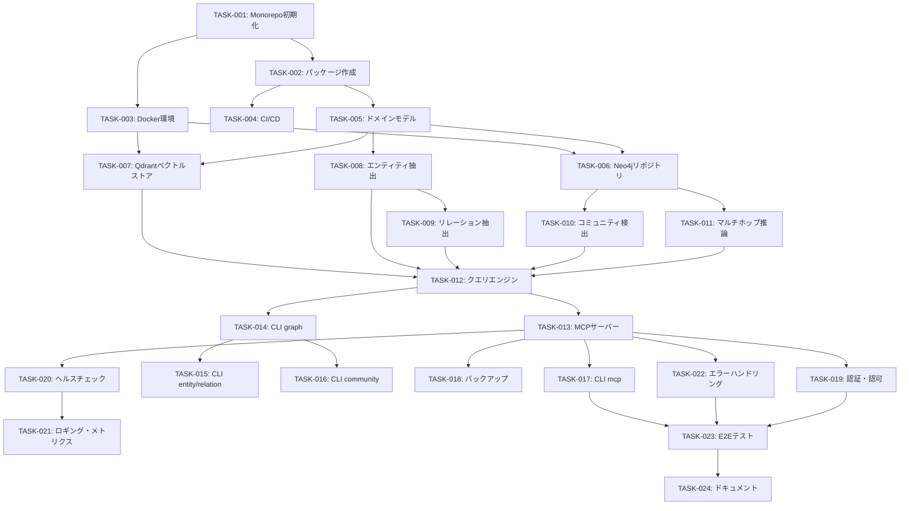

# タスク分解書: Generative AI 系譜 GraphRAG MCPシステム

**Document ID**: TASKS-001
**Version**: 1.1
**Created**: 2025-12-28
**Updated**: 2025-12-28
**Status**: Draft
**Related Requirements**: REQ-001
**Related Design**: DES-001

---

## 1. タスク概要

### 1.1 スプリント計画

| Sprint | 期間 | 目標 | 主要成果物 |
|--------|------|------|-----------|
| Sprint 0 | Week 1 | プロジェクト基盤構築 | monorepo, CI/CD, Docker |
| Sprint 1 | Week 2-3 | ドメイン・インフラ層 | domain, neo4j, vector libs |
| Sprint 2 | Week 4-5 | GraphRAGコア | graphrag lib |
| Sprint 3 | Week 6-7 | インターフェース層 | mcp, cli libs |
| Sprint 4 | Week 8 | 統合・E2Eテスト | 全体統合、ドキュメント |

### 1.2 優先度定義

| 優先度 | 説明 | 対応要件 |
|--------|------|----------|
| P0 | ブロッカー（後続タスクの前提） | Must要件 |
| P1 | 高優先度（Sprint内で完了必須） | Must要件 |
| P2 | 中優先度（Sprint内で完了推奨） | Should要件 |
| P3 | 低優先度（時間があれば実施） | Could要件 |

---

## 2. Sprint 0: プロジェクト基盤構築

### TASK-001: Monorepo初期化

**優先度**: P0
**見積もり**: 2h
**担当**: -
**要件ID**: -（基盤）

#### 説明
pnpm workspacesによるmonorepo構造を初期化する。

#### 受入条件
- [ ] `pnpm-workspace.yaml` が作成されている
- [ ] ルート `package.json` が作成されている
- [ ] ルート `tsconfig.json` が作成されている
- [ ] `biome.json` が作成されている
- [ ] `.gitignore` が適切に設定されている
- [ ] `pnpm install` が成功する

#### サブタスク
- [ ] pnpm-workspace.yaml 作成
- [ ] package.json 作成（scripts: build, test, lint, format）
- [ ] tsconfig.json 作成（TypeScript 5.x strict mode）
- [ ] biome.json 作成（formatter + linter）
- [ ] .gitignore 作成
- [ ] .env.example 作成

---

### TASK-002: ライブラリパッケージ作成

**優先度**: P0
**見積もり**: 3h
**担当**: -
**要件ID**: -（基盤、Article I準拠）

#### 説明
6つのライブラリパッケージと1つのアプリパッケージを作成する。

#### 受入条件
- [ ] 全パッケージの package.json が作成されている
- [ ] 全パッケージの tsconfig.json が作成されている
- [ ] 全パッケージの src/index.ts が作成されている
- [ ] 依存関係が正しく設定されている
- [ ] `pnpm build` が全パッケージで成功する

#### サブタスク
- [ ] lib/yagokoro-domain パッケージ作成
- [ ] lib/yagokoro-graphrag パッケージ作成
- [ ] lib/yagokoro-neo4j パッケージ作成
- [ ] lib/yagokoro-vector パッケージ作成
- [ ] lib/yagokoro-mcp パッケージ作成
- [ ] lib/yagokoro-cli パッケージ作成
- [ ] apps/yagokoro パッケージ作成

---

### TASK-003: Docker環境構築

**優先度**: P0
**見積もり**: 2h
**担当**: -
**要件ID**: REQ-001-DATA-001, REQ-001-DATA-002

#### 説明
Neo4jとQdrantのDocker Compose環境を構築する。

#### 受入条件
- [ ] `docker-compose.yml` が作成されている
- [ ] `docker-compose.dev.yml` が作成されている
- [ ] Neo4jコンテナが起動する
- [ ] Qdrantコンテナが起動する
- [ ] ヘルスチェックが通る

#### サブタスク
- [ ] docker/docker-compose.yml 作成
- [ ] docker/docker-compose.dev.yml 作成
- [ ] docker/neo4j/neo4j.conf 作成
- [ ] 動作確認

---

### TASK-004: CI/CD パイプライン構築

**優先度**: P1
**見積もり**: 3h
**担当**: -
**要件ID**: -（基盤、Article III準拠）

#### 説明
GitHub Actionsによるci/cdパイプラインを構築する。

#### 受入条件
- [ ] PR時にlint/test/buildが実行される
- [ ] main pushでテストが実行される
- [ ] Testcontainersが動作する

#### サブタスク
- [ ] .github/workflows/ci.yml 作成
- [ ] .github/workflows/test.yml 作成
- [ ] .github/workflows/release.yml 作成

---

## 3. Sprint 1: ドメイン・インフラ層

### TASK-005: ドメインモデル実装

**優先度**: P0
**見積もり**: 12h
**担当**: -
**要件ID**: REQ-001-KG-003

#### 説明
yagokoro-domainパッケージにドメインモデルを実装する。

#### 受入条件
- [ ] 全エンティティ型が定義されている
- [ ] 全リレーション型が定義されている
- [ ] バリューオブジェクトが定義されている
- [ ] ポート（インターフェース）が定義されている
- [ ] ユニットテストがパスする（カバレッジ≥80%）

#### サブタスク（Test-First: テスト → 実装の順）
- [ ] entities/AIModel.test.ts 作成 → AIModel.ts 実装
- [ ] entities/Organization.test.ts 作成 → Organization.ts 実装
- [ ] entities/Technique.test.ts 作成 → Technique.ts 実装
- [ ] entities/Publication.test.ts 作成 → Publication.ts 実装
- [ ] entities/Person.test.ts 作成 → Person.ts 実装
- [ ] entities/Benchmark.test.ts 作成 → Benchmark.ts 実装
- [ ] entities/Concept.test.ts 作成 → Concept.ts 実装
- [ ] entities/Community.test.ts 作成 → Community.ts 実装
- [ ] relations/RelationType.ts 実装（型定義のみ）
- [ ] value-objects/EntityId.test.ts 作成 → EntityId.ts 実装
- [ ] value-objects/Confidence.test.ts 作成 → Confidence.ts 実装
- [ ] ports/EntityRepository.ts 定義
- [ ] ports/RelationRepository.ts 定義
- [ ] ports/VectorStore.ts 定義
- [ ] ports/LLMClient.ts 定義

---

### TASK-006: Neo4jリポジトリ実装

**優先度**: P0
**見積もり**: 12h
**担当**: -
**要件ID**: REQ-001-DATA-001, REQ-001-KG-003

#### 説明
yagokoro-neo4jパッケージにNeo4jリポジトリを実装する。

#### 受入条件
- [ ] Neo4j接続が確立できる
- [ ] EntityRepositoryが実装されている
- [ ] RelationRepositoryが実装されている
- [ ] CommunityRepositoryが実装されている
- [ ] Cypherクエリが正しく動作する
- [ ] 統合テストがパスする（Testcontainers使用）

#### サブタスク
- [ ] Neo4jConnection.ts 実装 + テスト
- [ ] queries/entity.cypher.ts 実装
- [ ] queries/relation.cypher.ts 実装
- [ ] queries/path.cypher.ts 実装
- [ ] repositories/Neo4jEntityRepository.ts 実装 + 統合テスト
- [ ] repositories/Neo4jRelationRepository.ts 実装 + 統合テスト
- [ ] repositories/Neo4jCommunityRepository.ts 実装 + 統合テスト
- [ ] スキーマ初期化スクリプト作成

---

### TASK-007: Qdrantベクトルストア実装

**優先度**: P0
**見積もり**: 8h
**担当**: -
**要件ID**: REQ-001-DATA-002, REQ-001-GR-005

#### 説明
yagokoro-vectorパッケージにQdrantベクトルストアを実装する。

#### 受入条件
- [ ] Qdrant接続が確立できる
- [ ] VectorStoreインターフェースが実装されている
- [ ] EmbeddingServiceが実装されている
- [ ] 類似検索が動作する
- [ ] 統合テストがパスする（Testcontainers使用）

#### サブタスク
- [ ] QdrantConnection.ts 実装 + テスト
- [ ] QdrantVectorStore.ts 実装 + 統合テスト
- [ ] EmbeddingService.ts 実装 + テスト（Mock使用）
- [ ] コレクション初期化スクリプト作成

---

## 4. Sprint 2: GraphRAGコア

### TASK-008: エンティティ抽出実装

**優先度**: P0
**見積もり**: 10h
**担当**: -
**要件ID**: REQ-001-KG-001, REQ-001-KG-004

#### 説明
LLMを使用したエンティティ抽出機能を実装する。

#### 受入条件
- [ ] テキストからエンティティを抽出できる
- [ ] オントロジースキーマに準拠した抽出ができる
- [ ] 信頼度スコアが計算される
- [ ] 抽出精度 F1≥80%（テストデータセットで）
- [ ] ユニットテストがパスする

#### サブタスク
- [ ] llm/OpenAIClient.ts 実装 + テスト
- [ ] llm/prompts/extraction.ts 実装
- [ ] extraction/EntityExtractor.ts 実装 + テスト
- [ ] extraction/LLMExtractionEngine.ts 実装 + テスト
- [ ] テストフィクスチャ作成

---

### TASK-009: リレーション抽出実装

**優先度**: P0
**見積もり**: 8h
**担当**: -
**要件ID**: REQ-001-KG-002

#### 説明
LLMを使用したリレーション抽出機能を実装する。

#### 受入条件
- [ ] テキストからリレーションを抽出できる
- [ ] 定義済みリレーションタイプに準拠
- [ ] 信頼度スコアが計算される
- [ ] ユニットテストがパスする

#### サブタスク
- [ ] extraction/RelationExtractor.ts 実装 + テスト
- [ ] llm/prompts/relation.ts 実装
- [ ] テストフィクスチャ作成

---

### TASK-010: コミュニティ検出実装

**優先度**: P1
**見積もり**: 8h
**担当**: -
**要件ID**: REQ-001-GR-002

#### 説明
Leidenアルゴリズムによるコミュニティ検出を実装する。

#### 受入条件
- [ ] グラフからコミュニティを検出できる
- [ ] 階層的コミュニティ構造が生成される
- [ ] コミュニティサマリーが生成される
- [ ] ユニットテストがパスする

#### サブタスク
- [ ] reasoning/CommunityDetector.ts 実装 + テスト
- [ ] llm/prompts/summarization.ts 実装
- [ ] graphology-communities-leiden 統合

---

### TASK-011: マルチホップ推論実装

**優先度**: P0
**見積もり**: 10h
**担当**: -
**要件ID**: REQ-001-GR-001

#### 説明
知識グラフ上でのマルチホップ推論を実装する。

#### 受入条件
- [ ] 2〜10ホップの経路探索ができる
- [ ] 経路の信頼度スコアが計算される
- [ ] 推論ステップが説明できる
- [ ] 推論時間 p95<500ms
- [ ] ユニットテストがパスする

#### サブタスク
- [ ] reasoning/MultiHopReasoner.ts 実装 + テスト
- [ ] パス探索アルゴリズム実装
- [ ] 信頼度計算ロジック実装

---

### TASK-012: クエリエンジン実装

**優先度**: P0
**見積もり**: 16h
**担当**: -
**要件ID**: REQ-001-GR-003, REQ-001-GR-004, REQ-001-GR-005

#### 説明
ローカル・グローバル・ハイブリッドクエリエンジンを実装する。

#### 受入条件
- [ ] ローカルクエリが動作する
- [ ] グローバルクエリ（Map-Reduce）が動作する
- [ ] ハイブリッド検索が動作する
- [ ] 回答に引用情報が含まれる
- [ ] ユニットテストがパスする

#### サブタスク
- [ ] query/LocalQueryEngine.ts 実装 + テスト
- [ ] query/GlobalQueryEngine.ts 実装 + テスト
- [ ] reasoning/HybridSearchEngine.ts 実装 + テスト
- [ ] query/ResponseGenerator.ts 実装 + テスト
- [ ] llm/prompts/query.ts 実装

---

## 5. Sprint 3: インターフェース層

### TASK-013: MCPサーバー実装

**優先度**: P0
**見積もり**: 14h
**担当**: -
**要件ID**: REQ-001-MCP-001, REQ-001-MCP-002, REQ-001-MCP-003

#### 説明
MCPプロトコルサーバーを実装する。

#### 受入条件
- [ ] MCPサーバーが起動する
- [ ] 8つのToolsが登録されている
- [ ] 4つのResourcesが登録されている
- [ ] stdio/http両方のトランスポートに対応
- [ ] 統合テストがパスする

#### サブタスク
- [ ] server/MCPServer.ts 実装 + テスト
- [ ] tools/queryKnowledgeGraph.ts 実装 + テスト
- [ ] tools/getEntity.ts 実装 + テスト
- [ ] tools/getRelations.ts 実装 + テスト
- [ ] tools/getPath.ts 実装 + テスト
- [ ] tools/getCommunity.ts 実装 + テスト
- [ ] tools/addEntity.ts 実装 + テスト
- [ ] tools/addRelation.ts 実装 + テスト
- [ ] tools/searchSimilar.ts 実装 + テスト
- [ ] resources/ontologySchema.ts 実装 + テスト
- [ ] resources/graphStatistics.ts 実装 + テスト
- [ ] resources/entityList.ts 実装 + テスト
- [ ] resources/timeline.ts 実装 + テスト

---

### TASK-014: CLI実装（graphコマンド）

**優先度**: P0
**見積もり**: 8h
**担当**: -
**要件ID**: REQ-001-CLI-001

#### 説明
CLIのgraphサブコマンドを実装する。

#### 受入条件
- [ ] `yagokoro graph init` が動作する
- [ ] `yagokoro graph ingest` が動作する
- [ ] `yagokoro graph query` が動作する
- [ ] `yagokoro graph stats` が動作する
- [ ] `yagokoro graph export/import` が動作する
- [ ] `yagokoro graph validate` が動作する
- [ ] --help が適切に表示される
- [ ] E2Eテストがパスする

#### サブタスク
- [ ] cli.ts エントリポイント実装
- [ ] commands/graph/init.ts 実装 + テスト
- [ ] commands/graph/ingest.ts 実装 + テスト
- [ ] commands/graph/query.ts 実装 + テスト
- [ ] commands/graph/stats.ts 実装 + テスト
- [ ] commands/graph/export.ts 実装 + テスト
- [ ] commands/graph/import.ts 実装 + テスト
- [ ] commands/graph/validate.ts 実装 + テスト

---

### TASK-015: CLI実装（entity/relationコマンド）

**優先度**: P1
**見積もり**: 6h
**担当**: -
**要件ID**: REQ-001-CLI-001

#### 説明
CLIのentity/relationサブコマンドを実装する。

#### 受入条件
- [ ] `yagokoro entity list/get/add/delete` が動作する
- [ ] `yagokoro relation add/list/delete` が動作する
- [ ] E2Eテストがパスする

#### サブタスク
- [ ] commands/entity/list.ts 実装 + テスト
- [ ] commands/entity/get.ts 実装 + テスト
- [ ] commands/entity/add.ts 実装 + テスト
- [ ] commands/entity/delete.ts 実装 + テスト
- [ ] commands/relation/add.ts 実装 + テスト
- [ ] commands/relation/list.ts 実装 + テスト
- [ ] commands/relation/delete.ts 実装 + テスト

---

### TASK-016: CLI実装（communityコマンド）

**優先度**: P2
**見積もり**: 4h
**担当**: -
**要件ID**: REQ-001-CLI-001

#### 説明
CLIのcommunityサブコマンドを実装する。

#### 受入条件
- [ ] `yagokoro community detect` が動作する
- [ ] `yagokoro community list` が動作する
- [ ] `yagokoro community summarize` が動作する
- [ ] E2Eテストがパスする

#### サブタスク
- [ ] commands/community/detect.ts 実装 + テスト
- [ ] commands/community/list.ts 実装 + テスト
- [ ] commands/community/summarize.ts 実装 + テスト

---

### TASK-017: CLI実装（mcpコマンド）

**優先度**: P0
**見積もり**: 4h
**担当**: -
**要件ID**: REQ-001-CLI-002

#### 説明
CLIのmcpサブコマンドを実装する。

#### 受入条件
- [ ] `yagokoro mcp serve` が動作する
- [ ] `yagokoro mcp status` が動作する
- [ ] `yagokoro mcp stop` が動作する
- [ ] `yagokoro mcp tools` が動作する
- [ ] `yagokoro mcp resources` が動作する
- [ ] E2Eテストがパスする

#### サブタスク
- [ ] commands/mcp/serve.ts 実装 + テスト
- [ ] commands/mcp/status.ts 実装 + テスト
- [ ] commands/mcp/stop.ts 実装 + テスト
- [ ] commands/mcp/tools.ts 実装 + テスト
- [ ] commands/mcp/resources.ts 実装 + テスト

---

## 6. Sprint 4: 統合・E2Eテスト

### TASK-018: バックアップ・リストア実装

**優先度**: P1
**見積もり**: 6h
**担当**: -
**要件ID**: REQ-001-DATA-003

#### 説明
Neo4jとQdrantのバックアップ・リストア機能を実装する。

#### 受入条件
- [ ] Neo4jデータのエクスポートができる
- [ ] Qdrantデータのエクスポートができる
- [ ] バックアップからのリストアができる
- [ ] CLIコマンドで実行できる
- [ ] 統合テストがパスする

#### サブタスク（Test-First: テスト → 実装の順）
- [ ] backup/BackupService.test.ts 作成 → BackupService.ts 実装
- [ ] commands/graph/backup.test.ts 作成 → backup.ts 実装
- [ ] commands/graph/restore.test.ts 作成 → restore.ts 実装

---

### TASK-019: 認証・認可機能実装

**優先度**: P2
**見積もり**: 8h
**担当**: -
**要件ID**: REQ-001-SEC-001, REQ-001-SEC-002

#### 説明
APIキー認証とRBAC（Role-Based Access Control）を実装する。

#### 受入条件
- [ ] APIキー認証が動作する
- [ ] 読み取り専用/管理者ロールが区別される
- [ ] 認証エラーが適切に返される
- [ ] 統合テストがパスする

#### サブタスク（Test-First: テスト → 実装の順）
- [ ] auth/ApiKeyAuth.test.ts 作成 → ApiKeyAuth.ts 実装
- [ ] auth/RBACMiddleware.test.ts 作成 → RBACMiddleware.ts 実装
- [ ] MCPサーバーへの認証統合

---

### TASK-020: システムヘルスチェック実装

**優先度**: P1
**見積もり**: 4h
**担当**: -
**要件ID**: REQ-001-SYS-001

#### 説明
システムヘルスチェック機能を実装する。

#### 受入条件
- [ ] Neo4j接続状態が確認できる
- [ ] Qdrant接続状態が確認できる
- [ ] ヘルスエンドポイントが応答する
- [ ] 統合テストがパスする

#### サブタスク（Test-First: テスト → 実装の順）
- [ ] HealthCheckService.test.ts 作成 → HealthCheckService.ts 実装
- [ ] MCPヘルスリソーステスト → 実装

---

### TASK-021: ロギング・メトリクス実装

**優先度**: P2
**見積もり**: 4h
**担当**: -
**要件ID**: REQ-001-SYS-002, REQ-001-SYS-003

#### 説明
構造化ログとメトリクス収集を実装する。

#### 受入条件
- [ ] 構造化ログが出力される
- [ ] リクエストID追跡ができる
- [ ] メトリクス（レイテンシ、スループット）が収集される

#### サブタスク（Test-First: テスト → 実装の順）
- [ ] Logger.test.ts 作成 → Logger設定（pino）実装
- [ ] MetricsMiddleware.test.ts 作成 → 実装

---

### TASK-022: エラーハンドリング統一

**優先度**: P1
**見積もり**: 4h
**担当**: -
**要件ID**: REQ-001-ERR-001, REQ-001-ERR-002

#### 説明
エラーハンドリングを統一し、定義済みエラーコードを使用する。外部API障害時のフォールバック機構も実装する。

#### 受入条件
- [ ] 全エラーが定義済みコードを使用
- [ ] ErrorResponseフォーマットが統一されている
- [ ] エラーにsuggestionsが含まれる
- [ ] 外部API障害時のreconnect/retryが動作する

#### サブタスク（Test-First: テスト → 実装の順）
- [ ] ErrorCodes.test.ts 作成 → errors/ErrorCodes.ts 実装
- [ ] AppError.test.ts 作成 → errors/AppError.ts 実装
- [ ] RetryHandler.test.ts 作成 → RetryHandler.ts 実装
- [ ] 全パッケージのエラーハンドリング更新

---

### TASK-023: E2Eテスト実装

**優先度**: P0
**見積もり**: 10h
**担当**: -
**要件ID**: -（Article IX準拠）

#### 説明
CLI/MCPのE2Eテストを実装する。

#### 受入条件
- [ ] CLIの主要フローがテストされている
- [ ] MCPの主要フローがテストされている
- [ ] Docker Compose環境で実行できる
- [ ] CI/CDで実行できる

#### サブタスク
- [ ] E2E用Docker Compose設定
- [ ] test/e2e/cli.test.ts 実装（テスト先行：シナリオ定義 → 実行）
- [ ] test/e2e/mcp.test.ts 実装（テスト先行）
- [ ] test/e2e/integration.test.ts 実装（テスト先行）

---

### TASK-024: ドキュメント作成

**優先度**: P1
**見積もり**: 6h
**担当**: -
**要件ID**: -

#### 説明
ユーザードキュメントとAPIドキュメントを作成する。

#### 受入条件
- [ ] README.md が完成している
- [ ] API ドキュメントが作成されている
- [ ] インストールガイドが作成されている
- [ ] クイックスタートガイドが作成されている

#### サブタスク
- [ ] README.md 更新
- [ ] docs/guides/quickstart.md 作成
- [ ] docs/guides/installation.md 作成
- [ ] docs/api/mcp-tools.md 作成
- [ ] docs/api/cli-reference.md 作成
- [ ] docs/architecture/overview.md 作成

---

## 7. タスク依存関係

---

## 8. タスク-要件トレーサビリティマトリクス

| タスクID | 関連要件ID |
|---------|-----------|
| TASK-001 | -（基盤） |
| TASK-002 | -（Article I） |
| TASK-003 | REQ-001-DATA-001, REQ-001-DATA-002 |
| TASK-004 | -（Article III） |
| TASK-005 | REQ-001-KG-003 |
| TASK-006 | REQ-001-DATA-001, REQ-001-KG-003 |
| TASK-007 | REQ-001-DATA-002, REQ-001-GR-005 |
| TASK-008 | REQ-001-KG-001, REQ-001-KG-004 |
| TASK-009 | REQ-001-KG-002 |
| TASK-010 | REQ-001-GR-002 |
| TASK-011 | REQ-001-GR-001 |
| TASK-012 | REQ-001-GR-003, REQ-001-GR-004, REQ-001-GR-005 |
| TASK-013 | REQ-001-MCP-001, REQ-001-MCP-002, REQ-001-MCP-003 |
| TASK-014 | REQ-001-CLI-001 |
| TASK-015 | REQ-001-CLI-001 |
| TASK-016 | REQ-001-CLI-001 |
| TASK-017 | REQ-001-CLI-002 |
| TASK-018 | REQ-001-DATA-003 |
| TASK-019 | REQ-001-SEC-001, REQ-001-SEC-002 |
| TASK-020 | REQ-001-SYS-001 |
| TASK-021 | REQ-001-SYS-002, REQ-001-SYS-003 |
| TASK-022 | REQ-001-ERR-001, REQ-001-ERR-002 |
| TASK-023 | -（Article IX） |
| TASK-024 | - |

---

## 9. 工数サマリー

| Sprint | タスク数 | 見積もり合計 | バッファ(20%) | 合計 |
|--------|---------|-------------|-------------|------|
| Sprint 0 | 4 | 10h | 2h | 12h |
| Sprint 1 | 3 | 32h | 6h | 38h |
| Sprint 2 | 5 | 52h | 10h | 62h |
| Sprint 3 | 5 | 36h | 7h | 43h |
| Sprint 4 | 7 | 46h | 9h | 55h |
| **合計** | **24** | **176h** | **34h** | **210h (26人日)** |

---

## 10. リスク管理

### 10.1 リスク一覧

| ID | リスク | 影響度 | 発生確率 | 軽減策 |
|----|--------|--------|----------|--------|
| R-001 | OpenAI API依存 | 高 | 中 | モックテスト整備、ローカルモデル移行パス確保 |
| R-002 | Neo4j/Qdrantコンテナ不安定 | 中 | 低 | Testcontainersバージョン固定、CIキャッシュ |
| R-003 | MCP SDK破壊的変更 | 高 | 低 | SDKバージョン固定、リリースノート監視 |
| R-004 | Leidenアルゴリズム精度 | 中 | 中 | 解像度パラメータチューニング、代替アルゴリズム検討 |
| R-005 | エンティティ抽出F1<80% | 高 | 中 | プロンプトエンジニアリング、テストデータセット拡充 |
| R-006 | 工数超過 | 中 | 中 | 20%バッファ確保、Sprintレビューで調整 |

### 10.2 コンティンジェンシープラン

| リスクID | トリガー | アクション |
|--------|-----------|----------|
| R-001 | OpenAI API障害/コスト超過 | ローカル埋め込みモデル(BGE-M3)へ切替 |
| R-003 | MCP SDK破壊的変更 | 特定バージョンにロック、後方互換レイヤー作成 |
| R-005 | F1<80%が続く | Few-shot例追加、マルチステージ抽出に変更 |

---

## 11. 改訂履歴

| バージョン | 日付 | 変更内容 | 著者 |
|-----------|------|----------|------|
| 1.0 | 2025-12-28 | 初版作成 | YAGOKORO Team |
| 1.1 | 2025-12-28 | 要件カバレッジ追加(SEC/DATA-003)、Test-First明示化、工数バッファ20%、リスクセクション追加 | YAGOKORO Team |

---

## 12. 承認

| 役割 | 氏名 | 日付 | 署名 |
|------|------|------|------|
| プロジェクトマネージャー | | | |
| テックリード | | | |
