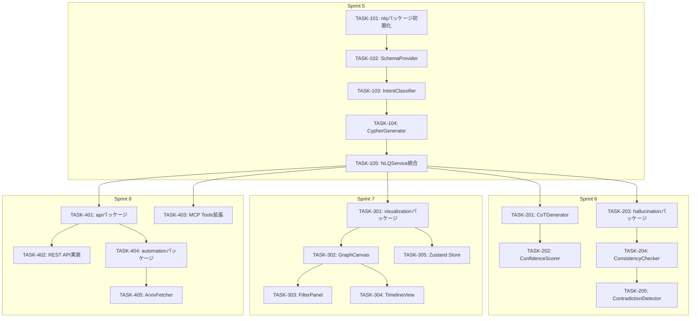
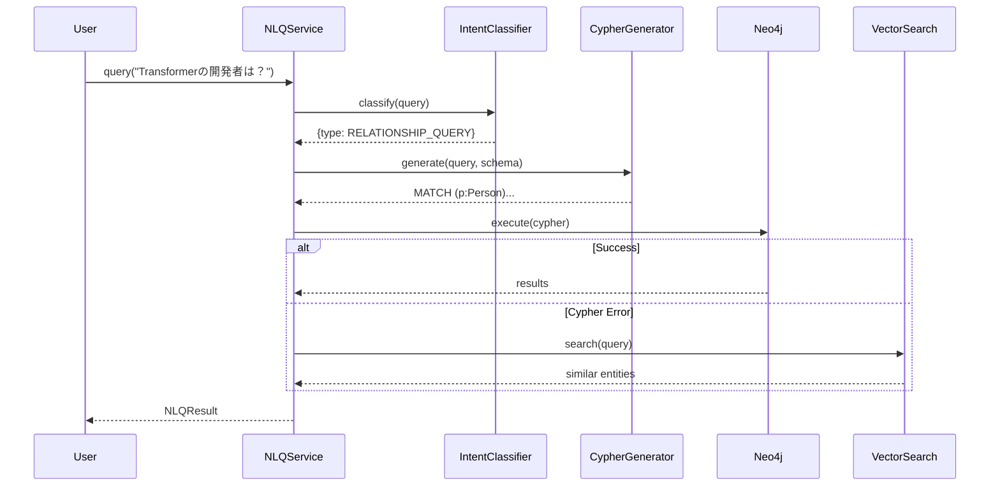

# タスク分解書: Phase 2 機能拡張

**Document ID**: TASKS-002
**Version**: 1.0
**Created**: 2025-12-29
**Updated**: 2025-12-29
**Status**: Draft
**Related Requirements**: REQ-002-phase2-enhancements.md
**Related Design**: DES-002-phase2-enhancements.md

---

## 1. タスク概要

### 1.1 Phase 2 スプリント計画

| Sprint | 期間 | 目標 | 主要成果物 |
|--------|------|------|-----------|
| Sprint 5 | Week 9-10 | NLQ基盤構築 | libs/nlq, Cypher生成 |
| Sprint 6 | Week 11-12 | 推論・検証機能 | GGR拡張, libs/hallucination |
| Sprint 7 | Week 13-14 | 可視化UI | libs/visualization (React) |
| Sprint 8 | Week 15-16 | 自動化・API | libs/automation, libs/api |

### 1.2 優先度定義

| 優先度 | 説明 | 対応要件 |
|--------|------|----------|
| P0 | ブロッカー（後続タスクの前提） | NLQ-001, API-002 |
| P1 | 高優先度（Sprint内で完了必須） | GGR-001, HAL-001, VIS-001 |
| P2 | 中優先度（Sprint内で完了推奨） | AUTO-001, API-001 |
| P3 | 低優先度（時間があれば実施） | VIS-002〜004 |

### 1.3 依存関係図



---

## 2. Sprint 5: NLQ基盤構築 (Week 9-10)

### TASK-101: nlqパッケージ初期化

**優先度**: P0
**見積もり**: 2h
**担当**: -
**要件ID**: REQ-002-NLQ-001（基盤）
**設計参照**: DES-002 セクション1.3, 5

#### 説明
自然言語クエリ処理用の新規ライブラリパッケージを作成する。

#### 受入条件
- [ ] `libs/nlq/package.json` が作成されている
- [ ] `libs/nlq/tsconfig.json` が作成されている
- [ ] `libs/nlq/src/index.ts` が作成されている
- [ ] `libs/nlq/src/types.ts` が作成されている
- [ ] 依存関係（@yagokoro/domain, @yagokoro/neo4j）が設定されている
- [ ] `pnpm build` が成功する

#### サブタスク
- [ ] package.json 作成（name: @yagokoro/nlq）
- [ ] tsconfig.json 作成
- [ ] src/index.ts 作成（public exports）
- [ ] src/types.ts 作成（QueryIntent, NLQResult, NLQError等）
- [ ] vitest.config.ts 作成
- [ ] ルートpackage.jsonのworkspacesに追加

---

### TASK-102: SchemaProvider実装

**優先度**: P0
**見積もり**: 4h
**担当**: -
**要件ID**: REQ-002-NLQ-001
**設計参照**: DES-002 セクション2.1.1

#### 説明
Neo4jスキーマ情報をキャッシュしLLMプロンプトに提供するコンポーネントを実装する。

#### 受入条件
- [ ] Neo4jからノードラベル一覧を取得できる
- [ ] Neo4jからリレーションタイプ一覧を取得できる
- [ ] Neo4jからプロパティキー一覧を取得できる
- [ ] スキーマ情報が5分間キャッシュされる
- [ ] LLMプロンプト用のフォーマット済み文字列を出力できる
- [ ] 単体テストカバレッジ80%以上

#### サブタスク
- [ ] src/schema-provider.ts 作成
- [ ] GraphSchema型定義
- [ ] getSchema()メソッド実装
- [ ] formatForPrompt()メソッド実装
- [ ] キャッシュ機構実装（TTL: 5分）
- [ ] test/schema-provider.test.ts 作成

#### コード例
```typescript
// libs/nlq/src/schema-provider.ts
export class SchemaProvider {
  private cache: GraphSchema | null = null;
  private cacheTime = 0;
  private readonly TTL = 5 * 60 * 1000; // 5分
  
  constructor(private readonly neo4j: Neo4jConnection) {}
  
  async getSchema(): Promise<GraphSchema> {
    if (this.cache && Date.now() - this.cacheTime < this.TTL) {
      return this.cache;
    }
    // Neo4jからスキーマ取得
    this.cache = await this.fetchSchema();
    this.cacheTime = Date.now();
    return this.cache;
  }
  
  formatForPrompt(schema: GraphSchema): string {
    // LLMプロンプト用フォーマット
  }
}
```

---

### TASK-103: IntentClassifier実装

**優先度**: P0
**見積もり**: 6h
**担当**: -
**要件ID**: REQ-002-NLQ-002
**設計参照**: DES-002 セクション2.1.2

#### 説明
自然言語クエリの意図を分類するコンポーネントを実装する。

#### 受入条件
- [ ] 6種類の意図タイプを分類できる（ENTITY_LOOKUP, RELATIONSHIP_QUERY, PATH_FINDING, AGGREGATION, GLOBAL_SUMMARY, COMPARISON）
- [ ] 信頼度スコア（0-1）を出力できる
- [ ] 曖昧性フラグを判定できる
- [ ] 日本語・英語両対応
- [ ] LLM呼び出しが適切にハンドリングされる
- [ ] 単体テストカバレッジ80%以上

#### サブタスク
- [ ] src/intent-classifier.ts 作成
- [ ] QueryIntent型定義（types.tsに追加）
- [ ] classify()メソッド実装
- [ ] プロンプトテンプレート作成（prompts/intent-classification.md）
- [ ] LLMレスポンスパース処理実装
- [ ] test/intent-classifier.test.ts 作成

#### テストケース
```typescript
describe('IntentClassifier', () => {
  it('should classify entity lookup query', async () => {
    const result = await classifier.classify('GPT-4とは何ですか？');
    expect(result.type).toBe('ENTITY_LOOKUP');
    expect(result.confidence).toBeGreaterThan(0.7);
  });
  
  it('should classify relationship query', async () => {
    const result = await classifier.classify('Transformerを開発した人は誰？');
    expect(result.type).toBe('RELATIONSHIP_QUERY');
  });
  
  it('should flag ambiguous queries', async () => {
    const result = await classifier.classify('最近のAI');
    expect(result.isAmbiguous).toBe(true);
  });
});
```

---

### TASK-104: CypherGenerator実装

**優先度**: P0
**見積もり**: 8h
**担当**: -
**要件ID**: REQ-002-NLQ-001
**設計参照**: DES-002 セクション2.1.1, 2.1.4

#### 説明
自然言語クエリをCypherクエリに変換するコアコンポーネントを実装する。

#### 受入条件
- [ ] 自然言語からCypherを生成できる
- [ ] 生成されたCypherのバリデーションが行われる
- [ ] 構文エラー時は再生成を試みる（最大3回）
- [ ] スキーマ情報がプロンプトに含まれる
- [ ] 日本語・英語両対応
- [ ] 単体テストカバレッジ80%以上
- [ ] 精度80%以上（テストセット50件）

#### サブタスク
- [ ] src/cypher-generator.ts 作成
- [ ] CypherQuery型定義
- [ ] generate()メソッド実装
- [ ] validate()メソッド実装（Neo4j EXPLAIN使用）
- [ ] プロンプトテンプレート作成（prompts/cypher-generation.md）
- [ ] エラーハンドリング実装（E-NLQ-002, E-NLQ-003）
- [ ] test/cypher-generator.test.ts 作成
- [ ] data/eval/nlq-test-queries.json 作成（50件）

#### プロンプトテンプレート
```markdown
# prompts/cypher-generation.md

あなたはNeo4jのCypherクエリ生成エキスパートです。

## グラフスキーマ
{schema}

## 制約
- 存在するノードラベルとリレーションタイプのみを使用してください
- プロパティ名は正確に使用してください
- LIMIT句を適切に使用してください（デフォルト: 25）
- 日本語のプロパティ値はそのまま使用してください

## ユーザークエリ
{query}

## 出力形式
```cypher
// ここにCypherクエリを出力
```
```

---

### TASK-105: NLQService統合

**優先度**: P0
**見積もり**: 6h
**担当**: -
**要件ID**: REQ-002-NLQ-001, REQ-002-NLQ-003
**設計参照**: DES-002 セクション2.1

#### 説明
NLQ機能の統合サービスを実装する。フォールバック機構と対話的精緻化を含む。

#### 受入条件
- [ ] query()メソッドで自然言語クエリを処理できる
- [ ] Cypherエラー時はベクトル検索にフォールバックする
- [ ] 曖昧なクエリに対して明確化質問を返せる
- [ ] 実行時間を計測して返す
- [ ] エラーハンドリングが適切に行われる
- [ ] E2Eテストが通る
- [ ] 単体テストカバレッジ80%以上

#### サブタスク
- [ ] src/nlq-service.ts 作成
- [ ] query()メソッド実装
- [ ] フォールバック機構実装
- [ ] QueryRefiner実装（対話的精緻化）
- [ ] エラーハンドリング実装（E-NLQ-001〜005）
- [ ] test/nlq-service.test.ts 作成
- [ ] E2Eテスト追加（apps/yagokoro/test/）

#### シーケンス


---

## 3. Sprint 6: 推論・検証機能 (Week 11-12)

### TASK-201: CoTGenerator実装

**優先度**: P1
**見積もり**: 8h
**担当**: -
**要件ID**: REQ-002-GGR-001
**設計参照**: DES-002 セクション2.2.1

#### 説明
Chain-of-Thought推論を生成するコンポーネントを実装する。

#### 受入条件
- [ ] マルチホップ推論のステップを生成できる
- [ ] 各ステップにエビデンスを紐付けられる
- [ ] 推論チェーンをJSON形式で出力できる
- [ ] 最大5ホップまで対応
- [ ] 単体テストカバレッジ80%以上

#### サブタスク
- [ ] libs/graphrag/src/reasoning/cot-generator.ts 作成
- [ ] ReasoningStep型定義
- [ ] generateChain()メソッド実装
- [ ] プロンプトテンプレート作成（prompts/cot-generation.md）
- [ ] test/reasoning/cot-generator.test.ts 作成

---

### TASK-202: ConfidenceScorer実装

**優先度**: P1
**見積もり**: 6h
**担当**: -
**要件ID**: REQ-002-GGR-003
**設計参照**: DES-002 セクション2.2.3

#### 説明
回答の信頼度を多角的に評価するコンポーネントを実装する。

#### 受入条件
- [ ] 5つの信頼度指標を計算できる（graphCoverage, pathConfidence, recency, sourceQuality, consensus）
- [ ] 総合スコアを0-1で算出できる
- [ ] 低信頼度（<0.5）の場合に警告を出力できる
- [ ] 単体テストカバレッジ80%以上

#### サブタスク
- [ ] libs/graphrag/src/reasoning/confidence-scorer.ts 作成
- [ ] ConfidenceScore型定義（domain/value-objects/に追加）
- [ ] score()メソッド実装
- [ ] 各指標の計算ロジック実装
- [ ] test/reasoning/confidence-scorer.test.ts 作成

---

### TASK-203: hallucinationパッケージ初期化

**優先度**: P1
**見積もり**: 2h
**担当**: -
**要件ID**: REQ-002-HAL-001（基盤）
**設計参照**: DES-002 セクション1.4, 5

#### 説明
ハルシネーション検出用の新規ライブラリパッケージを作成する。

#### 受入条件
- [ ] `libs/hallucination/package.json` が作成されている
- [ ] `libs/hallucination/tsconfig.json` が作成されている
- [ ] `libs/hallucination/src/index.ts` が作成されている
- [ ] `libs/hallucination/src/types.ts` が作成されている
- [ ] 依存関係が設定されている
- [ ] `pnpm build` が成功する

#### サブタスク
- [ ] package.json 作成（name: @yagokoro/hallucination）
- [ ] tsconfig.json 作成
- [ ] src/index.ts 作成
- [ ] src/types.ts 作成（HallucinationWarning, CheckResult等）
- [ ] vitest.config.ts 作成

---

### TASK-204: ConsistencyChecker実装

**優先度**: P1
**見積もり**: 6h
**担当**: -
**要件ID**: REQ-002-HAL-001
**設計参照**: DES-002 セクション2.3.1

#### 説明
テキスト内の主張とグラフデータの整合性を検証するコンポーネントを実装する。

#### 受入条件
- [ ] テキストからエンティティ言及を抽出できる
- [ ] 各言及をグラフノードとマッチングできる
- [ ] 属性値の整合性を検証できる
- [ ] 整合性スコア（0-1）を出力できる
- [ ] 単体テストカバレッジ80%以上

#### サブタスク
- [ ] src/entity-mention-extractor.ts 作成
- [ ] src/consistency-checker.ts 作成
- [ ] extractMentions()メソッド実装
- [ ] checkConsistency()メソッド実装
- [ ] test/consistency-checker.test.ts 作成

---

### TASK-205: ContradictionDetector実装

**優先度**: P1
**見積もり**: 8h
**担当**: -
**要件ID**: REQ-002-HAL-002
**設計参照**: DES-002 セクション2.3.2

#### 説明
テキスト内の矛盾や事実誤認を検出するコンポーネントを実装する。

#### 受入条件
- [ ] 時間的矛盾を検出できる（例: 発表日の誤り）
- [ ] 関係性矛盾を検出できる（例: 開発者の誤り）
- [ ] 属性矛盾を検出できる（例: パラメータ数の誤り）
- [ ] 存在しないエンティティの検出ができる
- [ ] 重要度レベル（LOW/MEDIUM/HIGH）を判定できる
- [ ] 単体テストカバレッジ80%以上

#### サブタスク
- [ ] src/contradiction-detector.ts 作成
- [ ] 矛盾ルール定義
- [ ] detect()メソッド実装
- [ ] WarningGenerator実装
- [ ] test/contradiction-detector.test.ts 作成

#### テストケース
```typescript
describe('ContradictionDetector', () => {
  it('should detect temporal contradiction', async () => {
    const result = await detector.detect(
      'GPT-4は2020年に発表された',
      ['GPT-4']
    );
    expect(result.warnings).toContainEqual(
      expect.objectContaining({
        type: 'TEMPORAL_MISMATCH',
        severity: 'HIGH'
      })
    );
  });
  
  it('should detect relationship contradiction', async () => {
    const result = await detector.detect(
      'TransformerはGoogleが開発した',
      ['Transformer']
    );
    // Transformer開発者は複数名（Vaswani et al.）
    expect(result.warnings.length).toBeGreaterThan(0);
  });
});
```

---

## 4. Sprint 7: 可視化UI (Week 13-14)

### TASK-301: visualizationパッケージ初期化

**優先度**: P1
**見積もり**: 3h
**担当**: -
**要件ID**: REQ-002-VIS-001（基盤）
**設計参照**: DES-002 セクション1.6, 5, ADR-006

#### 説明
React/D3.jsベースの可視化ライブラリパッケージを作成する。

#### 受入条件
- [ ] `libs/visualization/package.json` が作成されている
- [ ] React 18.x、D3.js 7.x、Cytoscape.js 3.x が依存関係に含まれる
- [ ] Zustand、TailwindCSS が依存関係に含まれる
- [ ] Vite設定が作成されている
- [ ] `pnpm build` が成功する

#### サブタスク
- [ ] package.json 作成（name: @yagokoro/visualization）
- [ ] tsconfig.json 作成（jsx: react-jsx）
- [ ] vite.config.ts 作成
- [ ] tailwind.config.js 作成
- [ ] src/index.ts 作成
- [ ] src/components/index.ts 作成

---

### TASK-302: GraphCanvas実装

**優先度**: P1
**見積もり**: 12h
**担当**: -
**要件ID**: REQ-002-VIS-001
**設計参照**: DES-002 セクション2.4.1, ADR-006

#### 説明
インタラクティブなグラフ表示キャンバスコンポーネントを実装する。

#### 受入条件
- [ ] ノードとエッジをフォースレイアウトで表示できる
- [ ] ズーム・パン操作ができる
- [ ] ノードをドラッグ移動できる
- [ ] ノードクリックで詳細表示ができる
- [ ] 1000ノード未満: D3.js (SVG)
- [ ] 1000ノード以上: Cytoscape.js (WebGL)
- [ ] 60fps以上のパフォーマンス（500ノード時）

#### サブタスク
- [ ] src/components/GraphCanvas.tsx 作成
- [ ] D3.jsフォースシミュレーション実装
- [ ] Cytoscape.js WebGLレンダラー実装
- [ ] ノード種別による色分け実装
- [ ] ズーム・パン実装
- [ ] ドラッグ&ドロップ実装
- [ ] パフォーマンス最適化
- [ ] test/components/GraphCanvas.test.tsx 作成

---

### TASK-303: FilterPanel実装

**優先度**: P2
**見積もり**: 6h
**担当**: -
**要件ID**: REQ-002-VIS-003
**設計参照**: DES-002 セクション2.4.3

#### 説明
グラフフィルタリング用のUIパネルを実装する。

#### 受入条件
- [ ] ノードタイプでフィルタできる
- [ ] リレーションタイプでフィルタできる
- [ ] 時間範囲でフィルタできる
- [ ] フィルタ状態がURLに反映される
- [ ] フィルタ変更でグラフがリアルタイム更新される

#### サブタスク
- [ ] src/components/FilterPanel.tsx 作成
- [ ] NodeTypeFilter実装
- [ ] RelationTypeFilter実装
- [ ] TimeRangeSlider実装
- [ ] URLパラメータ同期実装
- [ ] test/components/FilterPanel.test.tsx 作成

---

### TASK-304: TimelineView実装

**優先度**: P3
**見積もり**: 8h
**担当**: -
**要件ID**: REQ-002-VIS-002
**設計参照**: DES-002 セクション2.4.2

#### 説明
時系列表示用のタイムラインコンポーネントを実装する。

#### 受入条件
- [ ] エンティティを時系列で表示できる
- [ ] 年単位のスケールで表示できる
- [ ] マウスホバーで詳細表示できる
- [ ] クリックでグラフビューにジャンプできる

#### サブタスク
- [ ] src/components/TimelineView.tsx 作成
- [ ] D3.js時系列スケール実装
- [ ] イベントマーカー実装
- [ ] ツールチップ実装
- [ ] グラフビュー連携実装
- [ ] test/components/TimelineView.test.tsx 作成

---

### TASK-305: Zustand Store実装

**優先度**: P1
**見積もり**: 4h
**担当**: -
**要件ID**: REQ-002-VIS
**設計参照**: DES-002 セクション2.4.5, ADR-008

#### 説明
可視化コンポーネントの状態管理ストアを実装する。

#### 受入条件
- [ ] グラフデータ（nodes, edges）を管理できる
- [ ] フィルタ状態を管理できる
- [ ] 選択状態（selectedNodeId）を管理できる
- [ ] ローディング状態を管理できる
- [ ] Immerによるイミュータブル更新が行われる

#### サブタスク
- [ ] src/store/graph-store.ts 作成
- [ ] GraphState型定義
- [ ] アクション定義（setNodes, setEdges, setFilter, selectNode）
- [ ] Immer middleware設定
- [ ] test/store/graph-store.test.ts 作成

---

## 5. Sprint 8: 自動化・API (Week 15-16)

### TASK-401: apiパッケージ初期化

**優先度**: P2
**見積もり**: 2h
**担当**: -
**要件ID**: REQ-002-API-001（基盤）
**設計参照**: DES-002 セクション2.6, ADR-007

#### 説明
REST API用のライブラリパッケージを作成する。

#### 受入条件
- [ ] `libs/api/package.json` が作成されている
- [ ] Hono、@hono/zod-validator が依存関係に含まれる
- [ ] OpenAPI仕様ファイルが作成されている
- [ ] `pnpm build` が成功する

#### サブタスク
- [ ] package.json 作成（name: @yagokoro/api）
- [ ] tsconfig.json 作成
- [ ] src/index.ts 作成
- [ ] src/routes.ts 作成
- [ ] src/openapi.yaml 作成

---

### TASK-402: REST API実装

**優先度**: P2
**見積もり**: 10h
**担当**: -
**要件ID**: REQ-002-API-001
**設計参照**: DES-002 セクション2.6.1, 2.6.2

#### 説明
RESTful APIエンドポイントを実装する。

#### 受入条件
- [ ] GET /api/v1/entities - エンティティ一覧
- [ ] GET /api/v1/entities/:id - エンティティ詳細
- [ ] GET /api/v1/query - 自然言語クエリ
- [ ] GET /api/v1/path - パス検索
- [ ] GET /api/v1/communities - コミュニティ一覧
- [ ] POST /api/v1/graph - グラフデータ取得
- [ ] POST /api/v1/check-hallucination - ハルシネーションチェック
- [ ] Zodバリデーションが適用されている
- [ ] OpenAPI仕様と一致している
- [ ] 統合テストが通る

#### サブタスク
- [ ] src/routes/entities.ts 作成
- [ ] src/routes/query.ts 作成
- [ ] src/routes/path.ts 作成
- [ ] src/routes/communities.ts 作成
- [ ] src/routes/graph.ts 作成
- [ ] src/routes/hallucination.ts 作成
- [ ] src/middleware/auth.ts 作成（APIキー認証）
- [ ] src/middleware/rate-limit.ts 作成
- [ ] src/middleware/error-handler.ts 作成
- [ ] test/routes/*.test.ts 作成

---

### TASK-403: MCP Tools拡張

**優先度**: P0
**見積もり**: 6h
**担当**: -
**要件ID**: REQ-002-API-002
**設計参照**: DES-002 セクション2.7

#### 説明
MCPサーバーにNLQおよびハルシネーションチェックツールを追加する。

#### 受入条件
- [ ] `query` ツールが追加されている
- [ ] `check_hallucination` ツールが追加されている
- [ ] ツールスキーマが適切に定義されている
- [ ] ハンドラーが正しく動作する
- [ ] 統合テストが通る

#### サブタスク
- [ ] libs/mcp/src/tools/query-tool.ts 作成
- [ ] libs/mcp/src/tools/check-hallucination-tool.ts 作成
- [ ] server.ts にツール登録追加
- [ ] test/tools/query-tool.test.ts 作成
- [ ] test/tools/check-hallucination-tool.test.ts 作成
- [ ] E2Eテスト追加

---

### TASK-404: automationパッケージ初期化

**優先度**: P2
**見積もり**: 2h
**担当**: -
**要件ID**: REQ-002-AUTO-001（基盤）
**設計参照**: DES-002 セクション2.5, 5

#### 説明
自動更新機能用のライブラリパッケージを作成する。

#### 受入条件
- [ ] `libs/automation/package.json` が作成されている
- [ ] 依存関係が設定されている
- [ ] `pnpm build` が成功する

#### サブタスク
- [ ] package.json 作成（name: @yagokoro/automation）
- [ ] tsconfig.json 作成
- [ ] src/index.ts 作成
- [ ] src/types.ts 作成

---

### TASK-405: ArxivFetcher実装

**優先度**: P2
**見積もり**: 8h
**担当**: -
**要件ID**: REQ-002-AUTO-001
**設計参照**: DES-002 セクション2.5.1

#### 説明
arXivから新着論文を自動取得するコンポーネントを実装する。

#### 受入条件
- [ ] arXiv APIから論文を取得できる
- [ ] カテゴリ（cs.AI, cs.CL, cs.LG, cs.CV）でフィルタできる
- [ ] レート制限（5req/s）が適用されている
- [ ] 取得済み論文の重複チェックが行われる
- [ ] 単体テストカバレッジ80%以上

#### サブタスク
- [ ] src/arxiv-fetcher.ts 作成
- [ ] ArxivPaper型定義
- [ ] FetchOptions型定義
- [ ] fetch()メソッド実装
- [ ] レート制限実装
- [ ] 重複排除実装
- [ ] test/arxiv-fetcher.test.ts 作成

---

## 6. 共通タスク（全Sprint）

### TASK-501: Resilience実装

**優先度**: P1
**見積もり**: 4h
**担当**: -
**要件ID**: REQ-002-NFR（信頼性）
**設計参照**: DES-002 セクション2.8

#### 説明
Circuit BreakerとRetry機構を実装する。

#### 受入条件
- [ ] CircuitBreaker クラスが実装されている
- [ ] withRetry() ユーティリティが実装されている
- [ ] 状態遷移（CLOSED→OPEN→HALF_OPEN）が正しい
- [ ] 単体テストカバレッジ90%以上

#### サブタスク
- [ ] libs/graphrag/src/resilience/circuit-breaker.ts 作成
- [ ] libs/graphrag/src/resilience/retry.ts 作成
- [ ] test/resilience/*.test.ts 作成

---

### TASK-502: プロンプトテンプレート整備

**優先度**: P1
**見積もり**: 3h
**担当**: -
**要件ID**: REQ-002-NLQ, REQ-002-GGR
**設計参照**: DES-002 セクション5

#### 説明
LLM用のプロンプトテンプレートを整備する。

#### 受入条件
- [ ] prompts/cypher-generation.md が作成されている
- [ ] prompts/intent-classification.md が作成されている
- [ ] prompts/cot-generation.md が作成されている
- [ ] prompts/entity-extraction.md が作成されている

#### サブタスク
- [ ] prompts/ ディレクトリ作成
- [ ] 各プロンプトファイル作成
- [ ] 変数プレースホルダー定義

---

### TASK-503: 評価データセット作成

**優先度**: P2
**見積もり**: 4h
**担当**: -
**要件ID**: REQ-002-NLQ（精度要件）
**設計参照**: DES-002 セクション5

#### 説明
NLQ精度評価用のテストデータセットを作成する。

#### 受入条件
- [ ] 50件以上のテストクエリ
- [ ] 各クエリに期待されるCypherまたは結果が紐付いている
- [ ] 6種類の意図タイプをカバー
- [ ] 日本語・英語両方を含む

#### サブタスク
- [ ] data/eval/nlq-test-queries.json 作成
- [ ] data/eval/intent-classification.json 作成
- [ ] 評価スクリプト作成

---

## 7. タスクサマリー

### Sprint別タスク数

| Sprint | タスク数 | 見積もり時間 | P0 | P1 | P2 | P3 |
|--------|---------|-------------|----|----|----|----|
| Sprint 5 | 5 | 26h | 5 | 0 | 0 | 0 |
| Sprint 6 | 5 | 30h | 0 | 5 | 0 | 0 |
| Sprint 7 | 5 | 33h | 0 | 3 | 1 | 1 |
| Sprint 8 | 5 | 28h | 1 | 0 | 4 | 0 |
| 共通 | 3 | 11h | 0 | 2 | 1 | 0 |
| **合計** | **23** | **128h** | **6** | **10** | **6** | **1** |

### 要件カバレッジ

| 要件ID | 対応タスク |
|--------|-----------|
| REQ-002-NLQ-001 | TASK-101, 102, 104, 105 |
| REQ-002-NLQ-002 | TASK-103 |
| REQ-002-NLQ-003 | TASK-105 |
| REQ-002-GGR-001 | TASK-201 |
| REQ-002-GGR-002 | TASK-201 |
| REQ-002-GGR-003 | TASK-202 |
| REQ-002-HAL-001 | TASK-203, 204 |
| REQ-002-HAL-002 | TASK-205 |
| REQ-002-HAL-003 | TASK-205 |
| REQ-002-VIS-001 | TASK-301, 302 |
| REQ-002-VIS-002 | TASK-304 |
| REQ-002-VIS-003 | TASK-303 |
| REQ-002-VIS-004 | TASK-302 |
| REQ-002-AUTO-001 | TASK-404, 405 |
| REQ-002-AUTO-002 | - (Sprint 9以降) |
| REQ-002-AUTO-003 | - (Sprint 9以降) |
| REQ-002-AUTO-004 | - (Sprint 9以降) |
| REQ-002-API-001 | TASK-401, 402 |
| REQ-002-API-002 | TASK-403 |

---

## 8. 改訂履歴

| バージョン | 日付 | 変更内容 | 著者 |
|-----------|------|----------|------|
| 1.0 | 2025-12-29 | 初版作成 | YAGOKORO Team |

---

## 9. 参照文書

- [REQ-002-phase2-enhancements.md](REQ-002-phase2-enhancements.md) - Phase 2要件定義
- [DES-002-phase2-enhancements.md](DES-002-phase2-enhancements.md) - Phase 2設計書
- [TASKS-001-genai-graphrag-system.md](TASKS-001-genai-graphrag-system.md) - Phase 1タスク分解
