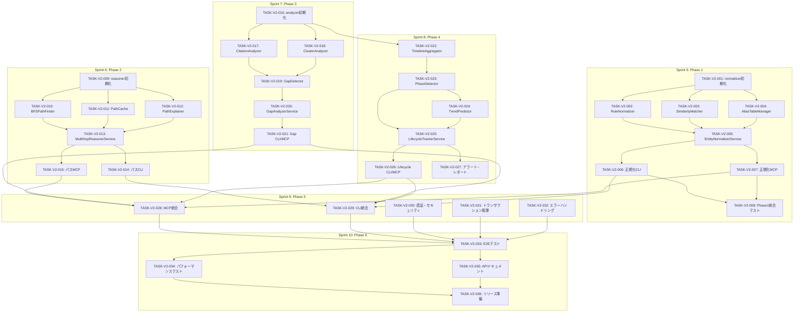

# タスク分解書: YAGOKORO v2.0.0

**Document ID**: TASKS-002
**Version**: 1.0.0
**Created**: 2025-12-30
**Updated**: 2025-12-30
**Status**: Draft
**Related Requirements**: REQ-002
**Related Design**: DES-002

---

## 1. タスク概要

### 1.1 プロジェクト目標

YAGOKORO v2.0.0 は以下の4つの主要機能を追加します：

1. **Phase 1**: エンティティ正規化パイプライン（FR-001）
2. **Phase 2**: マルチホップ推論エンジン（FR-002）
3. **Phase 3**: 研究空白分析器（FR-003）
4. **Phase 4**: 技術ライフサイクルトラッカー（FR-004）
5. **Phase 5**: MCP/CLI拡張（FR-005, FR-006）
6. **Phase 6**: テスト・ドキュメント

### 1.2 スプリント計画

| Sprint | 期間 | 目標 | 主要成果物 |
|--------|------|------|-----------|
| Sprint 5 | Week 1-2 | Phase 1: エンティティ正規化 | libs/normalizer |
| Sprint 6 | Week 3-4 | Phase 2: マルチホップ推論 | libs/reasoner |
| Sprint 7 | Week 5-6 | Phase 3: 研究空白分析 | libs/analyzer (gap) |
| Sprint 8 | Week 7-8 | Phase 4: ライフサイクルトラッカー | libs/analyzer (lifecycle) |
| Sprint 9 | Week 9 | Phase 5: MCP/CLI統合 | libs/mcp, libs/cli 拡張 |
| Sprint 10 | Week 10 | Phase 6: テスト・ドキュメント | E2Eテスト、ドキュメント |

### 1.3 優先度定義

| 優先度 | 説明 | 対応要件 |
|--------|------|----------|
| P0 | ブロッカー（後続タスクの前提） | Must要件 (P0) |
| P1 | 高優先度（Sprint内で完了必須） | Should要件 (P1) |
| P2 | 中優先度（Sprint内で完了推奨） | Could要件 (P2) |
| P3 | 低優先度（時間があれば実施） | Nice-to-have |

### 1.4 見積もりサマリー

| Phase | タスク数 | 合計見積もり |
|-------|----------|--------------|
| Phase 1: エンティティ正規化 | 8 | 40h |
| Phase 2: マルチホップ推論 | 7 | 35h |
| Phase 3: 研究空白分析 | 6 | 30h |
| Phase 4: ライフサイクルトラッカー | 6 | 30h |
| Phase 5: MCP/CLI統合 | 5 | 20h |
| Phase 6: テスト・ドキュメント | 4 | 16h |
| **合計** | **36** | **171h** |

---

## 2. Sprint 5: Phase 1 - エンティティ正規化

### TASK-V2-001: normalizer パッケージ初期化

**優先度**: P0
**見積もり**: 2h
**担当**: -
**要件ID**: FR-001（基盤）
**設計参照**: DES-002 §3

#### 説明
`libs/normalizer` パッケージを新規作成し、基本構造を整備する。

#### 受入条件
- [ ] `libs/normalizer/package.json` が作成されている
- [ ] `libs/normalizer/tsconfig.json` が作成されている
- [ ] `libs/normalizer/vitest.config.ts` が作成されている
- [ ] ディレクトリ構造（rules/, similarity/, alias/, service/）が作成されている
- [ ] `pnpm build` が成功する

#### サブタスク
- [ ] package.json 作成（依存: @yagokoro/neo4j, fastest-levenshtein, compromise）
- [ ] tsconfig.json 作成
- [ ] vitest.config.ts 作成
- [ ] src/index.ts 作成（エクスポート定義）
- [ ] ディレクトリ構造作成

---

### TASK-V2-002: RuleNormalizer 実装

**優先度**: P0
**見積もり**: 6h
**担当**: -
**要件ID**: FR-001-01, FR-001-02
**設計参照**: DES-002 §3.2

#### 説明
ルールベースの正規化エンジンを実装する。表記揺れパターン（GPT-4 → GPT4等）を正規化する。

#### 受入条件
- [ ] `RuleNormalizer` クラスが実装されている
- [ ] ルール設定ファイル（YAML）が読み込める
- [ ] 少なくとも20種類の正規化ルールが定義されている
- [ ] 単体テストカバレッジ > 80%
- [ ] 以下のケースが正しく処理される：
  - GPT-4 → GPT4
  - Chain of Thought → CoT
  - OpenAI / Open AI → OpenAI

#### サブタスク
- [ ] NormalizationRule インターフェース定義
- [ ] RuleNormalizer クラス実装
- [ ] YAML ルール読み込み機能実装
- [ ] デフォルトルールセット作成（config/normalization-rules.yaml）
- [ ] 単体テスト作成

---

### TASK-V2-003: SimilarityMatcher 実装

**優先度**: P0
**見積もり**: 6h
**担当**: -
**要件ID**: FR-001-03, FR-001-04
**設計参照**: DES-002 §3.2

#### 説明
編集距離とベクトル類似度を組み合わせた類似性マッチングを実装する。

#### 受入条件
- [ ] `SimilarityMatcher` クラスが実装されている
- [ ] Levenshtein距離による文字列類似度が計算できる
- [ ] Qdrantベクトル検索との統合ができている
- [ ] 類似度閾値（デフォルト0.8）が設定可能
- [ ] 単体テストカバレッジ > 80%

#### サブタスク
- [ ] SimilarityMatcher クラス実装
- [ ] Levenshtein距離計算（fastest-levenshtein使用）
- [ ] Qdrant統合（ベクトル類似度検索）
- [ ] ハイブリッドスコア計算ロジック
- [ ] 単体テスト作成

---

### TASK-V2-004: AliasTableManager 実装

**優先度**: P0
**見積もり**: 6h
**担当**: -
**要件ID**: FR-001-05, FR-001-06, FR-001-07
**設計参照**: DES-002 §3.2, ADR-001

#### 説明
エイリアステーブルをNeo4jノードとして管理するマネージャーを実装する。

#### 受入条件
- [ ] `AliasTableManager` クラスが実装されている
- [ ] エイリアスの登録・取得・削除ができる
- [ ] エイリアス→正規形の解決ができる
- [ ] Neo4jにAliasノードが永続化される
- [ ] キャッシュ機構が実装されている
- [ ] 単体テスト・統合テストが作成されている

#### サブタスク
- [ ] AliasTableManager クラス実装
- [ ] registerAlias() メソッド実装
- [ ] resolveAlias() メソッド実装
- [ ] loadCache() / saveCache() 実装
- [ ] Neo4j Cypherクエリ作成
- [ ] 統合テスト作成

---

### TASK-V2-005: EntityNormalizerService 実装

**優先度**: P0
**見積もり**: 8h
**担当**: -
**要件ID**: FR-001-01〜FR-001-08
**設計参照**: DES-002 §3.2

#### 説明
正規化パイプライン全体を統括するサービスを実装する。

#### 受入条件
- [ ] `EntityNormalizerService` クラスが実装されている
- [ ] 3段階パイプライン（ルール→類似度→LLM）が動作する
- [ ] バッチ正規化が実装されている
- [ ] LLM確認ステップがオプションで有効化できる
- [ ] 処理結果に信頼度スコアが含まれる
- [ ] 統合テストが作成されている

#### サブタスク
- [ ] EntityNormalizerService クラス実装
- [ ] normalize() メソッド実装
- [ ] normalizeAll() メソッド実装（バッチ処理）
- [ ] getExistingEntities() メソッド実装
- [ ] LLM確認ステップ実装
- [ ] 統合テスト作成

---

### TASK-V2-006: 正規化 CLI コマンド実装

**優先度**: P1
**見積もり**: 4h
**担当**: -
**要件ID**: FR-006-01
**設計参照**: DES-002 §8.2

#### 説明
`yagokoro normalize` CLI コマンドを実装する。

#### 受入条件
- [ ] `yagokoro normalize --all` が動作する
- [ ] `yagokoro normalize --entity <name>` が動作する
- [ ] `yagokoro normalize --dry-run` が動作する
- [ ] `yagokoro normalize --export <file>` が動作する
- [ ] 進捗表示（ora spinner）が実装されている

#### サブタスク
- [ ] libs/cli/src/commands/normalize.ts 作成
- [ ] CLI オプション定義
- [ ] EntityNormalizerService 統合
- [ ] 出力フォーマット実装（table / json）
- [ ] E2Eテスト作成

---

### TASK-V2-007: 正規化 MCP ツール実装

**優先度**: P1
**見積もり**: 4h
**担当**: -
**要件ID**: FR-005-01
**設計参照**: DES-002 §7.2

#### 説明
`normalizeEntity` MCP ツールを実装する。

#### 受入条件
- [ ] `normalizeEntity` ツールが MCP サーバーに登録されている
- [ ] inputSchema が正しく定義されている
- [ ] エンティティ名を受け取り、正規化結果を返す
- [ ] エラーハンドリングが実装されている

#### サブタスク
- [ ] libs/mcp/src/tools/normalize.ts 作成
- [ ] ツール登録（server.ts更新）
- [ ] inputSchema 定義
- [ ] ハンドラー実装
- [ ] 単体テスト作成

---

### TASK-V2-008: Phase 1 統合テスト

**優先度**: P1
**見積もり**: 4h
**担当**: -
**要件ID**: FR-001, NFR-008
**設計参照**: DES-002 §10

#### 説明
Phase 1 の統合テストを作成し、精度目標（> 90%）を検証する。

#### 受入条件
- [ ] 統合テストスイートが作成されている
- [ ] テストデータセット（100エンティティ以上）が準備されている
- [ ] 正規化精度 > 90% が達成されている
- [ ] パフォーマンス目標（1000エンティティ < 30秒）が達成されている

#### サブタスク
- [ ] テストデータセット作成
- [ ] 統合テストスイート作成
- [ ] 精度測定・レポート
- [ ] パフォーマンス測定

---

## 3. Sprint 6: Phase 2 - マルチホップ推論

### TASK-V2-009: reasoner パッケージ初期化

**優先度**: P0
**見積もり**: 2h
**担当**: -
**要件ID**: FR-002（基盤）
**設計参照**: DES-002 §4

#### 説明
`libs/reasoner` パッケージを新規作成し、基本構造を整備する。

#### 受入条件
- [ ] `libs/reasoner/package.json` が作成されている
- [ ] `libs/reasoner/tsconfig.json` が作成されている
- [ ] ディレクトリ構造（pathfinder/, explainer/, cache/, service/）が作成されている
- [ ] `pnpm build` が成功する

#### サブタスク
- [ ] package.json 作成
- [ ] tsconfig.json 作成
- [ ] vitest.config.ts 作成
- [ ] src/index.ts 作成
- [ ] ディレクトリ構造作成

---

### TASK-V2-010: BFSPathFinder 実装

**優先度**: P0
**見積もり**: 8h
**担当**: -
**要件ID**: FR-002-01, FR-002-02, FR-002-03, FR-002-05
**設計参照**: DES-002 §4.2

#### 説明
BFS（幅優先探索）によるパス探索エンジンを実装する。

#### 受入条件
- [ ] `BFSPathFinder` クラスが実装されている
- [ ] `findPaths()` メソッドが動作する
- [ ] `findWeightedPaths()` メソッドが動作する（FR-002-03）
- [ ] `batchFindPaths()` メソッドが動作する（FR-002-05）
- [ ] サイクル検出が実装されている
- [ ] 単体テスト・統合テストが作成されている

#### サブタスク
- [ ] PathQuery, PathResult インターフェース定義
- [ ] BFSPathFinder クラス実装
- [ ] findPaths() 実装（Cypherクエリ）
- [ ] findWeightedPaths() 実装
- [ ] batchFindPaths() 実装（並列処理）
- [ ] CycleDetector 実装
- [ ] 単体テスト・統合テスト作成

---

### TASK-V2-011: PathCache 実装

**優先度**: P1
**見積もり**: 4h
**担当**: -
**要件ID**: FR-002-06
**設計参照**: DES-002 §4.2, ADR-002

#### 説明
パス探索結果のキャッシュ機構を実装する。

#### 受入条件
- [ ] `PathCache` クラスが実装されている
- [ ] LRU キャッシュが動作する
- [ ] TTL（デフォルト1時間）が設定可能
- [ ] キャッシュヒット率のメトリクスが取得できる
- [ ] 単体テストが作成されている

#### サブタスク
- [ ] PathCache クラス実装
- [ ] LRU 戦略実装
- [ ] TTL 管理実装
- [ ] メトリクス収集
- [ ] 単体テスト作成

---

### TASK-V2-012: PathExplainer 実装

**優先度**: P1
**見積もり**: 6h
**担当**: -
**要件ID**: FR-002-04
**設計参照**: DES-002 §4.2

#### 説明
パスの自然言語説明をLLMで生成するコンポーネントを実装する。

#### 受入条件
- [ ] `PathExplainer` クラスが実装されている
- [ ] パスを入力として自然言語説明を生成できる
- [ ] 日本語・英語の両方に対応している
- [ ] 単体テストが作成されている

#### サブタスク
- [ ] PathExplainer クラス実装
- [ ] プロンプトテンプレート作成
- [ ] LLMClient 統合
- [ ] 多言語対応
- [ ] 単体テスト作成

---

### TASK-V2-013: MultiHopReasonerService 実装

**優先度**: P0
**見積もり**: 6h
**担当**: -
**要件ID**: FR-002-01〜FR-002-07
**設計参照**: DES-002 §4.2

#### 説明
マルチホップ推論の統括サービスを実装する。

#### 受入条件
- [ ] `MultiHopReasonerService` クラスが実装されている
- [ ] `findRelationPaths()` メソッドが動作する
- [ ] `explainPath()` メソッドが動作する
- [ ] 統合テストが作成されている

#### サブタスク
- [ ] MultiHopReasonerService クラス実装
- [ ] findRelationPaths() 実装
- [ ] explainPath() 実装
- [ ] 統合テスト作成

---

### TASK-V2-014: パス探索 CLI コマンド実装

**優先度**: P1
**見積もり**: 4h
**担当**: -
**要件ID**: FR-006-02
**設計参照**: DES-002 §8.2

#### 説明
`yagokoro path` CLI コマンドを実装する。

#### 受入条件
- [ ] `yagokoro path --from <entity> --to <entity>` が動作する
- [ ] `--max-hops` オプションが動作する
- [ ] `--explain` オプションでLLM説明が出力される
- [ ] `--batch <file>` でバッチ実行ができる

#### サブタスク
- [ ] libs/cli/src/commands/path.ts 作成
- [ ] CLI オプション定義
- [ ] MultiHopReasonerService 統合
- [ ] 出力フォーマット実装
- [ ] E2Eテスト作成

---

### TASK-V2-015: パス探索 MCP ツール実装

**優先度**: P1
**見積もり**: 4h
**担当**: -
**要件ID**: FR-005-02
**設計参照**: DES-002 §7.2

#### 説明
`findMultiHopPath` MCP ツールを実装する。

#### 受入条件
- [ ] `findMultiHopPath` ツールが登録されている
- [ ] inputSchema が正しく定義されている
- [ ] パス探索結果とオプションで説明を返す

#### サブタスク
- [ ] libs/mcp/src/tools/path.ts 作成
- [ ] ツール登録
- [ ] ハンドラー実装
- [ ] 単体テスト作成

---

## 4. Sprint 7: Phase 3 - 研究空白分析

### TASK-V2-016: analyzer パッケージ初期化

**優先度**: P0
**見積もり**: 2h
**担当**: -
**要件ID**: FR-003（基盤）
**設計参照**: DES-002 §5

#### 説明
`libs/analyzer` パッケージを新規作成し、基本構造を整備する。

#### 受入条件
- [ ] `libs/analyzer/package.json` が作成されている
- [ ] ディレクトリ構造（gap/, lifecycle/）が作成されている
- [ ] `pnpm build` が成功する

#### サブタスク
- [ ] package.json 作成
- [ ] tsconfig.json 作成
- [ ] vitest.config.ts 作成
- [ ] src/index.ts 作成
- [ ] ディレクトリ構造作成

---

### TASK-V2-017: CitationAnalyzer 実装

**優先度**: P0
**見積もり**: 6h
**担当**: -
**要件ID**: FR-003-01
**設計参照**: DES-002 §5.2

#### 説明
引用分析によるカバレッジ計算を実装する。

#### 受入条件
- [ ] `CitationAnalyzer` クラスが実装されている
- [ ] カテゴリ別の論文数・エンティティ数が計算できる
- [ ] カバレッジスコア（0.0-1.0）が算出される
- [ ] 単体テストが作成されている

#### サブタスク
- [ ] CitationAnalyzer クラス実装
- [ ] Cypherクエリ作成
- [ ] カバレッジスコア算出ロジック
- [ ] 単体テスト作成

---

### TASK-V2-018: ClusterAnalyzer 実装

**優先度**: P1
**見積もり**: 6h
**担当**: -
**要件ID**: FR-003-02
**設計参照**: DES-002 §5.2

#### 説明
技術クラスタリング分析を実装する。

#### 受入条件
- [ ] `ClusterAnalyzer` クラスが実装されている
- [ ] 技術間の共起分析ができる
- [ ] クラスター境界の検出ができる
- [ ] 単体テストが作成されている

#### サブタスク
- [ ] ClusterAnalyzer クラス実装
- [ ] 共起分析Cypherクエリ
- [ ] クラスター境界検出ロジック
- [ ] 単体テスト作成

---

### TASK-V2-019: GapDetector 実装

**優先度**: P0
**見積もり**: 8h
**担当**: -
**要件ID**: FR-003-01〜FR-003-03
**設計参照**: DES-002 §5.2

#### 説明
研究ギャップ検出エンジンを実装する。

#### 受入条件
- [ ] `GapDetector` クラスが実装されている
- [ ] 未探索カテゴリの検出ができる
- [ ] 未探索の技術組み合わせの検出ができる
- [ ] ギャップの重要度スコアが算出される
- [ ] 統合テストが作成されている

#### サブタスク
- [ ] GapDetector クラス実装
- [ ] detectGaps() メソッド実装
- [ ] generatePossibleCombinations() 実装
- [ ] 重要度スコア算出（ADR-003準拠）
- [ ] 統合テスト作成

---

### TASK-V2-020: ResearchGapAnalyzerService 実装

**優先度**: P0
**見積もり**: 4h
**担当**: -
**要件ID**: FR-003-04, FR-003-05
**設計参照**: DES-002 §5.2

#### 説明
研究空白分析の統括サービスを実装する。

#### 受入条件
- [ ] `ResearchGapAnalyzerService` クラスが実装されている
- [ ] `analyze()` メソッドが動作する
- [ ] `generateResearchProposals()` が動作する
- [ ] 統合テストが作成されている

#### サブタスク
- [ ] ResearchGapAnalyzerService クラス実装
- [ ] analyze() 実装
- [ ] generateResearchProposals() 実装
- [ ] 統合テスト作成

---

### TASK-V2-021: 研究空白 CLI/MCP 実装

**優先度**: P1
**見積もり**: 4h
**担当**: -
**要件ID**: FR-005-03, FR-006-03
**設計参照**: DES-002 §7.2, §8.2

#### 説明
研究空白分析のCLI/MCPインターフェースを実装する。

#### 受入条件
- [ ] `yagokoro gaps` CLI コマンドが動作する
- [ ] `analyzeResearchGaps` MCP ツールが動作する

#### サブタスク
- [ ] CLI コマンド実装
- [ ] MCP ツール実装
- [ ] テスト作成

---

## 5. Sprint 8: Phase 4 - ライフサイクルトラッカー

### TASK-V2-022: TimelineAggregator 実装

**優先度**: P0
**見積もり**: 6h
**担当**: -
**要件ID**: FR-004-06
**設計参照**: DES-002 §6.2

#### 説明
技術の時系列イベントを集約するコンポーネントを実装する。

#### 受入条件
- [ ] `TimelineAggregator` クラスが実装されている
- [ ] 論文発表、派生技術、ベンチマーク等のイベントが集約できる
- [ ] 時系列でソートされたイベントリストが返される
- [ ] 単体テストが作成されている

#### サブタスク
- [ ] TimelineEvent インターフェース定義
- [ ] TimelineAggregator クラス実装
- [ ] getPublicationEvents() 実装
- [ ] getDerivativeEvents() 実装
- [ ] 単体テスト作成

---

### TASK-V2-023: PhaseDetector 実装

**優先度**: P0
**見積もり**: 8h
**担当**: -
**要件ID**: FR-004-01, FR-004-02
**設計参照**: DES-002 §6.2

#### 説明
Hype Cycleステージ判定と成熟度スコア算出を実装する。

#### 受入条件
- [ ] `PhaseDetector` クラスが実装されている
- [ ] 5つのHype Cycleステージ（黎明期/過熱期/幻滅期/回復期/安定期）が判定できる
- [ ] 成熟度スコア（0-100）が算出される
- [ ] 単体テスト・統合テストが作成されている

#### サブタスク
- [ ] LifecyclePhase 型定義
- [ ] MaturityScore インターフェース定義
- [ ] PhaseDetector クラス実装
- [ ] determinePhase() 実装
- [ ] calculateMaturityScore() 実装
- [ ] 単体テスト・統合テスト作成

---

### TASK-V2-024: TrendPredictor 実装

**優先度**: P1
**見積もり**: 6h
**担当**: -
**要件ID**: FR-004-03
**設計参照**: DES-002 §6.2

#### 説明
トレンド予測エンジンを実装する。

#### 受入条件
- [ ] `TrendPredictor` クラスが実装されている
- [ ] 線形外挿による基本予測ができる
- [ ] LLMによる定性要因分析ができる
- [ ] 単体テストが作成されている

#### サブタスク
- [ ] TrendForecast インターフェース定義
- [ ] TrendPredictor クラス実装
- [ ] linearExtrapolation() 実装
- [ ] analyzeTrendFactors() 実装
- [ ] 単体テスト作成

---

### TASK-V2-025: TechnologyLifecycleTrackerService 実装

**優先度**: P0
**見積もり**: 6h
**担当**: -
**要件ID**: FR-004-01〜FR-004-06
**設計参照**: DES-002 §6.2

#### 説明
ライフサイクルトラッキングの統括サービスを実装する。

#### 受入条件
- [ ] `TechnologyLifecycleTrackerService` クラスが実装されている
- [ ] `trackLifecycle()` メソッドが動作する
- [ ] `compareLifecycles()` メソッドが動作する
- [ ] `findEmergingTechnologies()` が動作する
- [ ] `findDecliningTechnologies()` が動作する
- [ ] 統合テストが作成されている

#### サブタスク
- [ ] TechnologyLifecycleTrackerService クラス実装
- [ ] trackLifecycle() 実装
- [ ] compareLifecycles() 実装
- [ ] findEmergingTechnologies() 実装
- [ ] findDecliningTechnologies() 実装
- [ ] 統合テスト作成

---

### TASK-V2-026: ライフサイクル CLI/MCP 実装

**優先度**: P1
**見積もり**: 4h
**担当**: -
**要件ID**: FR-005-04, FR-006-04
**設計参照**: DES-002 §7.2, §8.2

#### 説明
ライフサイクル分析のCLI/MCPインターフェースを実装する。

#### 受入条件
- [ ] `yagokoro lifecycle` CLI コマンドが動作する
- [ ] `getTechnologyLifecycle` MCP ツールが動作する

#### サブタスク
- [ ] CLI コマンド実装
- [ ] MCP ツール実装
- [ ] テスト作成

---

### TASK-V2-027: アラート・レポート機能実装

**優先度**: P1
**見積もり**: 4h
**担当**: -
**要件ID**: FR-004-03, FR-004-04
**設計参照**: DES-002 §6.2

#### 説明
ステージ遷移アラートと定期レポート生成を実装する。

#### 受入条件
- [ ] ステージ遷移時にアラートが生成される
- [ ] 月次/四半期レポートが生成できる

#### サブタスク
- [ ] StageTransitionAlert 実装
- [ ] PeriodicReportGenerator 実装
- [ ] レポートテンプレート作成

---

## 6. Sprint 9: Phase 5 - MCP/CLI統合

### TASK-V2-028: MCPサーバー拡張

**優先度**: P1
**見積もり**: 4h
**担当**: -
**要件ID**: FR-005-01〜FR-005-05
**設計参照**: DES-002 §7

#### 説明
全ての新規ツールをMCPサーバーに統合する。

#### 受入条件
- [ ] 全4ツールが登録されている
- [ ] ツール一覧に表示される
- [ ] 統合テストが通過する

#### サブタスク
- [ ] ツール登録コード統合
- [ ] エラーハンドリング統一
- [ ] 統合テスト作成

---

### TASK-V2-029: CLIコマンド統合

**優先度**: P1
**見積もり**: 4h
**担当**: -
**要件ID**: FR-006-01〜FR-006-05
**設計参照**: DES-002 §8

#### 説明
全ての新規コマンドをCLIに統合する。

#### 受入条件
- [ ] `yagokoro --help` に全コマンドが表示される
- [ ] 各コマンドのヘルプが正しく表示される
- [ ] E2Eテストが通過する

#### サブタスク
- [ ] index.ts にコマンド登録
- [ ] ヘルプテキスト整備
- [ ] E2Eテスト作成

---

### TASK-V2-030: 認証・セキュリティ実装

**優先度**: P1
**見積もり**: 6h
**担当**: -
**要件ID**: NFR-013, NFR-014
**設計参照**: DES-002 §9.2

#### 説明
APIキー認証とセキュリティ機能を実装する。

#### 受入条件
- [ ] `SecretManager` が実装されている
- [ ] `MCPAuthenticator` が実装されている
- [ ] 入力バリデーション・サニタイズが実装されている
- [ ] レート制限が動作する

#### サブタスク
- [ ] SecretManager 実装
- [ ] MCPAuthenticator 実装
- [ ] InputValidator 実装
- [ ] レート制限実装
- [ ] 単体テスト作成

---

### TASK-V2-031: トランザクション管理実装

**優先度**: P1
**見積もり**: 4h
**担当**: -
**要件ID**: -（インフラ）
**設計参照**: DES-002 §9.3

#### 説明
Neo4jトランザクション管理を実装する。

#### 受入条件
- [ ] `TransactionManager` が実装されている
- [ ] `UnitOfWork` パターンが実装されている
- [ ] バッチ書き込みが動作する

#### サブタスク
- [ ] TransactionManager 実装
- [ ] Neo4jUnitOfWork 実装
- [ ] 単体テスト作成

---

### TASK-V2-032: エラーハンドリング統一

**優先度**: P1
**見積もり**: 4h
**担当**: -
**要件ID**: NFR-016
**設計参照**: DES-002 §8.5

#### 説明
全体のエラーハンドリング戦略を実装する。

#### 受入条件
- [ ] `YagokoroError` 階層が実装されている
- [ ] `ErrorHandler` が実装されている
- [ ] `Result<T, E>` 型が使用されている
- [ ] スタックトレース付きログが出力される

#### サブタスク
- [ ] エラー型定義
- [ ] ErrorHandler 実装
- [ ] 既存コードへの適用
- [ ] 単体テスト作成

---

## 7. Sprint 10: Phase 6 - テスト・ドキュメント

### TASK-V2-033: E2Eテストスイート

**優先度**: P0
**見積もり**: 8h
**担当**: -
**要件ID**: NFR-011
**設計参照**: DES-002 §10.3

#### 説明
全機能のE2Eテストを作成する。

#### 受入条件
- [ ] CLI E2Eテストが作成されている
- [ ] MCP E2Eテストが作成されている
- [ ] テストカバレッジ > 80%

#### サブタスク
- [ ] CLI E2Eテスト作成
- [ ] MCP E2Eテスト作成
- [ ] カバレッジ計測・レポート

---

### TASK-V2-034: パフォーマンステスト

**優先度**: P1
**見積もり**: 4h
**担当**: -
**要件ID**: NFR-001〜NFR-004
**設計参照**: DES-002 §10

#### 説明
パフォーマンス要件の検証テストを作成する。

#### 受入条件
- [ ] 正規化パフォーマンス（1000件 < 30秒）検証
- [ ] パス探索パフォーマンス（4-hop < 5秒）検証
- [ ] 研究空白分析（< 60秒）検証
- [ ] レポート生成（< 120秒）検証

#### サブタスク
- [ ] パフォーマンステスト作成
- [ ] ベンチマーク実行
- [ ] 結果レポート

---

### TASK-V2-035: APIドキュメント

**優先度**: P1
**見積もり**: 4h
**担当**: -
**要件ID**: NFR-012
**設計参照**: DES-002 §12

#### 説明
公開APIのドキュメントを作成する。

#### 受入条件
- [ ] TypeDoc による API ドキュメントが生成される
- [ ] 全 public メソッドにJSDoc コメントがある
- [ ] 使用例が含まれている

#### サブタスク
- [ ] TypeDoc 設定
- [ ] JSDoc コメント追加
- [ ] 使用例追加
- [ ] ドキュメント生成

---

### TASK-V2-036: リリース準備

**優先度**: P0
**見積もり**: 4h
**担当**: -
**要件ID**: -（リリース）
**設計参照**: -

#### 説明
v2.0.0 リリースの準備を行う。

#### 受入条件
- [ ] CHANGELOG.md が更新されている
- [ ] バージョン番号が 2.0.0 に更新されている
- [ ] GitHub Release が作成できる
- [ ] npm publish が成功する（該当する場合）

#### サブタスク
- [ ] CHANGELOG.md 更新
- [ ] package.json バージョン更新
- [ ] リリースノート作成
- [ ] リリースタグ作成

---

## 8. 依存関係グラフ

---

## 9. リスクと対策

| リスク | 影響度 | 発生確率 | 対策 |
|--------|--------|----------|------|
| LLM応答品質のばらつき | 中 | 高 | プロンプト最適化、フォールバック実装 |
| パス探索の計算量爆発 | 高 | 中 | maxHops制限、プルーニング戦略 |
| エンティティ正規化の精度不足 | 高 | 中 | 多段階パイプライン、LLM確認ステップ |
| 大規模データでの性能劣化 | 高 | 中 | インデックス最適化、キャッシュ戦略 |
| 外部API仕様変更 | 中 | 低 | アダプター層の抽象化 |

---

## 10. 承認

| 役割 | 名前 | 日付 | 署名 |
|------|------|------|------|
| プロダクトオーナー | | | |
| テックリード | | | |
| QAリード | | | |

---

**Document History**

| Version | Date | Author | Changes |
|---------|------|--------|---------|
| 1.0.0 | 2025-12-30 | YAGOKORO Dev Team | Initial draft |
