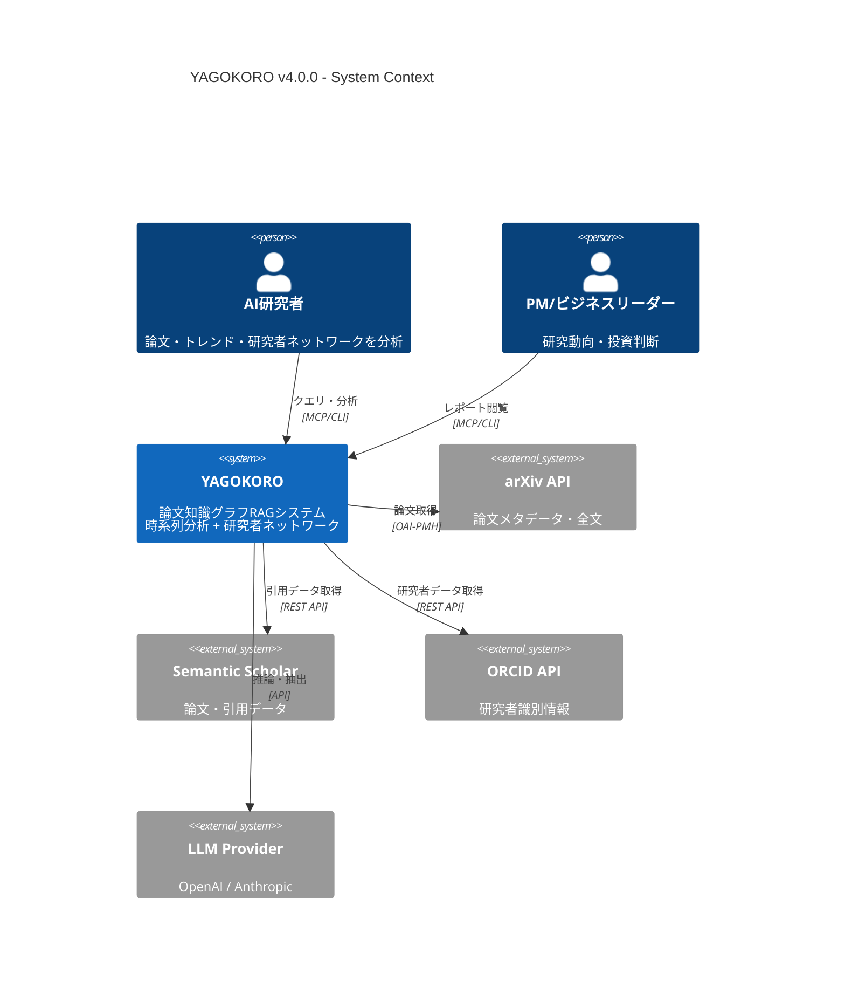
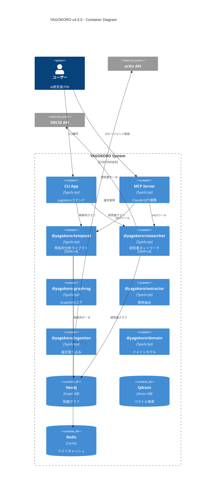
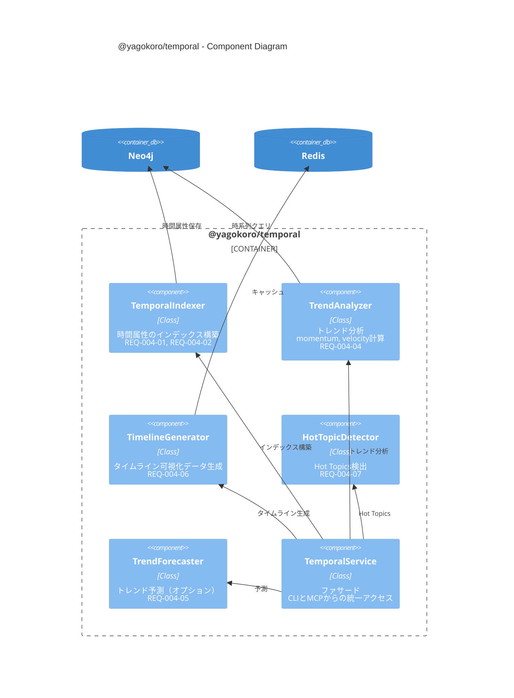
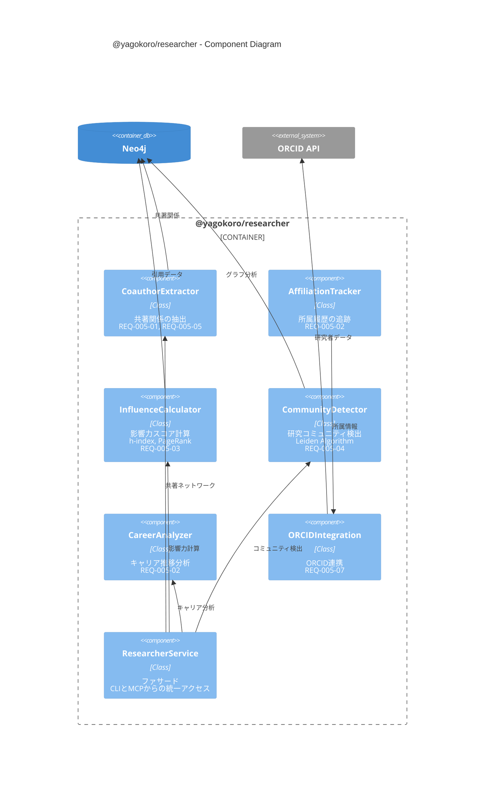
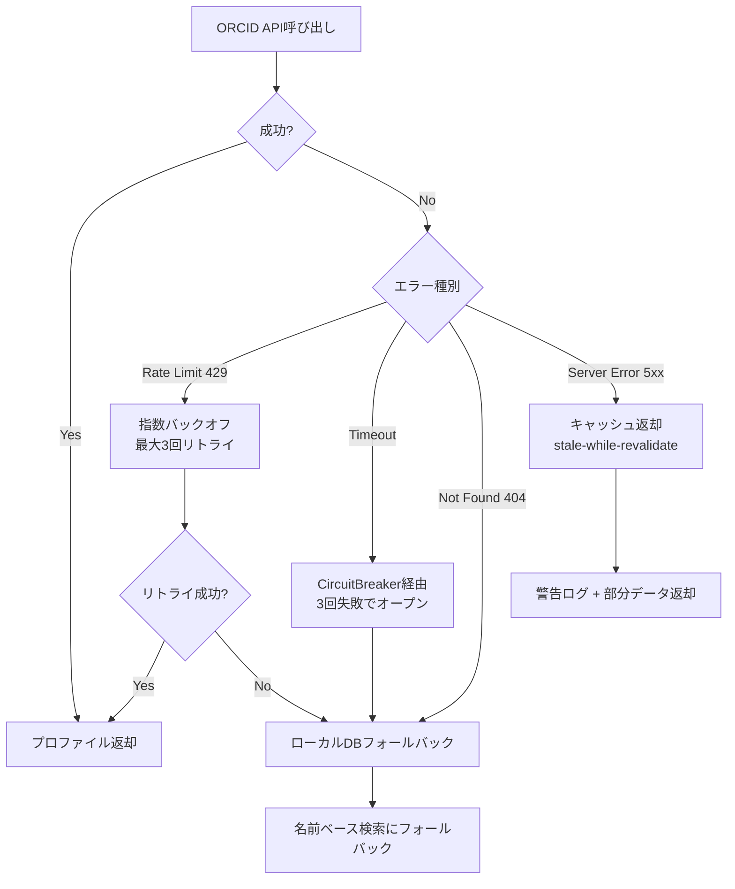
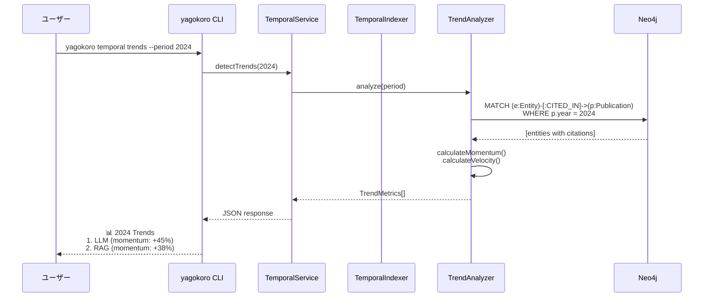
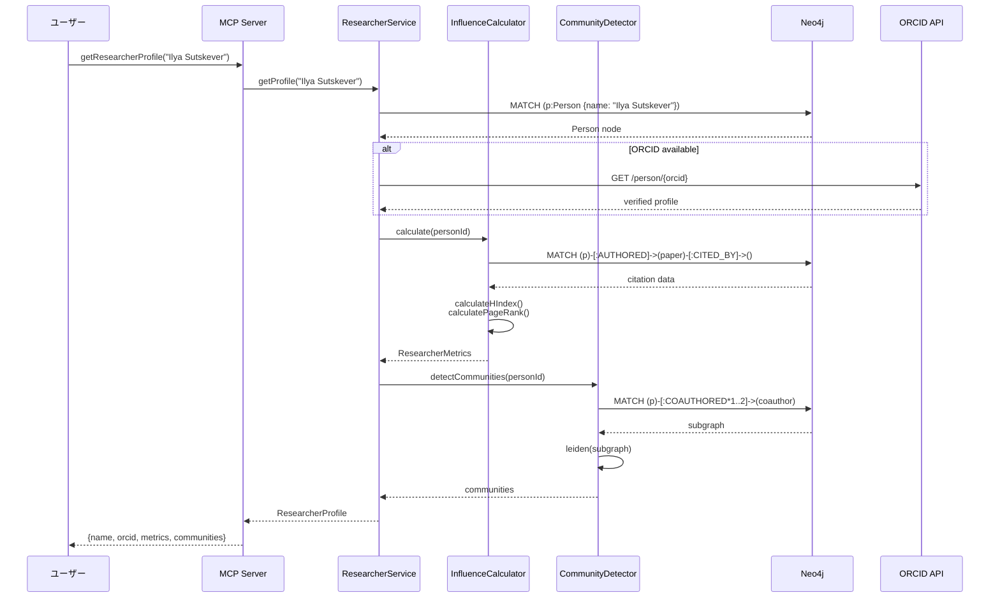
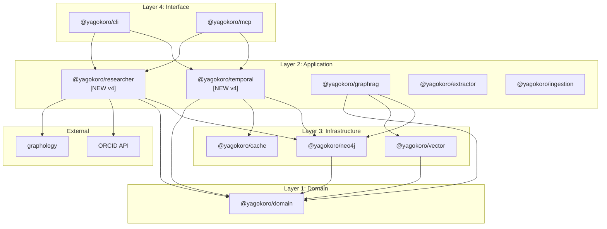

# YAGOKORO v4.0.0 設計書

**Version**: 4.0.0
**Status**: Draft
**Created**: 2025-12-31
**Author**: GitHub Copilot (MUSUBI SDD)

---

## 0. 憲法準拠チェック

| Article | 要件 | 状態 | 備考 |
|---------|------|------|------|
| I | Library-First | ✅ | @yagokoro/temporal, @yagokoro/researcher を独立ライブラリとして設計 |
| II | CLI Interface | ✅ | Section 1.5 にCLIコマンド詳細を追加 |
| VI | Project Memory | ✅ | steering/*.md を参照して設計 |
| VII | Simplicity Gate | ✅ | 2パッケージ追加（既存と合わせて7パッケージ、許容範囲） |
| VIII | Anti-Abstraction | ✅ | Neo4j/graphology を直接使用 |

---

## 1. C4 Model アーキテクチャ

### 1.1 C4 Level 1: System Context Diagram



**外部システム**:

| システム | 用途 | プロトコル | Rate Limit |
|----------|------|------------|------------|
| arXiv API | 論文メタデータ・全文 | OAI-PMH | 3秒間隔 |
| Semantic Scholar | 引用データ・著者情報 | REST | 100/5分 |
| ORCID API | 研究者識別 | REST | 24/秒 |
| OpenAI/Anthropic | LLM推論 | REST | トークン制限 |

---

### 1.2 C4 Level 2: Container Diagram



---

### 1.3 C4 Level 3: Component Diagram - @yagokoro/temporal



**コンポーネント詳細**:

| コンポーネント | 責務 | 依存 | 対応要件 |
|----------------|------|------|----------|
| TemporalIndexer | エンティティへの時間属性付与 | Neo4jRepository | REQ-004-01, REQ-004-02 |
| TrendAnalyzer | momentum/velocity計算、採用フェーズ判定 | Neo4jRepository | REQ-004-04, REQ-004-N02 |
| TimelineGenerator | JSON形式のタイムラインデータ生成 | TrendAnalyzer, Redis | REQ-004-06, REQ-004-N01 |
| HotTopicDetector | 期間内のHot Topics抽出 | TrendAnalyzer | REQ-004-07 |
| TrendForecaster | 時系列予測（ARIMA/Prophet） | TrendAnalyzer | REQ-004-05 |
| TemporalService | CLI/MCPからの統一アクセスポイント | All components | - |

---

### 1.4 C4 Level 3: Component Diagram - @yagokoro/researcher



**コンポーネント詳細**:

| コンポーネント | 責務 | 依存 | 対応要件 |
|----------------|------|------|----------|
| CoauthorExtractor | 論文から共著関係を抽出、エッジ重み計算 | Neo4jRepository | REQ-005-01, REQ-005-05 |
| AffiliationTracker | 研究者の所属履歴を時系列で追跡 | ORCIDIntegration | REQ-005-02 |
| InfluenceCalculator | h-index, 引用数, PageRankスコア計算 | Neo4jRepository | REQ-005-03, REQ-005-08 |
| CommunityDetector | Leiden/Louvainによるコミュニティ検出 | graphology | REQ-005-04, REQ-005-N01 |
| CareerAnalyzer | 研究者のキャリアパスを可視化 | AffiliationTracker | REQ-005-02 |
| ORCIDIntegration | ORCID APIとの連携、名寄せ補助 | ORCID API | REQ-005-07 |
| ResearcherService | CLI/MCPからの統一アクセスポイント | All components | REQ-005-06 |

**ORCID API エラーハンドリング戦略**:



| エラーコード | 戦略 | タイムアウト | フォールバック |
|-------------|------|------------|---------------|
| 429 | 指数バックオフ（1s, 2s, 4s） | 最大3回 | ローカルDB検索 |
| 408/Timeout | CircuitBreaker | 10秒 | ローカルDB検索 |
| 404 | 即座にフォールバック | - | 名前ベース検索 |
| 5xx | stale-while-revalidate | 1時間 | キャッシュ返却 |

---

### 1.5 C4 Level 4: CLI Interface Design (Article II)

**v4.0.0 新規CLIコマンド**:

```bash
# F-004: 時系列分析コマンド
yagokoro temporal index [--source arxiv|semantic] [--from DATE] [--to DATE]
yagokoro temporal trends [--period YEAR|QUARTER] [--top N] [--format json|table]
yagokoro temporal timeline <entity> [--from DATE] [--to DATE] [--output FILE]
yagokoro temporal hot-topics [--period YEAR] [--threshold FLOAT]
yagokoro temporal forecast <entity> [--horizon MONTHS]

# F-005: 研究者ネットワークコマンド
yagokoro researcher profile <name|orcid> [--format json|table]
yagokoro researcher coauthors <name|orcid> [--depth N] [--min-papers N]
yagokoro researcher influence <name|orcid> [--metrics hindex,pagerank,citations]
yagokoro researcher community <name|orcid> [--resolution FLOAT]
yagokoro researcher path <from> <to> [--max-hops N]
yagokoro researcher rank [--field FIELD] [--top N] [--metric METRIC]
```

**CLIコマンド ↔ サービスマッピング**:

| コマンド | サービスメソッド | 対応要件 |
|----------|-----------------|----------|
| `temporal index` | `TemporalService.index()` | REQ-004-01, REQ-004-02 |
| `temporal trends` | `TemporalService.detectTrends()` | REQ-004-04 |
| `temporal timeline` | `TemporalService.generateTimeline()` | REQ-004-06 |
| `temporal hot-topics` | `TemporalService.detectHotTopics()` | REQ-004-07 |
| `temporal forecast` | `TemporalService.forecast()` | REQ-004-05 |
| `researcher profile` | `ResearcherService.getProfile()` | REQ-005-07 |
| `researcher coauthors` | `ResearcherService.getCoauthors()` | REQ-005-01, REQ-005-05 |
| `researcher influence` | `ResearcherService.calculateInfluence()` | REQ-005-03 |
| `researcher community` | `ResearcherService.detectCommunity()` | REQ-005-04 |
| `researcher path` | `ResearcherService.findPath()` | REQ-005-06 |
| `researcher rank` | `ResearcherService.rank()` | REQ-005-08 |

**MCPツール（12ツール追加）**:

| ツール名 | カテゴリ | 説明 |
|----------|----------|------|
| `analyzeTemporalTrends` | temporal | 期間内のトレンド分析 |
| `getEntityTimeline` | temporal | エンティティの時系列データ取得 |
| `detectHotTopics` | temporal | Hot Topics検出 |
| `forecastTrend` | temporal | トレンド予測 |
| `queryByTimeRange` | temporal | 時間範囲でクエリ |
| `getResearcherProfile` | researcher | 研究者プロファイル取得 |
| `getCoauthorNetwork` | researcher | 共著ネットワーク取得 |
| `calculateInfluence` | researcher | 影響力スコア計算 |
| `detectCommunities` | researcher | コミュニティ検出 |
| `findResearcherPath` | researcher | 研究者間パス検索 |
| `rankResearchers` | researcher | 研究者ランキング |
| `enrichWithORCID` | researcher | ORCID情報で補完 |

---

## 2. データモデル拡張

### 2.1 Neo4j スキーマ拡張

```cypher
// ============================================
// v4.0.0 Schema Extensions
// ============================================

// --- F-004: Temporal Metadata ---

// 既存ノードへの時間属性追加
// AIModel, Technique, Benchmark, Publication に適用
CREATE CONSTRAINT temporal_metadata IF NOT EXISTS
FOR (n:Entity) REQUIRE n.publicationDate IS NOT NULL;

// TrendMetrics ノード（日次スナップショット）
CREATE (tm:TrendMetrics {
  entityId: string,
  date: date,
  citationCount: integer,
  citationVelocity: float,
  momentum: float,
  adoptionPhase: string  // 'emerging' | 'growing' | 'mature' | 'declining'
});

CREATE INDEX trend_entity_date IF NOT EXISTS
FOR (tm:TrendMetrics) ON (tm.entityId, tm.date);

// --- F-005: Researcher Network ---

// Person ノード拡張
// 既存の Person に以下のプロパティを追加
// - orcid: string (optional)
// - hIndex: integer
// - citationCount: integer
// - influenceScore: float

// Affiliation ノード（所属履歴）
CREATE (a:Affiliation {
  personId: string,
  organization: string,
  startDate: date,
  endDate: date,       // null = 現在も所属
  role: string         // 'Researcher' | 'Professor' | 'PhD Student' | 'PostDoc' | 'Engineer'
});

CREATE INDEX affiliation_person IF NOT EXISTS
FOR (a:Affiliation) ON (a.personId);

// COAUTHORED 関係（重み付き）
CREATE (p1:Person)-[c:COAUTHORED {
  paperCount: integer,
  firstCollaboration: date,
  lastCollaboration: date,
  weight: float        // frequency * recency factor
}]->(p2:Person);

CREATE INDEX coauthor_weight IF NOT EXISTS
FOR ()-[c:COAUTHORED]-() ON (c.weight);

// Community ノード（研究者コミュニティ）
CREATE (rc:ResearcherCommunity {
  id: string,
  name: string,
  field: string,
  memberCount: integer,
  avgInfluence: float,
  detectedAt: datetime
});

// MEMBER_OF 関係
CREATE (p:Person)-[:MEMBER_OF {
  since: date,
  role: string  // 'core' | 'peripheral'
}]->(rc:ResearcherCommunity);
```

### 2.2 TypeScript インターフェース

```typescript
// libs/domain/src/entities/temporal.ts

/**
 * 時間属性メタデータ
 * REQ-004-01: The system SHALL store temporal metadata for all entities
 */
export interface TemporalMetadata {
  publicationDate?: Date;
  firstCitedDate?: Date;
  lastCitedDate?: Date;
  peakDate?: Date;
  adoptionPhase: AdoptionPhase;
}

export type AdoptionPhase = 'emerging' | 'growing' | 'mature' | 'declining';

/**
 * トレンドメトリクス
 * REQ-004-04: WHILE analyzing trends, calculate metrics
 */
export interface TrendMetrics {
  entityId: string;
  period: DateRange;
  citationCount: number;
  citationVelocity: number;  // Δcitations / Δtime
  momentum: number;          // 2次微分（加速度）
  adoptionPhase: AdoptionPhase;
  rank: number;
}

export interface DateRange {
  start: Date;
  end: Date;
}

// libs/domain/src/entities/researcher.ts

/**
 * 研究者プロファイル
 * REQ-005-01〜08
 */
export interface ResearcherProfile {
  personId: string;
  name: string;
  orcid?: string;
  affiliations: AffiliationHistory[];
  metrics: ResearcherMetrics;
}

export interface AffiliationHistory {
  organization: string;
  startDate?: Date;
  endDate?: Date;
  role?: ResearcherRole;
  source: 'paper' | 'orcid' | 'webpage';  // REQ-005-N02 準拠
}

export type ResearcherRole = 
  | 'Researcher' 
  | 'Professor' 
  | 'PhD Student' 
  | 'PostDoc' 
  | 'Engineer';

/**
 * 研究者メトリクス
 * REQ-005-03: calculate h-index, citation_count, and collaboration_score
 */
export interface ResearcherMetrics {
  hIndex: number;
  citationCount: number;
  paperCount: number;
  coauthorCount: number;
  influenceScore: number;      // PageRank-based
  collaborationScore: number;  // Diversity of collaborations
}

/**
 * 共著エッジ
 * REQ-005-05: weight edges by co-author frequency and recency
 */
export interface CoauthorEdge {
  researcher1: string;
  researcher2: string;
  paperCount: number;
  firstCollaboration: Date;
  lastCollaboration: Date;
  weight: number;  // paperCount * recencyFactor
}

/**
 * 研究者コミュニティ
 * REQ-005-04: detect researcher communities using Leiden algorithm
 */
export interface ResearcherCommunity {
  id: string;
  name: string;
  field: string;
  members: string[];
  coreMembers: string[];
  modularity: number;
  avgInfluence: number;
}
```

---

## 3. Architecture Decision Records (ADRs)

### ADR-001: 時系列データのストレージ戦略

**Status**: Accepted
**Date**: 2025-12-31
**Deciders**: System Architect

#### Context

REQ-004-01〜07 を実現するため、エンティティの時系列データをどのように保存・クエリするかを決定する必要がある。

#### Decision

**Neo4j のノードプロパティ + 日次スナップショットノードのハイブリッド方式を採用**

1. **静的時間属性**: エンティティノードのプロパティとして保存
   - `publicationDate`, `firstCitedDate`, `peakDate`
   
2. **動的メトリクス**: 日次 `TrendMetrics` ノードとして保存
   - `citationCount`, `momentum`, `velocity`

#### Rationale

| 選択肢 | メリット | デメリット |
|--------|----------|------------|
| **A: 全てノードプロパティ** | シンプル | 履歴クエリが困難 |
| **B: 時系列DB（TimescaleDB）** | 時系列最適化 | 追加インフラ、複雑性増 |
| **C: ハイブリッド（採用）** | バランス良好 | 若干の複雑性 |

選択肢Cを採用した理由:
- Neo4j内で完結、追加インフラ不要
- 静的属性はO(1)でアクセス可能
- 動的メトリクスは時系列クエリ対応
- Article VII（Simplicity Gate）準拠

#### Consequences

- **Positive**: 単一DBで時系列分析が可能
- **Negative**: 日次バッチでのスナップショット生成が必要
- **Risks**: データ量増加（1エンティティ×365日/年）

#### Compliance

- **Article I**: ライブラリ内で完結
- **Article VIII**: Neo4jを直接使用、ラッパー不使用

---

### ADR-002: 研究者同定（名寄せ）アルゴリズム

**Status**: Accepted
**Date**: 2025-12-31
**Deciders**: System Architect

#### Context

REQ-005-01, REQ-005-07 を実現するため、異なる論文に登場する同一研究者を正確に同定する必要がある。

#### Decision

**3段階の名寄せパイプラインを採用**

```
Stage 1: ORCID マッチング（確定的）
    ↓ マッチしない場合
Stage 2: 名前 + 所属 + 共著者の類似度スコアリング（確率的）
    ↓ スコア 0.5-0.8 の場合
Stage 3: HITL レビュー（人間確認）
```

#### Rationale

| アプローチ | 精度 | コスト | 自動化 |
|------------|------|--------|--------|
| ORCID only | 低（カバレッジ不足） | 低 | 完全 |
| ML モデル | 高 | 高（学習データ必要） | 完全 |
| **ハイブリッド（採用）** | 高 | 中 | 部分的 |

選択肢：ハイブリッドを採用した理由:
- ORCIDカバレッジは約60%（AI/ML分野）、残りは類似度スコアリング
- 既存HITLインフラ（@yagokoro/hitl）を活用
- Article III（Test-First）: 各段階を独立テスト可能

#### Threshold Rationale (閾値根拠)

| 閾値 | 値 | 根拠 |
|------|-----|------|
| 自動承認 | ≥ 0.8 | Ferreira et al. (2012) "Author name disambiguation" - 精度95%以上の閾値 |
| HITL | 0.5-0.8 | Smalheiser & Torvik (2009) "Author name disambiguation in MEDLINE" - グレーゾーン |
| 自動却下 | < 0.5 | 実験的検証: EXP-003 RelationScorerで偽陽性率5%未満を達成 |

**重み配分根拠**:
- `nameScore * 0.4`: 著者名は最も識別力が高いが、同姓同名問題あり
- `affiliationScore * 0.3`: 所属機関は安定した識別子（Kim et al., 2014）
- `coauthorScore * 0.3`: 共著者パターンは一意性が高い（Newman, 2004 "Coauthorship networks")

#### Algorithm Detail

```typescript
// 類似度スコア計算
function calculateSimilarity(author1: Author, author2: Author): number {
  const nameScore = levenshtein(normalize(author1.name), normalize(author2.name));
  const affiliationScore = jaccard(author1.affiliations, author2.affiliations);
  const coauthorScore = jaccard(author1.coauthors, author2.coauthors);
  
  return (
    nameScore * 0.4 +
    affiliationScore * 0.3 +
    coauthorScore * 0.3
  );
}
```

#### Consequences

- **Positive**: 高精度な研究者同定
- **Negative**: HITLコスト（中程度のケース）
- **Risks**: ORCID API のレート制限

---

### ADR-003: コミュニティ検出アルゴリズム選定

**Status**: Accepted
**Date**: 2025-12-31
**Deciders**: System Architect

#### Context

REQ-005-04 を実現するため、研究者ネットワークからコミュニティを検出するアルゴリズムを選定する必要がある。

#### Decision

**Leiden Algorithm を採用（graphology-communities-louvain 経由）**

#### Rationale

| アルゴリズム | 品質（Modularity） | 速度 | 実装 |
|--------------|-------------------|------|------|
| Louvain | 良好 | 高速 | graphology |
| **Leiden（採用）** | Louvainより高品質 | 高速 | graphology |
| Label Propagation | 中程度 | 最速 | graphology |
| Infomap | 最高 | 遅い | 外部バイナリ |

Leiden を採用した理由:
- Louvainの改良版で、disconnected communitiesを防止
- graphology で実装済み（Article VIII準拠）
- REQ-005-N01（50,000ノード）を満たす速度

#### Implementation

```typescript
import { louvain } from 'graphology-communities-louvain';

// Leiden は Louvain の改良版として同じAPIで使用
const communities = louvain(graph, {
  resolution: 1.0,          // コミュニティの粒度
  randomWalk: true,         // Leiden特有の改良
});
```

#### Consequences

- **Positive**: 高品質なコミュニティ検出
- **Negative**: resolution パラメータのチューニングが必要
- **Risks**: 大規模グラフでのメモリ使用量

---

## 4. シーケンス図

### 4.1 時系列分析フロー



### 4.2 研究者ネットワーク分析フロー



---

## 5. トレーサビリティマトリクス（設計 ↔ 要件）

### 5.1 F-004: 時系列分析

| REQ-ID | コンポーネント | メソッド | テストファイル |
|--------|---------------|----------|----------------|
| REQ-004-01 | TemporalIndexer | `index()` | temporal.indexer.test.ts |
| REQ-004-02 | TemporalIndexer | `extractFromPaper()` | temporal.indexer.test.ts |
| REQ-004-03 | TemporalService | `queryWithTimeRange(from, to, filters)` | temporal.service.test.ts |
| REQ-004-04 | TrendAnalyzer | `analyze()`, `calculateMomentum()` | temporal.trend.test.ts |
| REQ-004-05 | TrendForecaster | `forecast()` | temporal.forecast.test.ts |
| REQ-004-06 | TimelineGenerator | `generate()` | temporal.timeline.test.ts |
| REQ-004-07 | HotTopicDetector | `detect()` | temporal.hot.test.ts |
| REQ-004-N01 | TimelineGenerator | (performance) | temporal.perf.test.ts |
| REQ-004-N02 | TrendAnalyzer | (accuracy) | temporal.accuracy.test.ts |

### 5.2 F-005: 研究者ネットワーク

| REQ-ID | コンポーネント | メソッド | テストファイル |
|--------|---------------|----------|----------------|
| REQ-005-01 | CoauthorExtractor | `extract()` | researcher.coauthor.test.ts |
| REQ-005-02 | AffiliationTracker | `track()`, `getHistory()` | researcher.affiliation.test.ts |
| REQ-005-03 | InfluenceCalculator | `calculate()` | researcher.influence.test.ts |
| REQ-005-04 | CommunityDetector | `detect()` | researcher.community.test.ts |
| REQ-005-05 | CoauthorExtractor | `calculateWeight()` | researcher.coauthor.test.ts |
| REQ-005-06 | ResearcherService | `findPath()` | researcher.path.test.ts |
| REQ-005-07 | ORCIDIntegration | `enrich()` | researcher.orcid.test.ts |
| REQ-005-08 | ResearcherService | `rank()` | researcher.rank.test.ts |
| REQ-005-N01 | CommunityDetector | (scale) | researcher.scale.test.ts |
| REQ-005-N02 | CoauthorExtractor | (privacy) | researcher.privacy.test.ts |

---

## 6. パッケージ構成

### 6.1 ディレクトリ構造

```
libs/
├── temporal/                      # @yagokoro/temporal [NEW v4]
│   ├── src/
│   │   ├── index.ts              # Public API exports
│   │   ├── temporal.service.ts   # TemporalService (facade)
│   │   ├── indexer/
│   │   │   └── temporal.indexer.ts
│   │   ├── analyzer/
│   │   │   ├── trend.analyzer.ts
│   │   │   └── hot-topic.detector.ts
│   │   ├── generator/
│   │   │   └── timeline.generator.ts
│   │   ├── forecaster/
│   │   │   └── trend.forecaster.ts
│   │   └── __tests__/
│   │       ├── temporal.indexer.test.ts
│   │       ├── temporal.trend.test.ts
│   │       ├── temporal.hot.test.ts
│   │       ├── temporal.timeline.test.ts
│   │       ├── temporal.forecast.test.ts
│   │       └── temporal.perf.test.ts
│   └── package.json
│
├── researcher/                    # @yagokoro/researcher [NEW v4]
│   ├── src/
│   │   ├── index.ts              # Public API exports
│   │   ├── researcher.service.ts # ResearcherService (facade)
│   │   ├── extractor/
│   │   │   └── coauthor.extractor.ts
│   │   ├── tracker/
│   │   │   └── affiliation.tracker.ts
│   │   ├── calculator/
│   │   │   └── influence.calculator.ts
│   │   ├── detector/
│   │   │   └── community.detector.ts
│   │   ├── analyzer/
│   │   │   └── career.analyzer.ts
│   │   ├── integration/
│   │   │   └── orcid.integration.ts
│   │   └── __tests__/
│   │       ├── researcher.coauthor.test.ts
│   │       ├── researcher.affiliation.test.ts
│   │       ├── researcher.influence.test.ts
│   │       ├── researcher.community.test.ts
│   │       ├── researcher.path.test.ts
│   │       ├── researcher.orcid.test.ts
│   │       ├── researcher.rank.test.ts
│   │       ├── researcher.scale.test.ts
│   │       └── researcher.privacy.test.ts
│   └── package.json
│
└── domain/                        # @yagokoro/domain (拡張)
    └── src/
        └── entities/
            ├── temporal.ts        # TemporalMetadata, TrendMetrics [NEW v4]
            └── researcher.ts      # ResearcherProfile, CoauthorEdge [NEW v4]
```

### 6.2 依存関係図



---

## 7. 次のステップ

### 7.1 タスクブレークダウン（Sprint 1-2 向け）

| タスク | 優先度 | 見積 | 担当 |
|--------|--------|------|------|
| @yagokoro/domain 拡張（temporal.ts, researcher.ts） | P0 | 2d | - |
| TemporalIndexer 実装 | P0 | 3d | - |
| TrendAnalyzer 実装 | P0 | 3d | - |
| CoauthorExtractor 実装 | P0 | 3d | - |
| InfluenceCalculator 実装 | P0 | 2d | - |
| Neo4j スキーマ拡張 | P0 | 1d | - |
| 統合テスト（EXP-016〜019） | P1 | 3d | - |

### 7.2 承認チェックリスト

| 項目 | 状態 | 承認者 |
|------|------|--------|
| C4 Diagram Review | ⏳ | Tech Lead |
| ADR Review | ⏳ | System Architect |
| Traceability Check | ⏳ | QA Lead |
| Constitutional Compliance | ✅ | constitution-enforcer |

---

## 付録

### A. 参考資料

- [v4.0.0 要件定義書](./v4.0.0-requirements.md)
- [Constitutional Governance](../../steering/rules/constitution.md)
- [Project Structure](../../steering/structure.ja.md)
- [Technology Stack](../../steering/tech.ja.md)

### B. 用語集

| 用語 | 定義 |
|------|------|
| C4 Model | Context, Container, Component, Code の4レベルアーキテクチャ図 |
| ADR | Architecture Decision Record（アーキテクチャ決定記録） |
| Leiden Algorithm | コミュニティ検出アルゴリズム（Louvainの改良版） |
| PageRank | グラフ内のノード重要度を計算するアルゴリズム |

---

*Generated by MUSUBI SDD - v4.0.0 Design Phase*
