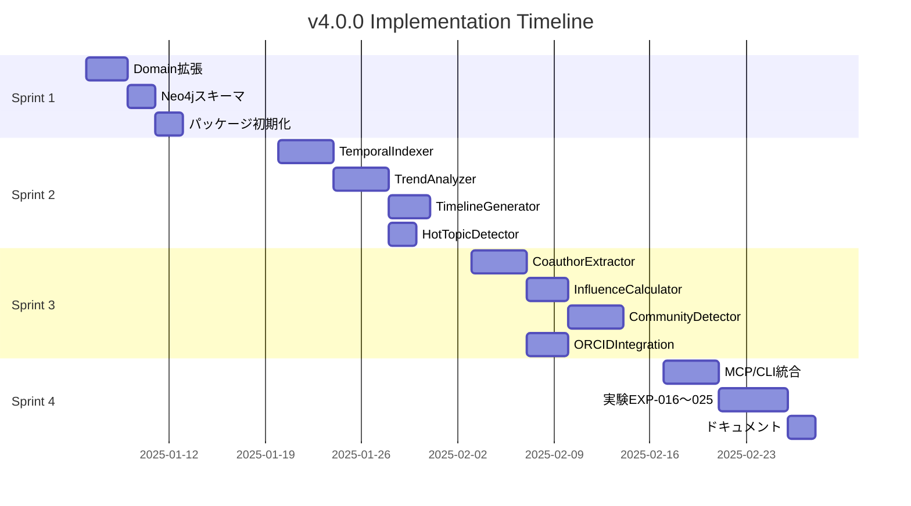

# YAGOKORO v4.0.0 タスク分解書

**Version**: 4.0.0
**Status**: Draft
**Created**: 2025-12-31
**Author**: GitHub Copilot (MUSUBI SDD)

---

## 0. 憲法準拠チェック

| Article | タスク設計への反映 |
|---------|-------------------|
| I | ライブラリ単位でタスクを分割 |
| II | CLI実装タスクを各ライブラリに含める |
| III | テスト作成を実装より前に配置 |
| V | REQ-ID→タスク追跡可能 |
| VII | 2パッケージに限定（temporal/researcher） |

---

## 1. スプリント計画

### 1.1 概要

| Sprint | 期間 | テーマ | 主要成果物 |
|--------|------|--------|------------|
| Sprint 1 | Week 1-2 | 基盤構築 | domain拡張、Neo4jスキーマ、パッケージセットアップ |
| Sprint 2 | Week 3-4 | 時系列分析 | @yagokoro/temporal 完成 |
| Sprint 3 | Week 5-6 | 研究者ネットワーク | @yagokoro/researcher 完成 |
| Sprint 4 | Week 7-8 | 統合・検証 | MCP/CLI統合、実験EXP-016〜025 |

### 1.2 マイルストーン



---

## 2. Sprint 1: 基盤構築（Week 1-2）

### 2.1 タスク一覧

| Task ID | タスク名 | 優先度 | 見積 | 依存 | 対応要件 |
|---------|----------|--------|------|------|----------|
| T-101 | @yagokoro/domain 時系列型追加 | P0 | 4h | - | REQ-004-01 |
| T-102 | @yagokoro/domain 研究者型追加 | P0 | 4h | - | REQ-005-01 |
| T-103 | Neo4j スキーマ拡張（時系列） | P0 | 4h | T-101 | REQ-004-01 |
| T-104 | Neo4j スキーマ拡張（研究者） | P0 | 4h | T-102 | REQ-005-01 |
| T-105 | @yagokoro/temporal パッケージ初期化 | P0 | 2h | T-101 | - |
| T-106 | @yagokoro/researcher パッケージ初期化 | P0 | 2h | T-102 | - |
| T-107 | graphology 依存追加・型定義 | P0 | 2h | T-106 | REQ-005-04 |
| T-108 | ORCID API クライアント準備 | P1 | 4h | T-106 | REQ-005-07 |

### 2.2 タスク詳細

#### T-101: @yagokoro/domain 時系列型追加

**説明**: TemporalMetadata, TrendMetrics インターフェースを追加

**受入基準**:
- [ ] `libs/domain/src/entities/temporal.ts` 作成
- [ ] TemporalMetadata インターフェース定義
- [ ] TrendMetrics インターフェース定義
- [ ] AdoptionPhase 型定義
- [ ] 単体テスト作成

**成果物**:
```typescript
// libs/domain/src/entities/temporal.ts
export type AdoptionPhase = 'emerging' | 'growing' | 'mature' | 'declining';

export interface TemporalMetadata {
  publicationDate?: Date;
  firstCitedDate?: Date;
  lastCitedDate?: Date;
  peakDate?: Date;
  adoptionPhase: AdoptionPhase;
}

export interface TrendMetrics {
  entityId: string;
  period: { start: Date; end: Date };
  citationCount: number;
  citationVelocity: number;
  momentum: number;
  rank: number;
}
```

---

#### T-102: @yagokoro/domain 研究者型追加

**説明**: ResearcherProfile, CoauthorEdge, ResearcherCommunity インターフェースを追加

**受入基準**:
- [ ] `libs/domain/src/entities/researcher.ts` 作成
- [ ] ResearcherProfile インターフェース定義
- [ ] ResearcherMetrics インターフェース定義
- [ ] CoauthorEdge インターフェース定義
- [ ] ResearcherCommunity インターフェース定義
- [ ] 単体テスト作成

**成果物**:
```typescript
// libs/domain/src/entities/researcher.ts
export interface ResearcherProfile {
  id: string;
  name: string;
  normalizedName: string;
  orcid?: string;
  affiliations: Affiliation[];
  metrics: ResearcherMetrics;
  communities: string[];
}

export interface ResearcherMetrics {
  hIndex: number;
  citationCount: number;
  paperCount: number;
  coauthorCount: number;
  pageRank: number;
}

export interface CoauthorEdge {
  researcher1: string;
  researcher2: string;
  paperCount: number;
  firstCollaboration: Date;
  lastCollaboration: Date;
  weight: number;
}

export interface ResearcherCommunity {
  id: string;
  name: string;
  field: string;
  members: string[];
  coreMembers: string[];
  modularity: number;
}
```

---

#### T-103: Neo4j スキーマ拡張（時系列）

**説明**: 時系列分析用のNeo4jスキーマとインデックスを追加

**受入基準**:
- [ ] Entity ノードに時間属性プロパティ追加
- [ ] TrendSnapshot ノードラベル作成
- [ ] 日付インデックス作成
- [ ] マイグレーションスクリプト作成

**成果物**:
```cypher
// migration/v4.0.0/001-temporal-schema.cypher
CREATE CONSTRAINT entity_temporal IF NOT EXISTS
FOR (e:Entity) REQUIRE e.publicationDate IS NOT NULL;

CREATE INDEX entity_publication_date IF NOT EXISTS
FOR (e:Entity) ON (e.publicationDate);

CREATE INDEX entity_adoption_phase IF NOT EXISTS
FOR (e:Entity) ON (e.adoptionPhase);

CREATE (ts:TrendSnapshot {
  entityId: '',
  date: date(),
  citationCount: 0,
  momentum: 0.0,
  velocity: 0.0
});
```

---

#### T-104: Neo4j スキーマ拡張（研究者）

**説明**: 研究者ネットワーク用のNeo4jスキーマを追加

**受入基準**:
- [ ] Person ノードラベル拡張
- [ ] COAUTHORED リレーションシップ作成
- [ ] AFFILIATED_WITH リレーションシップ作成
- [ ] インデックス作成
- [ ] マイグレーションスクリプト作成

**成果物**:
```cypher
// migration/v4.0.0/002-researcher-schema.cypher
CREATE CONSTRAINT person_orcid IF NOT EXISTS
FOR (p:Person) REQUIRE p.orcid IS UNIQUE;

CREATE INDEX person_name IF NOT EXISTS
FOR (p:Person) ON (p.normalizedName);

CREATE INDEX coauthor_weight IF NOT EXISTS
FOR ()-[r:COAUTHORED]-() ON (r.weight);
```

---

#### T-105: @yagokoro/temporal パッケージ初期化

**説明**: temporal パッケージのスキャフォールド

**受入基準**:
- [ ] `libs/temporal/` ディレクトリ構造作成
- [ ] `package.json` 作成
- [ ] `tsconfig.json` 作成
- [ ] `index.ts` 作成（空export）
- [ ] Vitest設定

**成果物**:
```
libs/temporal/
├── src/
│   ├── index.ts
│   └── __tests__/
├── package.json
├── tsconfig.json
└── vitest.config.ts
```

---

#### T-106: @yagokoro/researcher パッケージ初期化

**説明**: researcher パッケージのスキャフォールド

**受入基準**:
- [ ] `libs/researcher/` ディレクトリ構造作成
- [ ] `package.json` 作成
- [ ] `tsconfig.json` 作成
- [ ] `index.ts` 作成（空export）
- [ ] Vitest設定

---

#### T-107: graphology 依存追加・型定義

**説明**: graphology ライブラリとコミュニティ検出モジュールの追加

**受入基準**:
- [ ] graphology パッケージインストール
- [ ] graphology-communities-louvain インストール
- [ ] 型定義ファイル確認
- [ ] サンプルコード動作確認

**成果物**:
```json
// libs/researcher/package.json
{
  "dependencies": {
    "graphology": "^0.25.4",
    "graphology-communities-louvain": "^2.0.1"
  }
}
```

---

#### T-108: ORCID API クライアント準備

**説明**: ORCID Public API 連携の基盤準備

**受入基準**:
- [ ] ORCID API エンドポイント定義
- [ ] 認証ヘルパー作成（Public API用）
- [ ] レート制限対応（24 req/sec）
- [ ] CircuitBreaker 設定
- [ ] モッククライアント作成（テスト用）

---

## 3. Sprint 2: 時系列分析（Week 3-4）

### 3.1 タスク一覧

| Task ID | タスク名 | 優先度 | 見積 | 依存 | 対応要件 |
|---------|----------|--------|------|------|----------|
| T-201 | TemporalIndexer テスト作成 | P0 | 4h | T-105 | REQ-004-01, 02 |
| T-202 | TemporalIndexer 実装 | P0 | 8h | T-201 | REQ-004-01, 02 |
| T-203 | TrendAnalyzer テスト作成 | P0 | 4h | T-105 | REQ-004-04 |
| T-204 | TrendAnalyzer 実装 | P0 | 8h | T-203 | REQ-004-04 |
| T-205 | TimelineGenerator テスト作成 | P0 | 3h | T-105 | REQ-004-06 |
| T-206 | TimelineGenerator 実装 | P0 | 6h | T-205, T-204 | REQ-004-06 |
| T-207 | HotTopicDetector テスト作成 | P0 | 3h | T-105 | REQ-004-07 |
| T-208 | HotTopicDetector 実装 | P0 | 6h | T-207, T-204 | REQ-004-07 |
| T-209 | TrendForecaster テスト作成 | P1 | 4h | T-105 | REQ-004-05 |
| T-210 | TrendForecaster 実装 | P1 | 8h | T-209 | REQ-004-05 |
| T-211 | TemporalService ファサード作成 | P0 | 4h | T-202, T-204, T-206, T-208 | REQ-004-03 |
| T-212 | 性能テスト（100K entities） | P0 | 4h | T-211 | REQ-004-N01 |

### 3.2 タスク詳細

#### T-201: TemporalIndexer テスト作成（Article III: Test-First）

**説明**: TemporalIndexer のテストを先に作成

**受入基準**:
- [ ] `temporal.indexer.test.ts` 作成
- [ ] `index()` メソッドのテストケース
- [ ] `extractFromPaper()` メソッドのテストケース
- [ ] エッジケース（日付なし、不正形式）テスト

**テストケース例**:
```typescript
describe('TemporalIndexer', () => {
  describe('index()', () => {
    it('should index entity with valid publication date', async () => {
      // Given
      const entity = { id: 'e1', publicationDate: '2024-01-15' };
      // When
      const result = await indexer.index(entity);
      // Then
      expect(result.adoptionPhase).toBe('emerging');
    });

    it('should calculate adoption phase based on citation history', async () => {
      // Given entity with 3+ years of citations
      // Then adoptionPhase should be calculated correctly
    });
  });

  describe('extractFromPaper()', () => {
    it('should extract date from paper metadata', async () => {
      const paper = { title: 'Test Paper', publishedAt: '2023-06-01' };
      const temporal = await indexer.extractFromPaper(paper);
      expect(temporal.publicationDate).toEqual(new Date('2023-06-01'));
    });
  });
});
```

---

#### T-204: TrendAnalyzer 実装

**説明**: トレンド分析ロジックの実装

**受入基準**:
- [ ] `trend.analyzer.ts` 作成
- [ ] `analyze(period)` メソッド実装
- [ ] `calculateMomentum(entityId)` メソッド実装
- [ ] `calculateVelocity(entityId)` メソッド実装
- [ ] `determinePhase(entityId)` メソッド実装
- [ ] Neo4j クエリ最適化

**アルゴリズム**:
```typescript
// Momentum計算
momentum = (currentCitations - previousCitations) / previousCitations * 100

// Velocity計算（引用増加速度）
velocity = citationDelta / timeDelta  // citations/day

// AdoptionPhase判定
if (momentum > 20 && velocity > threshold) return 'emerging'
if (momentum > 0 && citationCount > established) return 'growing'
if (momentum <= 0 && citationCount > mature) return 'mature'
return 'declining'
```

---

## 4. Sprint 3: 研究者ネットワーク（Week 5-6）

### 4.1 タスク一覧

| Task ID | タスク名 | 優先度 | 見積 | 依存 | 対応要件 |
|---------|----------|--------|------|------|----------|
| T-301 | CoauthorExtractor テスト作成 | P0 | 4h | T-106 | REQ-005-01, 05 |
| T-302 | CoauthorExtractor 実装 | P0 | 8h | T-301 | REQ-005-01, 05 |
| T-303 | AffiliationTracker テスト作成 | P0 | 3h | T-106 | REQ-005-02 |
| T-304 | AffiliationTracker 実装 | P0 | 6h | T-303, T-308 | REQ-005-02 |
| T-305 | InfluenceCalculator テスト作成 | P0 | 4h | T-106 | REQ-005-03 |
| T-306 | InfluenceCalculator 実装 | P0 | 6h | T-305 | REQ-005-03 |
| T-307 | CommunityDetector テスト作成 | P0 | 4h | T-107 | REQ-005-04 |
| T-308 | CommunityDetector 実装 | P0 | 8h | T-307 | REQ-005-04 |
| T-309 | ORCIDIntegration テスト作成 | P1 | 4h | T-108 | REQ-005-07 |
| T-310 | ORCIDIntegration 実装 | P1 | 8h | T-309 | REQ-005-07 |
| T-311 | CareerAnalyzer 実装 | P1 | 6h | T-304 | REQ-005-02 |
| T-312 | ResearcherService ファサード作成 | P0 | 4h | T-302, T-306, T-308 | REQ-005-06, 08 |
| T-313 | スケーラビリティテスト（50K nodes） | P0 | 4h | T-312 | REQ-005-N01 |
| T-314 | プライバシーテスト | P0 | 2h | T-312 | REQ-005-N02 |

### 4.2 タスク詳細

#### T-302: CoauthorExtractor 実装

**説明**: 論文から共著関係を抽出しグラフ化

**受入基準**:
- [ ] `coauthor.extractor.ts` 作成
- [ ] `extract(paper)` メソッド実装
- [ ] `calculateWeight(edge)` メソッド実装
- [ ] 著者名正規化
- [ ] 重み計算（共著頻度 × 最新性）

**アルゴリズム**:
```typescript
// エッジ重み計算
weight = paperCount * recencyFactor

// recencyFactor計算
recencyFactor = 1 / (1 + daysSinceLastCollaboration / 365)
```

---

#### T-308: CommunityDetector 実装

**説明**: Leiden アルゴリズムによるコミュニティ検出

**受入基準**:
- [ ] `community.detector.ts` 作成
- [ ] `detect(graph)` メソッド実装
- [ ] graphology-communities-louvain 統合
- [ ] resolution パラメータ調整機能
- [ ] コミュニティ命名ヒューリスティック

**実装**:
```typescript
import Graph from 'graphology';
import louvain from 'graphology-communities-louvain';

export class CommunityDetector {
  detect(coauthorGraph: Graph, options: { resolution: number } = { resolution: 1.0 }) {
    // Leiden/Louvain実行
    const communities = louvain(coauthorGraph, {
      resolution: options.resolution,
      randomWalk: true,  // Leiden改良
    });

    // コミュニティ情報構築
    return this.buildCommunityInfo(coauthorGraph, communities);
  }
}
```

---

## 5. Sprint 4: 統合・検証（Week 7-8）

### 5.1 タスク一覧

| Task ID | タスク名 | 優先度 | 見積 | 依存 | 対応要件 |
|---------|----------|--------|------|------|----------|
| T-401 | temporal CLI コマンド実装 | P0 | 8h | T-211 | Article II |
| T-402 | researcher CLI コマンド実装 | P0 | 8h | T-312 | Article II |
| T-403 | MCP temporal ツール実装（5種） | P0 | 8h | T-211 | - |
| T-404 | MCP researcher ツール実装（7種） | P0 | 10h | T-312 | - |
| T-405 | EXP-016: TemporalIndexer 実験 | P0 | 4h | T-202 | - |
| T-406 | EXP-017: TrendAnalyzer 実験 | P0 | 4h | T-204 | - |
| T-407 | EXP-018: HotTopicDetector 実験 | P0 | 3h | T-208 | - |
| T-408 | EXP-019: Trend精度検証 | P0 | 6h | T-204 | REQ-004-N02 |
| T-409 | EXP-020: CoauthorExtractor 実験 | P0 | 4h | T-302 | - |
| T-410 | EXP-021: InfluenceCalculator 実験 | P0 | 4h | T-306 | - |
| T-411 | EXP-022: CommunityDetector 実験 | P0 | 4h | T-308 | - |
| T-412 | EXP-023: ORCIDIntegration 実験 | P1 | 4h | T-310 | - |
| T-413 | EXP-024: 研究者パス検索実験 | P0 | 3h | T-312 | REQ-005-06 |
| T-414 | EXP-025: E2E統合実験 | P0 | 6h | All | - |
| T-415 | v4.0.0実験レポート作成 | P0 | 4h | T-405〜414 | - |
| T-416 | ドキュメント更新 | P1 | 4h | All | - |

### 5.2 タスク詳細

#### T-401: temporal CLI コマンド実装

**説明**: Article II 準拠の temporal サブコマンド群を実装

**受入基準**:
- [ ] `yagokoro temporal index` コマンド
- [ ] `yagokoro temporal trends` コマンド
- [ ] `yagokoro temporal timeline` コマンド
- [ ] `yagokoro temporal hot-topics` コマンド
- [ ] `yagokoro temporal forecast` コマンド
- [ ] `--help` ドキュメント
- [ ] エラーハンドリング

**実装例**:
```typescript
// apps/cli/src/commands/temporal.ts
import { Command } from 'commander';
import { TemporalService } from '@yagokoro/temporal';

export const temporalCommand = new Command('temporal')
  .description('時系列分析コマンド')
  .addCommand(
    new Command('trends')
      .option('--period <year>', '分析期間')
      .option('--top <n>', '上位N件', '10')
      .action(async (opts) => {
        const service = new TemporalService();
        const trends = await service.detectTrends(opts.period);
        console.table(trends.slice(0, opts.top));
      })
  );
```

---

#### T-403: MCP temporal ツール実装（5種）

**説明**: Claude/GPT連携用MCPツールの追加

**受入基準**:
- [ ] `analyzeTemporalTrends` ツール
- [ ] `getEntityTimeline` ツール
- [ ] `detectHotTopics` ツール
- [ ] `forecastTrend` ツール
- [ ] `queryByTimeRange` ツール
- [ ] Zodスキーマ定義
- [ ] ツール説明文

---

#### T-408: EXP-019: Trend精度検証

**説明**: トレンド検出の精度を専門家ラベリングと比較検証

**受入基準**:
- [ ] 実験スクリプト作成
- [ ] テストデータセット準備（50エンティティ）
- [ ] 専門家ラベル収集（または既存データ活用）
- [ ] Precision/Recall/F1計算
- [ ] REQ-004-N02（>85%精度）の検証

**実験計画**:
```markdown
## EXP-019: トレンド検出精度

### 目的
TrendAnalyzerの精度をREQ-004-N02基準（>85%）で検証

### 方法
1. AI/ML分野の50エンティティを選定
2. 2020-2024年のトレンドラベルを付与（emerging/growing/mature/declining）
3. TrendAnalyzerで自動分類
4. Precision/Recall/F1を計算

### 成功基準
- Precision >= 85%
- Recall >= 80%
- F1 >= 82%
```

---

## 6. トレーサビリティマトリクス（タスク ↔ 要件）

### 6.1 F-004: 時系列分析

| REQ-ID | タスクID | テストタスク | 実装タスク | 実験 |
|--------|----------|-------------|------------|------|
| REQ-004-01 | T-201, T-202 | T-201 | T-202 | EXP-016 |
| REQ-004-02 | T-201, T-202 | T-201 | T-202 | EXP-016 |
| REQ-004-03 | T-211 | - | T-211 | - |
| REQ-004-04 | T-203, T-204 | T-203 | T-204 | EXP-017 |
| REQ-004-05 | T-209, T-210 | T-209 | T-210 | - |
| REQ-004-06 | T-205, T-206 | T-205 | T-206 | - |
| REQ-004-07 | T-207, T-208 | T-207 | T-208 | EXP-018 |
| REQ-004-N01 | T-212 | T-212 | - | - |
| REQ-004-N02 | T-408 | - | - | EXP-019 |

### 6.2 F-005: 研究者ネットワーク

| REQ-ID | タスクID | テストタスク | 実装タスク | 実験 |
|--------|----------|-------------|------------|------|
| REQ-005-01 | T-301, T-302 | T-301 | T-302 | EXP-020 |
| REQ-005-02 | T-303, T-304 | T-303 | T-304 | - |
| REQ-005-03 | T-305, T-306 | T-305 | T-306 | EXP-021 |
| REQ-005-04 | T-307, T-308 | T-307 | T-308 | EXP-022 |
| REQ-005-05 | T-301, T-302 | T-301 | T-302 | EXP-020 |
| REQ-005-06 | T-312 | - | T-312 | EXP-024 |
| REQ-005-07 | T-309, T-310 | T-309 | T-310 | EXP-023 |
| REQ-005-08 | T-312 | - | T-312 | - |
| REQ-005-N01 | T-313 | T-313 | - | - |
| REQ-005-N02 | T-314 | T-314 | - | EXP-019 |

---

## 7. リスクと対策

| リスク | 影響 | 確率 | 対策 |
|--------|------|------|------|
| ORCID API レート制限 | Medium | High | キャッシュ活用、バッチ処理 |
| 大規模グラフ性能問題 | High | Medium | Neo4jインデックス最適化、ページネーション |
| Leiden アルゴリズム品質 | Medium | Low | resolution パラメータチューニング |
| トレンド精度85%未達 | Medium | Medium | アルゴリズム改善、閾値調整 |

---

## 8. 見積サマリー

### 8.1 Sprint別工数

| Sprint | タスク数 | 総工数 | P0工数 | P1工数 |
|--------|---------|--------|--------|--------|
| Sprint 1 | 8 | 26h | 22h | 4h |
| Sprint 2 | 12 | 62h | 50h | 12h |
| Sprint 3 | 14 | 73h | 53h | 20h |
| Sprint 4 | 16 | 84h | 70h | 14h |
| **合計** | **50** | **245h** | **195h** | **50h** |

### 8.2 パッケージ別工数

| パッケージ | タスク数 | 工数 |
|------------|---------|------|
| @yagokoro/domain | 2 | 8h |
| @yagokoro/temporal | 12 | 66h |
| @yagokoro/researcher | 14 | 76h |
| @yagokoro/cli | 2 | 16h |
| @yagokoro/mcp | 2 | 18h |
| Neo4j Migration | 2 | 8h |
| 実験・ドキュメント | 12 | 53h |

---

## 9. 承認チェックリスト

| 項目 | 状態 | 承認者 |
|------|------|--------|
| タスク分解の粒度 | ⏳ | Tech Lead |
| 見積の妥当性 | ⏳ | PM |
| 依存関係の整合性 | ⏳ | System Architect |
| テストファースト遵守 | ⏳ | QA Lead |
| 憲法準拠 | ✅ | constitution-enforcer |

---

*Generated by MUSUBI SDD - v4.0.0 Task Breakdown Phase*
