# YAGOKORO v5.0.0 設計書

**Version**: 5.0.0
**Status**: Draft
**Created**: 2025-12-31
**Updated**: 2025-12-31
**Author**: GitHub Copilot (MUSUBI SDD)

---

## 目次

1. [C4モデル概要](#1-c4モデル概要)
2. [Context Diagram (Level 1)](#2-context-diagram-level-1)
3. [Container Diagram (Level 2)](#3-container-diagram-level-2)
4. [Component Diagram (Level 3)](#4-component-diagram-level-3)
5. [Architecture Decision Records (ADR)](#5-architecture-decision-records-adr)
6. [データフロー図](#6-データフロー図)
7. [シーケンス図](#7-シーケンス図)

---

## 1. C4モデル概要

### 1.1 v5.0.0 新規コンポーネント

| パッケージ | 責務 | 主要コンポーネント |
|-----------|------|-------------------|
| @yagokoro/multilang | 多言語論文処理 | LanguageDetector, TranslationService, CrossLingualLinker |
| @yagokoro/citation | 引用ネットワーク分析 | CitationExtractor, CitationPathFinder, CitationBurstDetector |
| @yagokoro/topic | トピックモデリング | TopicExtractor, TopicTrendAnalyzer, EmergingTopicDetector |

### 1.2 既存パッケージとの関係

```
v4.0.0 パッケージ (既存)
├── @yagokoro/core          ← 基盤
├── @yagokoro/ingestion     ← multilang が拡張
├── @yagokoro/extractor     ← citation が拡張
├── @yagokoro/graph         ← citation/topic が利用
├── @yagokoro/temporal      ← topic が連携
├── @yagokoro/researcher    ← citation が連携
├── @yagokoro/cli           ← 新規コマンド追加
└── @yagokoro/mcp           ← 新規ツール追加

v5.0.0 パッケージ (新規)
├── @yagokoro/multilang     NEW
├── @yagokoro/citation      NEW
└── @yagokoro/topic         NEW
```

---

## 2. Context Diagram (Level 1)

### 2.1 システムコンテキスト図

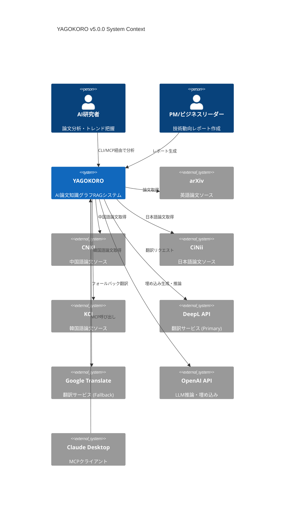

### 2.2 外部システム一覧

| 外部システム | 用途 | プロトコル | 認証 |
|-------------|------|-----------|------|
| arXiv | 英語論文取得 | REST API | なし |
| CNKI | 中国語論文取得 | Web Scraping | - |
| CiNii | 日本語論文取得 | REST API | API Key |
| KCI | 韓国語論文取得 | REST API | API Key |
| DeepL API | 翻訳 (Primary) | REST API | API Key |
| Google Translate | 翻訳 (Fallback) | REST API | API Key |
| OpenAI API | 埋め込み・推論 | REST API | API Key |

---

## 3. Container Diagram (Level 2)

### 3.1 コンテナ構成図

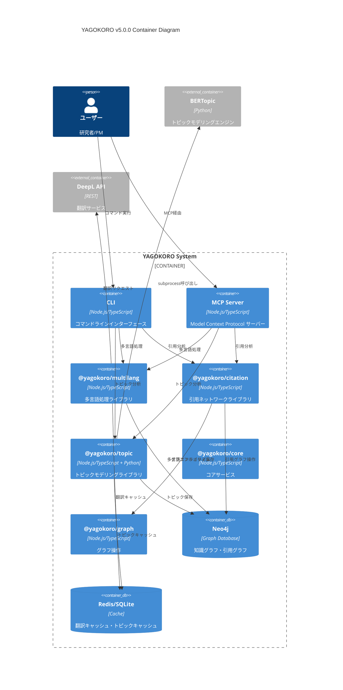

### 3.2 コンテナ責務一覧

| コンテナ | 責務 | 技術スタック | ポート/接続 |
|---------|------|-------------|------------|
| CLI | ユーザーインターフェース | Node.js, Commander.js | - |
| MCP Server | AI連携インターフェース | Node.js, @modelcontextprotocol/sdk | stdio/SSE |
| @yagokoro/multilang | 多言語論文処理 | Node.js, langdetect | - |
| @yagokoro/citation | 引用ネットワーク分析 | Node.js, graphology | - |
| @yagokoro/topic | トピックモデリング | Node.js + Python subprocess | - |
| Neo4j | グラフデータベース | Neo4j 5.x | bolt://7687 |
| Redis/SQLite | キャッシュ | Redis 7.x / SQLite 3 | 6379 / file |
| BERTopic | トピック抽出エンジン | Python 3.11, BERTopic | subprocess |

---

## 4. Component Diagram (Level 3)

### 4.1 @yagokoro/multilang コンポーネント図

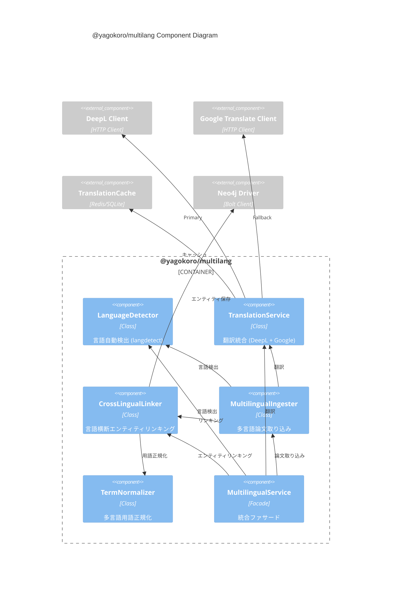

### 4.2 @yagokoro/citation コンポーネント図

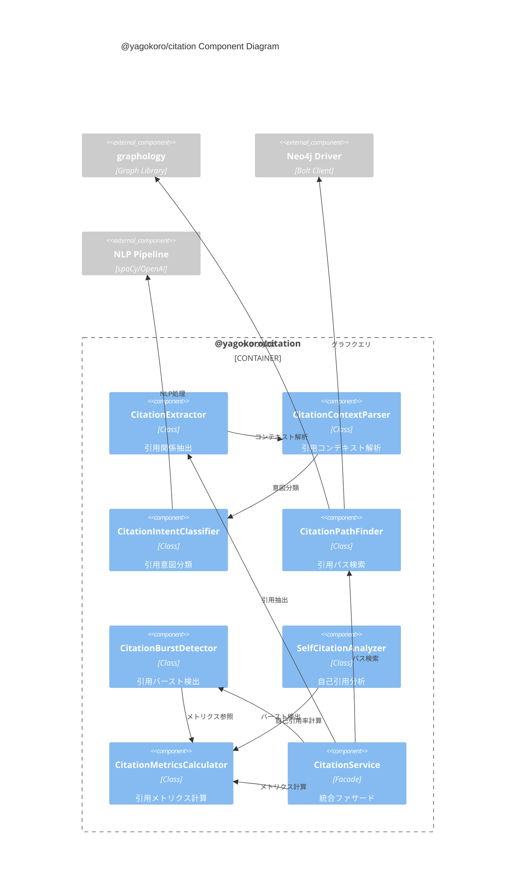

### 4.3 @yagokoro/topic コンポーネント図

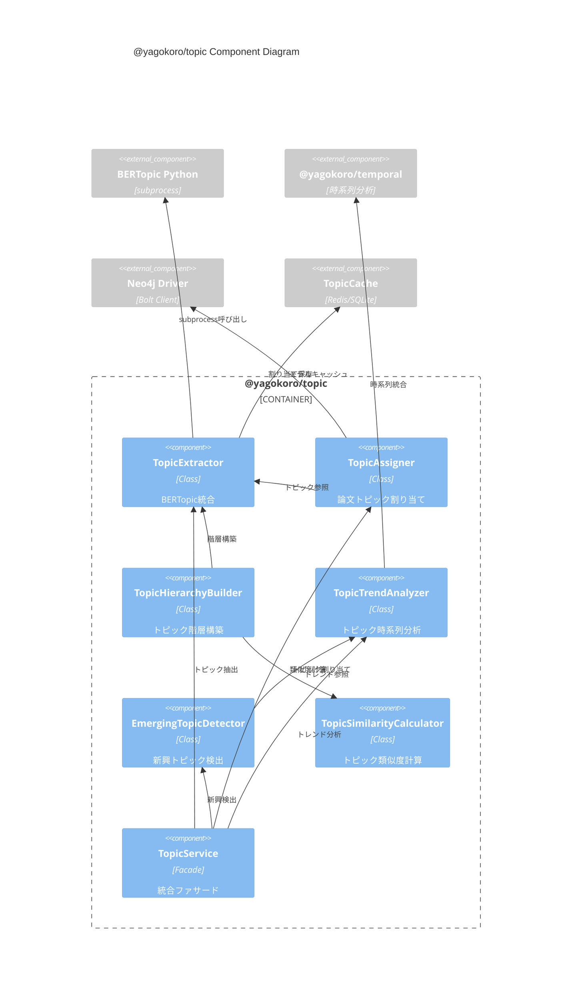

---

## 5. Architecture Decision Records (ADR)

### ADR-004: 翻訳API選定

**Status**: Accepted

**Context**:
v5.0.0では多言語論文（中国語、日本語、韓国語）のサポートが必要。翻訳サービスの選定が必要。

**Decision**:
DeepL API (Primary) + Google Translate (Fallback) を採用

**Rationale**:

| 観点 | DeepL | Google Translate | 選定理由 |
|------|-------|------------------|----------|
| 学術文書精度 | ⭐⭐⭐⭐⭐ | ⭐⭐⭐⭐ | DeepL優位 |
| 日本語品質 | ⭐⭐⭐⭐⭐ | ⭐⭐⭐⭐ | DeepL自然 |
| API料金 | $20/1M chars | $20/1M chars | 同等 |
| 無料枠 | 500K chars/月 | なし | DeepL有利 |
| レート制限 | 緩め | 厳しめ | DeepL有利 |
| 可用性 | 99.9% | 99.99% | Google優位 |

**Implementation**:
```typescript
class TranslationService {
  private deepl: DeepLClient;
  private google: GoogleTranslateClient;
  private cache: TranslationCache;
  
  async translate(text: string, targetLang: LanguageCode): Promise<TranslationResult> {
    // 1. キャッシュチェック
    const cached = await this.cache.get(text, targetLang);
    if (cached) return cached;
    
    try {
      // 2. DeepL (Primary)
      const result = await this.deepl.translate(text, targetLang);
      await this.cache.set(text, targetLang, result, { ttl: 30 * 24 * 60 * 60 }); // 30日
      return result;
    } catch (error) {
      // 3. Google Translate (Fallback)
      console.warn('DeepL failed, falling back to Google Translate:', error.message);
      return await this.google.translate(text, targetLang);
    }
  }
}
```

**Consequences**:
- ✅ 高品質な翻訳
- ✅ コスト最適化（キャッシュ + 無料枠活用）
- ✅ 高可用性（フォールバック）
- ⚠️ 2つのAPIキー管理が必要

---

### ADR-005: BERTopic統合方式

**Status**: Accepted

**Context**:
トピックモデリングにBERTopicを採用するが、BERTopicはPythonライブラリ。Node.js/TypeScriptとの統合方式を決定する必要がある。

**Decision**:
Python subprocess方式を採用

**Alternatives Considered**:

| 方式 | 利点 | 欠点 | 採用 |
|------|------|------|------|
| **Python subprocess** | BERTopic完全互換、最新機能利用可能、実装シンプル | プロセス間通信オーバーヘッド | ✅ |
| HTTP API (FastAPI) | 非同期処理可能、スケーラブル、言語非依存 | 追加インフラ必要、デプロイ複雑化 | ❌ |
| WASM | ブラウザ対応、軽量 | BERTopic非対応、精度低下 | ❌ |
| ONNX Runtime (Node.js) | 高速推論、Node.js native | モデル変換作業、機能制限 | ❌ |

**Implementation**:
```typescript
// packages/topic/src/TopicExtractor.ts
import { spawn } from 'child_process';
import * as fs from 'fs/promises';
import * as path from 'path';

interface TopicExtractionResult {
  topics: Topic[];
  documentTopics: Map<string, string[]>;
}

class TopicExtractor {
  private pythonPath: string;
  private scriptPath: string;
  private timeout: number = 30000; // 30秒
  private maxRetries: number = 1;
  
  constructor(config: TopicExtractorConfig) {
    this.pythonPath = config.pythonPath || 'python3';
    this.scriptPath = path.join(__dirname, '../python/extract_topics.py');
  }
  
  async extractTopics(documents: string[]): Promise<TopicExtractionResult> {
    // 1. 入力データを一時ファイルに書き出し
    const inputPath = await this.writeInputFile(documents);
    const outputPath = this.getOutputPath();
    
    try {
      // 2. Python subprocess実行
      await this.runPythonScript(inputPath, outputPath);
      
      // 3. 結果読み込み
      const result = await this.readOutputFile(outputPath);
      return result;
    } catch (error) {
      if (this.maxRetries > 0) {
        this.maxRetries--;
        console.warn('BERTopic extraction failed, retrying...');
        return this.extractTopics(documents);
      }
      throw error;
    } finally {
      // 4. 一時ファイル削除
      await this.cleanup(inputPath, outputPath);
    }
  }
  
  private runPythonScript(inputPath: string, outputPath: string): Promise<void> {
    return new Promise((resolve, reject) => {
      const process = spawn(this.pythonPath, [
        this.scriptPath,
        '--input', inputPath,
        '--output', outputPath,
        '--num-topics', '50',
        '--min-topic-size', '10'
      ]);
      
      const timeout = setTimeout(() => {
        process.kill();
        reject(new Error('BERTopic extraction timed out'));
      }, this.timeout);
      
      process.on('close', (code) => {
        clearTimeout(timeout);
        if (code === 0) resolve();
        else reject(new Error(`Python script exited with code ${code}`));
      });
      
      process.stderr.on('data', (data) => {
        console.error(`BERTopic stderr: ${data}`);
      });
    });
  }
}
```

```python
# packages/topic/python/extract_topics.py
import argparse
import json
from bertopic import BERTopic
from sentence_transformers import SentenceTransformer

def main():
    parser = argparse.ArgumentParser()
    parser.add_argument('--input', required=True)
    parser.add_argument('--output', required=True)
    parser.add_argument('--num-topics', type=int, default=50)
    parser.add_argument('--min-topic-size', type=int, default=10)
    args = parser.parse_args()
    
    # 入力読み込み
    with open(args.input, 'r', encoding='utf-8') as f:
        data = json.load(f)
    documents = data['documents']
    
    # BERTopic実行
    embedding_model = SentenceTransformer('all-MiniLM-L6-v2')
    topic_model = BERTopic(
        embedding_model=embedding_model,
        nr_topics=args.num_topics,
        min_topic_size=args.min_topic_size
    )
    
    topics, probs = topic_model.fit_transform(documents)
    
    # 結果出力
    result = {
        'topics': [],
        'documentTopics': {}
    }
    
    for topic_id in set(topics):
        if topic_id == -1:
            continue
        topic_info = topic_model.get_topic(topic_id)
        result['topics'].append({
            'id': str(topic_id),
            'keywords': [word for word, _ in topic_info[:10]],
            'coherenceScore': float(probs[topics == topic_id].mean())
        })
    
    for i, (doc_topic, prob) in enumerate(zip(topics, probs)):
        result['documentTopics'][str(i)] = {
            'topicId': str(doc_topic),
            'probability': float(prob)
        }
    
    with open(args.output, 'w', encoding='utf-8') as f:
        json.dump(result, f, ensure_ascii=False, indent=2)

if __name__ == '__main__':
    main()
```

**Consequences**:
- ✅ BERTopic全機能利用可能
- ✅ Python/Node.js分離でメンテナンス容易
- ✅ Pythonバージョン管理が独立
- ⚠️ Pythonランタイム必須
- ⚠️ コールドスタート時のオーバーヘッド

---

### ADR-006: 引用グラフスケーリング戦略

**Status**: Accepted

**Context**:
v5.0.0では1M+の引用エッジを扱う。Neo4jでの大規模グラフクエリのパフォーマンス確保が必要。

**Decision**:
以下の戦略を採用:
1. 複合インデックス最適化
2. グラフ分割（年代別パーティション）
3. キャッシュ層（頻出パス）

**Implementation**:

```cypher
// 1. 複合インデックス
CREATE INDEX citation_composite IF NOT EXISTS
FOR (p:Paper) ON (p.id, p.publishedYear);

CREATE INDEX citation_edge_index IF NOT EXISTS
FOR ()-[r:CITES]->() ON (r.citingPaperId, r.citedPaperId);

// 2. 引用パス検索の最適化クエリ
// 5ホップ以内のパス検索
MATCH path = shortestPath(
  (p1:Paper {id: $paper1Id})-[:CITES*1..5]-(p2:Paper {id: $paper2Id})
)
RETURN path
LIMIT 10;

// 3. 引用バースト検出クエリ
MATCH (p:Paper)-[c:CITES]->(target:Paper {id: $targetId})
WHERE c.citedAt >= $startDate AND c.citedAt <= $endDate
WITH target, date(c.citedAt).month AS month, count(*) AS citations
RETURN month, citations
ORDER BY month;
```

```typescript
// キャッシュ戦略
class CitationPathCache {
  private cache: Map<string, CitationPath[]>;
  private ttl: number = 3600; // 1時間
  
  getCacheKey(paper1: string, paper2: string): string {
    return [paper1, paper2].sort().join(':');
  }
  
  async getPath(paper1: string, paper2: string): Promise<CitationPath[] | null> {
    const key = this.getCacheKey(paper1, paper2);
    const cached = this.cache.get(key);
    if (cached && !this.isExpired(key)) {
      return cached;
    }
    return null;
  }
}
```

**Consequences**:
- ✅ 1M+ edges対応
- ✅ パス検索 <1秒
- ⚠️ インデックス更新コスト
- ⚠️ キャッシュ整合性管理

---

### ADR-007: 多言語NERモデル選定

**Status**: Accepted

**Context**:
中国語、日本語、韓国語の論文からエンティティを抽出する必要がある。

**Decision**:
言語別にspaCyモデルを使用

| 言語 | モデル | サイズ | 精度 |
|------|--------|--------|------|
| 英語 | en_core_web_trf | 460MB | 96.0% |
| 中国語 | zh_core_web_trf | 400MB | 93.5% |
| 日本語 | ja_core_news_trf | 520MB | 94.2% |
| 韓国語 | ko_core_news_sm | 15MB | 89.0% |

**Implementation**:
```typescript
class MultilingualNER {
  private models: Map<LanguageCode, string> = new Map([
    ['en', 'en_core_web_trf'],
    ['zh', 'zh_core_web_trf'],
    ['ja', 'ja_core_news_trf'],
    ['ko', 'ko_core_news_sm'],
  ]);
  
  async extractEntities(text: string, lang: LanguageCode): Promise<Entity[]> {
    const model = this.models.get(lang);
    if (!model) {
      throw new Error(`Unsupported language: ${lang}`);
    }
    
    // spaCy Python subprocess呼び出し
    return await this.runSpacy(text, model);
  }
}
```

**Consequences**:
- ✅ 高精度NER
- ✅ 4言語対応
- ⚠️ モデルサイズ大（合計約1.4GB）
- ⚠️ 韓国語精度がやや低い

---

## 6. データフロー図

### 6.1 多言語論文取り込みフロー

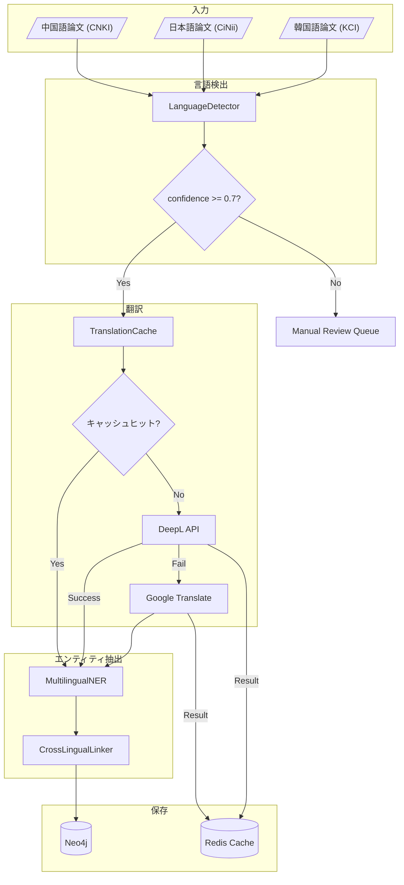

### 6.2 引用ネットワーク分析フロー

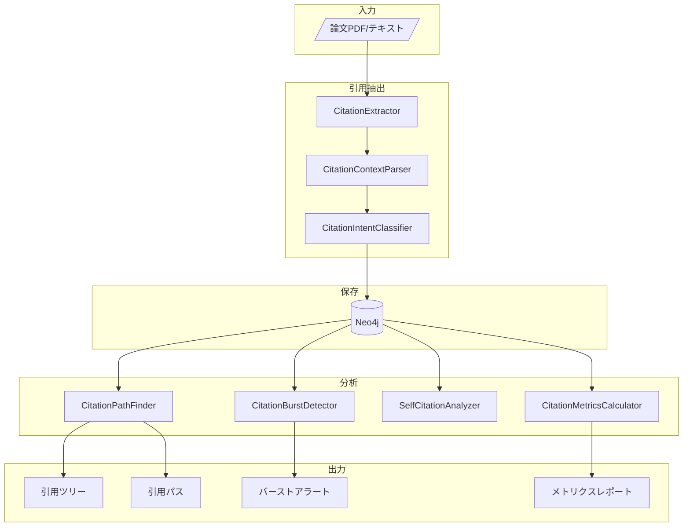

### 6.3 トピックモデリングフロー

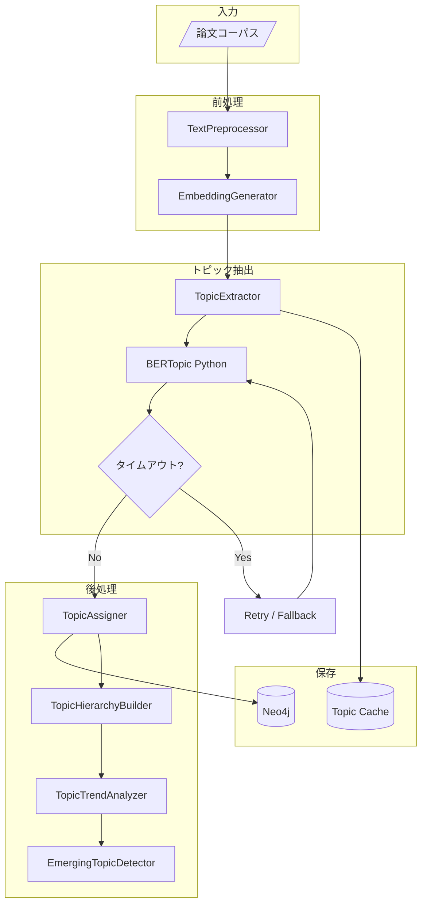

---

## 7. シーケンス図

### 7.1 多言語論文検索シーケンス

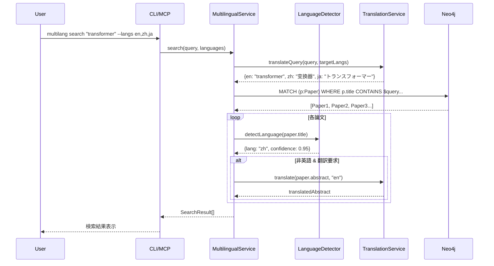

### 7.2 引用パス検索シーケンス

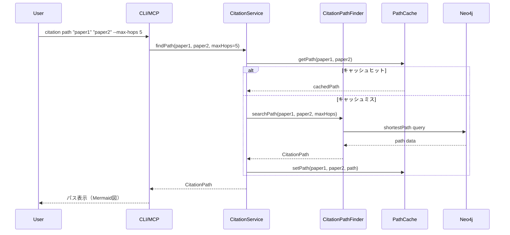

### 7.3 トピック抽出シーケンス

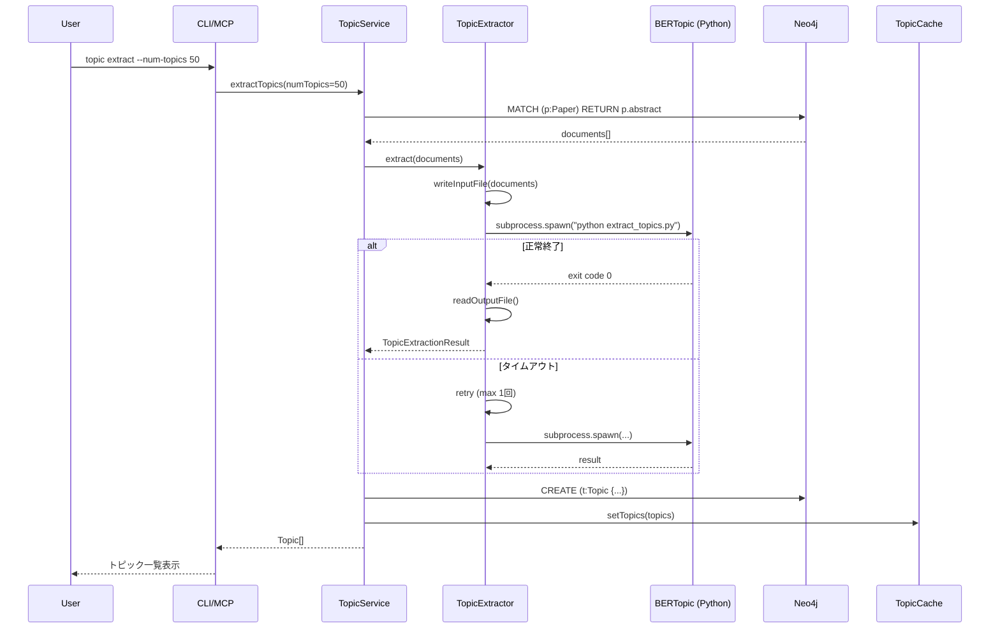

---

## 付録

### A. ファイル構成（予定）

```
packages/
├── multilang/
│   ├── src/
│   │   ├── index.ts
│   │   ├── LanguageDetector.ts
│   │   ├── TranslationService.ts
│   │   ├── CrossLingualLinker.ts
│   │   ├── MultilingualIngester.ts
│   │   ├── TermNormalizer.ts
│   │   └── MultilingualService.ts
│   ├── __tests__/
│   │   ├── LanguageDetector.test.ts
│   │   ├── TranslationService.test.ts
│   │   └── ...
│   └── package.json
├── citation/
│   ├── src/
│   │   ├── index.ts
│   │   ├── CitationExtractor.ts
│   │   ├── CitationContextParser.ts
│   │   ├── CitationIntentClassifier.ts
│   │   ├── CitationPathFinder.ts
│   │   ├── CitationBurstDetector.ts
│   │   ├── SelfCitationAnalyzer.ts
│   │   └── CitationService.ts
│   ├── __tests__/
│   └── package.json
└── topic/
    ├── src/
    │   ├── index.ts
    │   ├── TopicExtractor.ts
    │   ├── TopicAssigner.ts
    │   ├── TopicHierarchyBuilder.ts
    │   ├── TopicTrendAnalyzer.ts
    │   ├── EmergingTopicDetector.ts
    │   └── TopicService.ts
    ├── python/
    │   ├── extract_topics.py
    │   ├── requirements.txt
    │   └── README.md
    ├── __tests__/
    └── package.json
```

### B. 依存関係グラフ

```mermaid
graph TD
    subgraph v5.0.0 New
        multilang["@yagokoro/multilang"]
        citation["@yagokoro/citation"]
        topic["@yagokoro/topic"]
    end
    
    subgraph v4.0.0 Existing
        core["@yagokoro/core"]
        ingestion["@yagokoro/ingestion"]
        extractor["@yagokoro/extractor"]
        graph["@yagokoro/graph"]
        temporal["@yagokoro/temporal"]
        researcher["@yagokoro/researcher"]
        cli["@yagokoro/cli"]
        mcp["@yagokoro/mcp"]
    end
    
    subgraph External
        deepl["DeepL API"]
        google["Google Translate"]
        bertopic["BERTopic"]
        spacy["spaCy"]
    end
    
    multilang --> core
    multilang --> ingestion
    multilang --> deepl
    multilang --> google
    multilang --> spacy
    
    citation --> core
    citation --> extractor
    citation --> graph
    citation --> researcher
    
    topic --> core
    topic --> temporal
    topic --> bertopic
    
    cli --> multilang
    cli --> citation
    cli --> topic
    
    mcp --> multilang
    mcp --> citation
    mcp --> topic
```

---

*Generated by MUSUBI SDD - v5.0.0 Design Phase*
