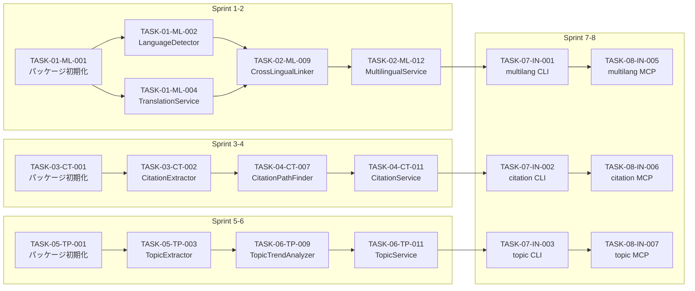

# YAGOKORO v5.0.0 タスク分解

**Version**: 5.0.0
**Status**: Draft
**Created**: 2025-12-31
**Updated**: 2025-12-31
**Author**: GitHub Copilot (MUSUBI SDD)

---

## 目次

1. [タスク概要](#1-タスク概要)
2. [Sprint 1-2: @yagokoro/multilang](#2-sprint-1-2-yagokoromultilang)
3. [Sprint 3-4: @yagokoro/citation](#3-sprint-3-4-yagokorocitation)
4. [Sprint 5-6: @yagokoro/topic](#4-sprint-5-6-yagokorotopic)
5. [Sprint 7-8: CLI/MCP統合・テスト](#5-sprint-7-8-climcp統合テスト)
6. [依存関係グラフ](#6-依存関係グラフ)
7. [リスクと対策](#7-リスクと対策)

---

## 1. タスク概要

### 1.1 全体スケジュール

| Sprint | 期間 | パッケージ | タスク数 | テスト目標 |
|--------|------|-----------|---------|-----------|
| 1-2 | Week 1-4 | @yagokoro/multilang | 24 | 185 |
| 3-4 | Week 5-8 | @yagokoro/citation | 22 | 180 |
| 5-6 | Week 9-12 | @yagokoro/topic | 20 | 190 |
| 7-8 | Week 13-16 | CLI/MCP統合 | 18 | 100 |
| **Total** | **16 weeks** | **3 packages** | **84** | **555+** |

### 1.2 タスクID規則

```
TASK-{Sprint}-{Package}-{Seq}
例: TASK-01-ML-001 = Sprint 1, Multilang, タスク001
```

| 接頭辞 | パッケージ |
|--------|-----------|
| ML | @yagokoro/multilang |
| CT | @yagokoro/citation |
| TP | @yagokoro/topic |
| IN | CLI/MCP統合 |

### 1.3 タスクステータス

| ステータス | 説明 |
|-----------|------|
| 🔲 TODO | 未着手 |
| 🔄 IN_PROGRESS | 進行中 |
| ✅ DONE | 完了 |
| ⏸️ BLOCKED | ブロック中 |
| ❌ CANCELLED | キャンセル |

---

## 2. Sprint 1-2: @yagokoro/multilang

### 2.1 Sprint 1: コア機能（Week 1-2）

#### TASK-01-ML-001: パッケージ初期化
- **説明**: @yagokoro/multilang パッケージのセットアップ
- **成果物**: 
  - `packages/multilang/package.json`
  - `packages/multilang/tsconfig.json`
  - `packages/multilang/src/index.ts`
- **見積り**: 2h
- **依存**: なし
- **担当**: -
- **ステータス**: 🔲 TODO

#### TASK-01-ML-002: LanguageDetector実装
- **説明**: langdetect統合による言語自動検出
- **成果物**:
  - `packages/multilang/src/LanguageDetector.ts`
  - `packages/multilang/python/detect_language.py`
- **要件**: REQ-008-02, REQ-008-09
- **ADR**: ADR-008
- **見積り**: 8h
- **依存**: TASK-01-ML-001
- **テスト**: 15件
- **ステータス**: 🔲 TODO

#### TASK-01-ML-003: LanguageDetectorテスト
- **説明**: LanguageDetectorのユニットテスト
- **成果物**:
  - `packages/multilang/__tests__/LanguageDetector.test.ts`
- **テストケース**:
  - 英語検出（confidence >= 0.7）
  - 中国語検出（簡体字・繁体字）
  - 日本語検出
  - 韓国語検出
  - 低confidence時のunknownフラグ（REQ-008-09）
  - Manual Review Queue追加
- **見積り**: 4h
- **依存**: TASK-01-ML-002
- **ステータス**: 🔲 TODO

#### TASK-01-ML-004: TranslationService実装（DeepL）
- **説明**: DeepL API統合
- **成果物**:
  - `packages/multilang/src/TranslationService.ts`
  - `packages/multilang/src/clients/DeepLClient.ts`
- **要件**: REQ-008-03, REQ-008-10
- **ADR**: ADR-004
- **見積り**: 8h
- **依存**: TASK-01-ML-001
- **テスト**: 12件
- **ステータス**: 🔲 TODO

#### TASK-01-ML-005: TranslationService実装（Google Fallback）
- **説明**: Google Translate APIフォールバック統合
- **成果物**:
  - `packages/multilang/src/clients/GoogleTranslateClient.ts`
  - TranslationService更新
- **要件**: REQ-008-08
- **ADR**: ADR-004
- **見積り**: 6h
- **依存**: TASK-01-ML-004
- **テスト**: 8件
- **ステータス**: 🔲 TODO

#### TASK-01-ML-006: TranslationCache実装
- **説明**: 翻訳結果キャッシュ（SQLite/Redis）
- **成果物**:
  - `packages/multilang/src/cache/TranslationCache.ts`
  - `packages/multilang/src/cache/SQLiteCache.ts`
  - `packages/multilang/src/cache/RedisCache.ts`
- **ADR**: ADR-009
- **見積り**: 6h
- **依存**: TASK-01-ML-004
- **テスト**: 10件
- **ステータス**: 🔲 TODO

#### TASK-01-ML-007: TranslationServiceテスト
- **説明**: TranslationServiceの統合テスト
- **成果物**:
  - `packages/multilang/__tests__/TranslationService.test.ts`
- **テストケース**:
  - DeepL正常翻訳
  - DeepL失敗→Googleフォールバック（REQ-008-08）
  - キャッシュヒット
  - タイムアウト（2秒制限、REQ-008-10）
  - バッチ翻訳
- **見積り**: 4h
- **依存**: TASK-01-ML-005, TASK-01-ML-006
- **ステータス**: 🔲 TODO

#### TASK-01-ML-008: TermNormalizer実装
- **説明**: 多言語用語正規化
- **成果物**:
  - `packages/multilang/src/TermNormalizer.ts`
  - `packages/multilang/data/term_mappings.json`
- **要件**: REQ-008-05
- **見積り**: 6h
- **依存**: TASK-01-ML-002
- **テスト**: 10件
- **ステータス**: 🔲 TODO

### 2.2 Sprint 2: 高度機能（Week 3-4）

#### TASK-02-ML-009: CrossLingualLinker実装
- **説明**: 言語横断エンティティリンキング
- **成果物**:
  - `packages/multilang/src/CrossLingualLinker.ts`
- **要件**: REQ-008-05, REQ-008-11
- **ADR**: ADR-011（精度閾値0.8）
- **見積り**: 12h
- **依存**: TASK-01-ML-008
- **テスト**: 15件
- **ステータス**: 🔲 TODO

#### TASK-02-ML-010: MultilingualNER実装
- **説明**: 言語別NERモデル統合（spaCy）
- **成果物**:
  - `packages/multilang/src/MultilingualNER.ts`
  - `packages/multilang/python/extract_entities.py`
- **要件**: REQ-008-06
- **ADR**: ADR-007
- **見積り**: 10h
- **依存**: TASK-01-ML-002
- **テスト**: 12件
- **ステータス**: 🔲 TODO

#### TASK-02-ML-011: MultilingualIngester実装
- **説明**: 多言語論文取り込みパイプライン
- **成果物**:
  - `packages/multilang/src/MultilingualIngester.ts`
- **要件**: REQ-008-01, REQ-008-02
- **見積り**: 10h
- **依存**: TASK-01-ML-002, TASK-01-ML-004, TASK-02-ML-010
- **テスト**: 15件
- **ステータス**: 🔲 TODO

#### TASK-02-ML-012: MultilingualService Facade実装
- **説明**: 統合ファサードクラス
- **成果物**:
  - `packages/multilang/src/MultilingualService.ts`
- **見積り**: 6h
- **依存**: TASK-02-ML-009, TASK-02-ML-011
- **テスト**: 8件
- **ステータス**: 🔲 TODO

#### TASK-02-ML-013: データモデル拡張
- **説明**: Neo4jスキーマ拡張（多言語メタデータ）
- **成果物**:
  - `packages/multilang/src/schema/MultilingualMetadata.ts`
  - Neo4j migration script
- **見積り**: 4h
- **依存**: TASK-02-ML-011
- **テスト**: 6件
- **ステータス**: 🔲 TODO

#### TASK-02-ML-014: 多言語統合テスト
- **説明**: E2E統合テスト
- **成果物**:
  - `packages/multilang/__tests__/integration/`
- **テストケース**:
  - 中国語論文取り込み→翻訳→エンティティ抽出→リンキング
  - 日本語論文同様
  - 韓国語論文同様
  - 言語横断検索
- **見積り**: 8h
- **依存**: TASK-02-ML-012
- **ステータス**: 🔲 TODO

#### TASK-02-ML-015: Python環境セットアップ
- **説明**: Python依存関係とセットアップスクリプト
- **成果物**:
  - `packages/multilang/python/requirements.txt`
  - `packages/multilang/python/setup.sh`
  - `packages/multilang/python/README.md`
- **見積り**: 2h
- **依存**: TASK-01-ML-002
- **ステータス**: 🔲 TODO

### 2.3 Sprint 1-2 サマリー

| カテゴリ | タスク数 | 見積り合計 | テスト目標 |
|---------|---------|-----------|-----------|
| 初期化 | 1 | 2h | - |
| 言語検出 | 2 | 12h | 15 |
| 翻訳 | 4 | 24h | 30 |
| 用語正規化 | 1 | 6h | 10 |
| エンティティ | 3 | 32h | 42 |
| 統合 | 3 | 16h | 14 |
| 環境 | 1 | 2h | - |
| **合計** | **15** | **94h** | **111** |

---

## 3. Sprint 3-4: @yagokoro/citation

### 3.1 Sprint 3: コア機能（Week 5-6）

#### TASK-03-CT-001: パッケージ初期化
- **説明**: @yagokoro/citation パッケージのセットアップ
- **成果物**: 
  - `packages/citation/package.json`
  - `packages/citation/tsconfig.json`
  - `packages/citation/src/index.ts`
- **見積り**: 2h
- **依存**: なし
- **ステータス**: 🔲 TODO

#### TASK-03-CT-002: CitationExtractor実装
- **説明**: 論文から引用関係を抽出
- **成果物**:
  - `packages/citation/src/CitationExtractor.ts`
- **要件**: REQ-009-01
- **見積り**: 10h
- **依存**: TASK-03-CT-001
- **テスト**: 15件
- **ステータス**: 🔲 TODO

#### TASK-03-CT-003: CitationContextParser実装
- **説明**: 引用コンテキスト解析
- **成果物**:
  - `packages/citation/src/CitationContextParser.ts`
- **要件**: REQ-009-02
- **見積り**: 8h
- **依存**: TASK-03-CT-002
- **テスト**: 12件
- **ステータス**: 🔲 TODO

#### TASK-03-CT-004: CitationIntentClassifier実装
- **説明**: 引用意図分類（背景/手法/比較/批判）
- **成果物**:
  - `packages/citation/src/CitationIntentClassifier.ts`
- **要件**: REQ-009-03
- **見積り**: 10h
- **依存**: TASK-03-CT-003
- **テスト**: 15件
- **ステータス**: 🔲 TODO

#### TASK-03-CT-005: CitationValidator実装
- **説明**: 引用検証（循環検出）
- **成果物**:
  - `packages/citation/src/CitationValidator.ts`
- **要件**: REQ-009-11
- **ADR**: ADR-010
- **見積り**: 6h
- **依存**: TASK-03-CT-002
- **テスト**: 10件
- **ステータス**: 🔲 TODO

#### TASK-03-CT-006: 引用抽出テスト
- **説明**: 引用抽出関連のユニットテスト
- **成果物**:
  - `packages/citation/__tests__/CitationExtractor.test.ts`
  - `packages/citation/__tests__/CitationContextParser.test.ts`
  - `packages/citation/__tests__/CitationIntentClassifier.test.ts`
- **見積り**: 6h
- **依存**: TASK-03-CT-004, TASK-03-CT-005
- **ステータス**: 🔲 TODO

### 3.2 Sprint 4: 分析機能（Week 7-8）

#### TASK-04-CT-007: CitationPathFinder実装
- **説明**: 引用パス検索（最短経路）
- **成果物**:
  - `packages/citation/src/CitationPathFinder.ts`
- **要件**: REQ-009-04, REQ-009-12
- **ADR**: ADR-006, ADR-010
- **見積り**: 10h
- **依存**: TASK-03-CT-002
- **テスト**: 15件
- **ステータス**: 🔲 TODO

#### TASK-04-CT-008: CitationBurstDetector実装
- **説明**: 引用バースト検出
- **成果物**:
  - `packages/citation/src/CitationBurstDetector.ts`
- **要件**: REQ-009-05
- **見積り**: 8h
- **依存**: TASK-03-CT-002
- **テスト**: 12件
- **ステータス**: 🔲 TODO

#### TASK-04-CT-009: SelfCitationAnalyzer実装
- **説明**: 自己引用分析
- **成果物**:
  - `packages/citation/src/SelfCitationAnalyzer.ts`
- **要件**: REQ-009-06
- **見積り**: 6h
- **依存**: TASK-03-CT-002
- **テスト**: 10件
- **ステータス**: 🔲 TODO

#### TASK-04-CT-010: CitationMetricsCalculator実装
- **説明**: 引用メトリクス計算（h-index, i10-index等）
- **成果物**:
  - `packages/citation/src/CitationMetricsCalculator.ts`
- **要件**: REQ-009-09
- **見積り**: 8h
- **依存**: TASK-03-CT-002
- **テスト**: 12件
- **ステータス**: 🔲 TODO

#### TASK-04-CT-011: CitationService Facade実装
- **説明**: 統合ファサードクラス
- **成果物**:
  - `packages/citation/src/CitationService.ts`
- **ADR**: ADR-011（タイムアウト500ms）
- **見積り**: 6h
- **依存**: TASK-04-CT-007, TASK-04-CT-008, TASK-04-CT-009, TASK-04-CT-010
- **テスト**: 10件
- **ステータス**: 🔲 TODO

#### TASK-04-CT-012: Neo4jインデックス最適化
- **説明**: 引用グラフ用インデックス作成
- **成果物**:
  - `packages/citation/src/schema/citations.cypher`
- **ADR**: ADR-006
- **見積り**: 4h
- **依存**: TASK-03-CT-002
- **テスト**: 5件
- **ステータス**: 🔲 TODO

#### TASK-04-CT-013: CitationPathCache実装
- **説明**: 引用パスキャッシュ
- **成果物**:
  - `packages/citation/src/cache/CitationPathCache.ts`
- **ADR**: ADR-006, ADR-009
- **見積り**: 4h
- **依存**: TASK-04-CT-007
- **テスト**: 8件
- **ステータス**: 🔲 TODO

#### TASK-04-CT-014: 引用分析統合テスト
- **説明**: E2E統合テスト
- **成果物**:
  - `packages/citation/__tests__/integration/`
- **テストケース**:
  - 引用ツリー構築
  - パス検索（キャッシュあり/なし）
  - バースト検出
  - 循環引用エラー（REQ-009-11）
  - 5ホップ制限（REQ-009-12）
- **見積り**: 8h
- **依存**: TASK-04-CT-011
- **ステータス**: 🔲 TODO

### 3.3 Sprint 3-4 サマリー

| カテゴリ | タスク数 | 見積り合計 | テスト目標 |
|---------|---------|-----------|-----------|
| 初期化 | 1 | 2h | - |
| 引用抽出 | 4 | 34h | 52 |
| 検証 | 1 | 6h | 10 |
| 分析 | 4 | 32h | 49 |
| 統合 | 2 | 10h | 15 |
| インフラ | 2 | 8h | 13 |
| **合計** | **14** | **92h** | **139** |

---

## 4. Sprint 5-6: @yagokoro/topic

### 4.1 Sprint 5: BERTopic統合（Week 9-10）

#### TASK-05-TP-001: パッケージ初期化
- **説明**: @yagokoro/topic パッケージのセットアップ
- **成果物**: 
  - `packages/topic/package.json`
  - `packages/topic/tsconfig.json`
  - `packages/topic/src/index.ts`
- **見積り**: 2h
- **依存**: なし
- **ステータス**: 🔲 TODO

#### TASK-05-TP-002: Python BERTopicスクリプト実装
- **説明**: BERTopicトピック抽出Pythonスクリプト
- **成果物**:
  - `packages/topic/python/extract_topics.py`
  - `packages/topic/python/requirements.txt`
- **ADR**: ADR-005
- **見積り**: 8h
- **依存**: TASK-05-TP-001
- **テスト**: 5件（Pythonテスト）
- **ステータス**: 🔲 TODO

#### TASK-05-TP-003: TopicExtractor実装
- **説明**: BERTopic subprocess統合
- **成果物**:
  - `packages/topic/src/TopicExtractor.ts`
- **要件**: REQ-010-01, REQ-010-07, REQ-010-11, REQ-010-12
- **ADR**: ADR-005, ADR-010, ADR-011
- **見積り**: 12h
- **依存**: TASK-05-TP-002
- **テスト**: 18件
- **ステータス**: 🔲 TODO

#### TASK-05-TP-004: TopicExtractorテスト
- **説明**: TopicExtractorのユニットテスト
- **成果物**:
  - `packages/topic/__tests__/TopicExtractor.test.ts`
- **テストケース**:
  - 正常トピック抽出
  - タイムアウト（30秒、REQ-010-07）
  - リトライ（REQ-010-11）
  - トピック数過少時のパラメータ調整（REQ-010-12）
  - Coherence閾値（0.5、REQ-010-08）
- **見積り**: 6h
- **依存**: TASK-05-TP-003
- **ステータス**: 🔲 TODO

#### TASK-05-TP-005: TopicAssigner実装
- **説明**: 論文へのトピック割り当て
- **成果物**:
  - `packages/topic/src/TopicAssigner.ts`
- **要件**: REQ-010-02
- **見積り**: 6h
- **依存**: TASK-05-TP-003
- **テスト**: 12件
- **ステータス**: 🔲 TODO

#### TASK-05-TP-006: TopicCache実装
- **説明**: トピックモデル結果キャッシュ
- **成果物**:
  - `packages/topic/src/cache/TopicCache.ts`
- **ADR**: ADR-009
- **見積り**: 4h
- **依存**: TASK-05-TP-003
- **テスト**: 8件
- **ステータス**: 🔲 TODO

### 4.2 Sprint 6: 高度分析（Week 11-12）

#### TASK-06-TP-007: TopicHierarchyBuilder実装
- **説明**: トピック階層構築
- **成果物**:
  - `packages/topic/src/TopicHierarchyBuilder.ts`
- **要件**: REQ-010-03
- **見積り**: 8h
- **依存**: TASK-05-TP-005
- **テスト**: 12件
- **ステータス**: 🔲 TODO

#### TASK-06-TP-008: TopicSimilarityCalculator実装
- **説明**: トピック間類似度計算
- **成果物**:
  - `packages/topic/src/TopicSimilarityCalculator.ts`
- **見積り**: 6h
- **依存**: TASK-05-TP-003
- **テスト**: 10件
- **ステータス**: 🔲 TODO

#### TASK-06-TP-009: TopicTrendAnalyzer実装
- **説明**: トピック時系列分析（@yagokoro/temporal連携）
- **成果物**:
  - `packages/topic/src/TopicTrendAnalyzer.ts`
- **要件**: REQ-010-04
- **見積り**: 8h
- **依存**: TASK-05-TP-005
- **テスト**: 12件
- **ステータス**: 🔲 TODO

#### TASK-06-TP-010: EmergingTopicDetector実装
- **説明**: 新興トピック検出
- **成果物**:
  - `packages/topic/src/EmergingTopicDetector.ts`
- **要件**: REQ-010-05
- **見積り**: 8h
- **依存**: TASK-06-TP-009
- **テスト**: 12件
- **ステータス**: 🔲 TODO

#### TASK-06-TP-011: TopicService Facade実装
- **説明**: 統合ファサードクラス
- **成果物**:
  - `packages/topic/src/TopicService.ts`
- **見積り**: 6h
- **依存**: TASK-06-TP-007, TASK-06-TP-010
- **テスト**: 10件
- **ステータス**: 🔲 TODO

#### TASK-06-TP-012: トピックモデリング統合テスト
- **説明**: E2E統合テスト
- **成果物**:
  - `packages/topic/__tests__/integration/`
- **テストケース**:
  - 論文コーパス→トピック抽出→階層構築
  - トピックトレンド分析
  - 新興トピック検出
  - @yagokoro/temporal連携
- **見積り**: 8h
- **依存**: TASK-06-TP-011
- **ステータス**: 🔲 TODO

#### TASK-06-TP-013: Python環境セットアップ
- **説明**: BERTopic Python環境
- **成果物**:
  - `packages/topic/python/setup.sh`
  - `packages/topic/python/README.md`
- **見積り**: 2h
- **依存**: TASK-05-TP-002
- **ステータス**: 🔲 TODO

### 4.3 Sprint 5-6 サマリー

| カテゴリ | タスク数 | 見積り合計 | テスト目標 |
|---------|---------|-----------|-----------|
| 初期化 | 1 | 2h | - |
| BERTopic統合 | 4 | 32h | 43 |
| トピック分析 | 4 | 30h | 46 |
| 統合 | 2 | 14h | 10 |
| 環境 | 1 | 2h | - |
| **合計** | **13** | **84h** | **99** |

---

## 5. Sprint 7-8: CLI/MCP統合・テスト

### 5.1 Sprint 7: CLI統合（Week 13-14）

#### TASK-07-IN-001: multilang CLIコマンド実装
- **説明**: multilangサブコマンド群
- **成果物**:
  - `packages/cli/src/commands/multilang/`
- **コマンド**:
  - `multilang ingest`
  - `multilang search`
  - `multilang translate`
  - `multilang stats`
- **見積り**: 10h
- **依存**: Sprint 2完了
- **テスト**: 15件
- **ステータス**: 🔲 TODO

#### TASK-07-IN-002: citation CLIコマンド実装
- **説明**: citationサブコマンド群
- **成果物**:
  - `packages/cli/src/commands/citation/`
- **コマンド**:
  - `citation tree`
  - `citation path`
  - `citation burst`
  - `citation metrics`
  - `citation self`
- **見積り**: 12h
- **依存**: Sprint 4完了
- **テスト**: 18件
- **ステータス**: 🔲 TODO

#### TASK-07-IN-003: topic CLIコマンド実装
- **説明**: topicサブコマンド群
- **成果物**:
  - `packages/cli/src/commands/topic/`
- **コマンド**:
  - `topic extract`
  - `topic assign`
  - `topic hierarchy`
  - `topic trends`
  - `topic emerging`
- **見積り**: 12h
- **依存**: Sprint 6完了
- **テスト**: 18件
- **ステータス**: 🔲 TODO

#### TASK-07-IN-004: CLIヘルプ・ドキュメント
- **説明**: CLIヘルプテキストとドキュメント
- **成果物**:
  - 各コマンドの`--help`
  - `docs/cli-v5.md`
- **見積り**: 4h
- **依存**: TASK-07-IN-001, TASK-07-IN-002, TASK-07-IN-003
- **ステータス**: 🔲 TODO

### 5.2 Sprint 8: MCP統合（Week 15-16）

#### TASK-08-IN-005: multilang MCPツール実装
- **説明**: multilang MCPツール群
- **成果物**:
  - `packages/mcp/src/tools/multilang/`
- **ツール**:
  - `multilang_search`
  - `multilang_translate`
  - `multilang_detect_language`
  - `multilang_stats`
- **見積り**: 8h
- **依存**: TASK-07-IN-001
- **テスト**: 12件
- **ステータス**: 🔲 TODO

#### TASK-08-IN-006: citation MCPツール実装
- **説明**: citation MCPツール群
- **成果物**:
  - `packages/mcp/src/tools/citation/`
- **ツール**:
  - `citation_get_tree`
  - `citation_find_path`
  - `citation_detect_burst`
  - `citation_get_metrics`
  - `citation_analyze_self`
- **見積り**: 10h
- **依存**: TASK-07-IN-002
- **テスト**: 15件
- **ステータス**: 🔲 TODO

#### TASK-08-IN-007: topic MCPツール実装
- **説明**: topic MCPツール群
- **成果物**:
  - `packages/mcp/src/tools/topic/`
- **ツール**:
  - `topic_extract`
  - `topic_get_hierarchy`
  - `topic_analyze_trends`
  - `topic_find_emerging`
  - `topic_get_similar`
  - `topic_assign_paper`
- **見積り**: 10h
- **依存**: TASK-07-IN-003
- **テスト**: 18件
- **ステータス**: 🔲 TODO

#### TASK-08-IN-008: MCP統合テスト
- **説明**: MCP E2Eテスト
- **成果物**:
  - `packages/mcp/__tests__/integration/v5-tools.test.ts`
- **見積り**: 6h
- **依存**: TASK-08-IN-005, TASK-08-IN-006, TASK-08-IN-007
- **ステータス**: 🔲 TODO

#### TASK-08-IN-009: 全体統合テスト
- **説明**: v5.0.0全機能統合テスト
- **成果物**:
  - `packages/e2e/__tests__/v5-integration.test.ts`
- **テストケース**:
  - CLI/MCP結果一致性
  - パフォーマンス検証
  - エラーハンドリング
- **見積り**: 8h
- **依存**: TASK-08-IN-008
- **ステータス**: 🔲 TODO

#### TASK-08-IN-010: ドキュメント更新
- **説明**: README、CHANGELOG、APIドキュメント
- **成果物**:
  - `README.md`更新
  - `CHANGELOG.md`
  - `docs/api/v5/`
- **見積り**: 4h
- **依存**: TASK-08-IN-009
- **ステータス**: 🔲 TODO

### 5.3 Sprint 7-8 サマリー

| カテゴリ | タスク数 | 見積り合計 | テスト目標 |
|---------|---------|-----------|-----------|
| CLI | 4 | 38h | 51 |
| MCP | 4 | 34h | 45 |
| 統合テスト | 1 | 8h | - |
| ドキュメント | 1 | 4h | - |
| **合計** | **10** | **84h** | **96** |

---

## 6. 依存関係グラフ

### 6.1 パッケージ間依存



### 6.2 クリティカルパス

```
TASK-01-ML-001 → TASK-01-ML-002 → TASK-02-ML-009 → TASK-02-ML-012 
  → TASK-07-IN-001 → TASK-08-IN-005 → TASK-08-IN-009
```

**クリティカルパス所要時間**: 約50h

---

## 7. リスクと対策

### 7.1 技術リスク

| リスク | 影響度 | 発生確率 | 対策 |
|-------|--------|---------|------|
| BERTopicタイムアウト | 高 | 中 | ADR-010でリトライ実装、タイムアウト30秒 |
| DeepL API制限 | 中 | 低 | Googleフォールバック、キャッシュ活用 |
| 大規模引用グラフ性能 | 高 | 中 | ADR-006でインデックス最適化 |
| 言語検出精度低下 | 中 | 低 | confidence閾値0.7、Manual Review Queue |
| Python/Node.js連携 | 中 | 中 | subprocess安定性テスト、エラーハンドリング |

### 7.2 スケジュールリスク

| リスク | 影響度 | 発生確率 | 対策 |
|-------|--------|---------|------|
| BERTopic統合遅延 | 高 | 中 | Sprint 5に2週間バッファ |
| 翻訳API統合遅延 | 中 | 低 | フォールバック先行実装 |
| 統合テスト遅延 | 中 | 中 | 各Sprintで統合テスト実施 |

### 7.3 リソースリスク

| リスク | 影響度 | 発生確率 | 対策 |
|-------|--------|---------|------|
| Python環境差異 | 中 | 中 | Docker/venv標準化 |
| API Key管理 | 低 | 低 | 環境変数 + .env.example |
| モデルサイズ（1.4GB） | 低 | 低 | 遅延ロード、ドキュメント明記 |

---

## 付録

### A. テスト目標サマリー

| パッケージ | ユニット | 統合 | 合計 |
|-----------|---------|------|------|
| @yagokoro/multilang | 97 | 14 | 111 |
| @yagokoro/citation | 124 | 15 | 139 |
| @yagokoro/topic | 89 | 10 | 99 |
| @yagokoro/cli (v5) | 51 | - | 51 |
| @yagokoro/mcp (v5) | 45 | - | 45 |
| E2E | - | 10 | 10 |
| **合計** | **406** | **49** | **455+** |

### B. 見積り合計

| Sprint | 期間 | 見積り | バッファ | 合計 |
|--------|------|-------|---------|------|
| 1-2 | 4週 | 94h | 16h | 110h |
| 3-4 | 4週 | 92h | 18h | 110h |
| 5-6 | 4週 | 84h | 26h | 110h |
| 7-8 | 4週 | 84h | 26h | 110h |
| **Total** | **16週** | **354h** | **86h** | **440h** |

### C. 成果物チェックリスト

- [ ] @yagokoro/multilang パッケージ
- [ ] @yagokoro/citation パッケージ
- [ ] @yagokoro/topic パッケージ
- [ ] CLI: multilang/citation/topic コマンド
- [ ] MCP: 15新規ツール
- [ ] テスト: 455+件
- [ ] ドキュメント: README, CHANGELOG, API docs

---

*Generated by MUSUBI SDD - v5.0.0 Task Breakdown Phase*
